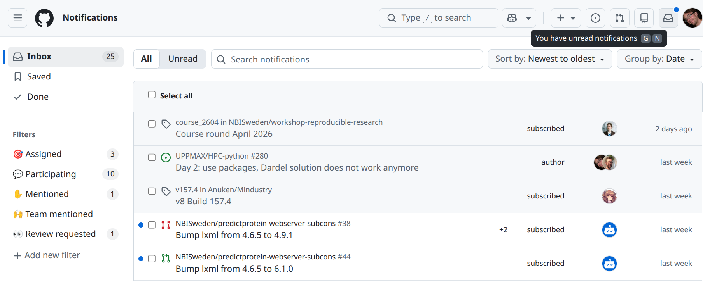
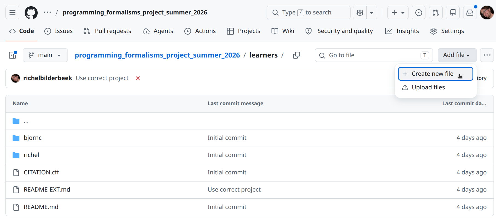
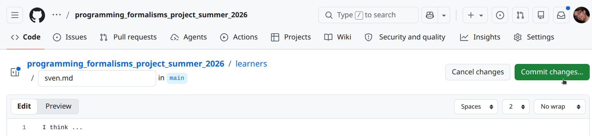
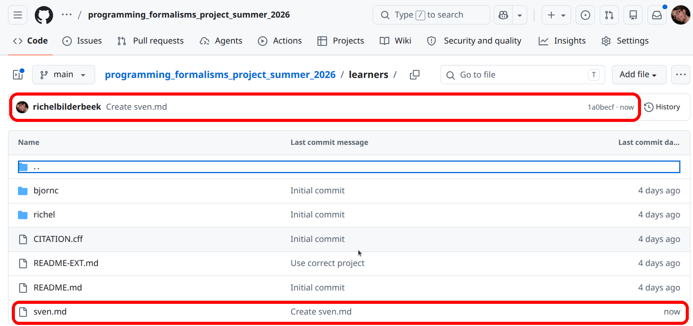
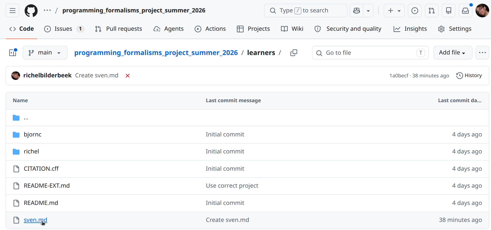
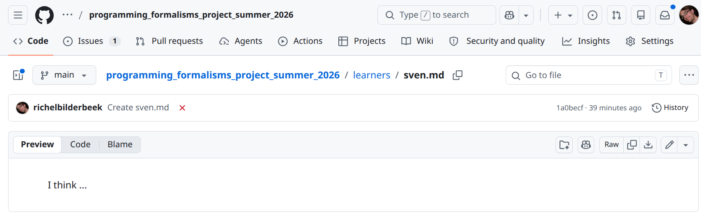
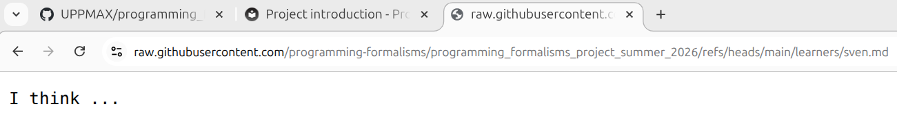

# Project introduction

!!! info "Learning outcomes"

    Learners ...

    - understand what the project is about
    - understand why the course project is set up as such
    - are a collaborator of the course project's GitHub repository
    - can modify the content of the course project's GitHub repository
      from GitHub

??? question "For teachers"

    Prior:

    - You work together with someone. How would you set up the project?
    - What is GitHub?
    - What is a GitHub repository?
    - What is a GitHub issue?
    - What is a Markdown?
    - What is a Markdown file?
    - What do we mean when we say 'This shows the rendered file'?

## Why we set up the project as such

For this course, we need a project to work, together.

As teachers, we've looked for a research project
on real data, that is as simple as possible.

We used the most popular code hosting website,
as is recommended (among others, `[Perez-Riverol et al., 2016]`,
but there will be many more references during the course).

In the end of the course, we will put our work into a Python
package, so that everyone can reproduce our results.

## The research project

You discovered data from the paper `[Bergström and Moberg, 2002]`,
where the average temperature is measured on a daily basis
since 1772 (yes, year seventeen-hundred-and-twenty-two)
in Uppsala.

You want to use this simple data set for a toy project
to practice software development with.

## Exercises

## Exercise 1: become member of the course project

Login to GitHub.

???- question "I don't have a GitHub account?"

    It is [a course prerequisite](../../prereqs.md) to have a GitHub
    account.

    If you forgot, then now is the time to make a (free) GitHub account :+1:

Share your GitHub name [at this issue](https://github.com/programming-formalisms/programming_formalisms_project_summer_2026/issues/1)

???- question "What happens then?"

    The teachers will make you a member of the learners' project

## Exercise 2: take a look at the project data

In this exercise, we'll take a look at the project data files
that are the result of research described in `[Bergström and Moberg, 2002]`.
The data files can be found in
[the `data` of the learners project](https://github.com/programming-formalisms/programming_formalisms_project_summer_2026/blob/main/data/README.md).

Take a look at the file `uppsala_tm_1722-2022.dat`.
What is the purpose of this file?

???- question "Answer"

    This is a metadata file: it describes the data

Take a look at the file `uppsala_tm_1722-2022.txt`.
What is the purpose of this file?

???- question "Answer"

    This file contains the actual data.

How would you describe the content of these files together?

???- question "Answer"

    These files describe the average daily temperature in Uppsala.

## Exercise 3: share your hypothesis to test

Read [the research project](#the-research-project).

In a file, write down one or more hypotheses one could test with that
data.

???- question "I cannot come up with a hypothesis"

    Sure, here are some:

    ???- info "Example hypothesis 1"

        Does the yearly average temperate increase over time?

    ???- info "Example hypothesis 2"

        Does the different between yearly minimum and maximum temperature
        increase over time?

    ???- info "Example hypothesis 3"

        Can daily temperatures be approximated by a (co)sine function?

    ???- info "Example hypothesis 4"

        Is the day with the least amount of sun
        (i.e. winter soltice, December 21st)
        the coldest day of the year?

        Is the day with the most amount of sun
        (i.e. summer soltice, June 21st)
        the warmest day of the year?

    ???- info "Example hypothesis 5"

        Have the dates for the coldest and warmest day of the year
        moved in time?

???- question "Does it matter what kind of file?"

    No. A Word document is fine, a plain-text file is fine too.

Check your email for a GitHub invitation to the course project,
or find this message in the GitHub notifications.
Accept the invitation. Welcome to the project!

???- question "Where are the GitHub notifications?"

    These are at the top-right of your GitHub pages:

    
    
    Click on it and your will see your GitHub notifications,
    which will look similar to this:

    

In the course repository website,
navigate into the `learners` folder.

???- question "How do I do this?"

    To navigate into the `learners` folder, click on the text `learners`:
    
    

In the course repository website,
create a new file.

???- question "How do I do this?"

    At the top-left, click on 'Add file | Create new file':
    
    

???- question "Huh? I am not allowed to do this...?"

    You did not yet accept the GitHub invitation to this project.
    Take a closer look at the previous step.
    Else, notify a teacher.

In the editor:

- name the file `[your_name].md`, e.g. `sven.md`
- copy-paste your hypotheses to this file

When done, click on the 'Commit' button

???- question "How does this look like?"

    

Check if your file has been created.

???- question "How do I check this?"

    There are two indications:
    
    - The so-called 'commit message' shows above the files in the folder
    - In the folder, you can see the file's name

    

View the file.

???- question "How do I do this?"

    Click on the file:
    
    

    You will now see the rendered file:
    
    

You now see the rendered file.
It may look different than the text you copy-pasted.
However, your text is absolutely there as you have copy-pasted it.
To view the file in its original form, view the file in its raw form.

???- question "How do I do this?"

    Click on the file:
    
    

    You will now see the raw file:
    
    

## (optional) Exercise 4: unwatch the learners project

When being added to a GitHub repository,
it is assumed you want to be informed on any event,
e.g. when the code breaks or when you are mentioned.

You will receive an email for every such event.

To prevent this, follow
[this course material on changing your 'Watch' settings](../watching/README.md).

## (optional) Exercise 5: explore the learners project

Explore the learners' project GitHub repository.
Where can you find the things below?

The folder to put documentation

???- question "Answer"

    The `docs` folder.
    
    This is a standard and standarized name for documentation.

The folder for the learners to put their notes

???- question "Answer"

    The `learners` folder.
    
    Us teachers picked this name.

The folder to put code.

???- question "Answer"

    The `src` folder.
    
    This is a standard and standarized name for source code.

The folder to put tests.

???- question "Answer"

    The `tests` folder.
    
    This is a standard and standarized name for a folder that
    contains code to assure everything works as it should.

The folder containing the scripts to work on the project.

???- question "Answer"

    The `scripts` folder.
    
    Us teachers picked this name.

The folder containing the GitHub Actions scripts

???- question "Answer"

    The `.github/worksflows` folder.
    
    This is the standarized name used by GitHub.

???- question "What are 'GitHub Actions scripts'?"

    These are scripts that are run upon a new online commit.
    We will discuss these more when we discuss Continuous Integration.

## References

- `[Bergström and Moberg, 2002]` Bergström, Hans, and Anders Moberg.
  "Daily air temperature and pressure series for Uppsala (1722–1998)."
  Climatic change 53.1 (2002): 213-252.
  [Paper homepage](https://doi.org/10.1023/A:1014983229213)

- `[Perez-Riverol et al., 2016]`
  Perez-Riverol, Yasset, et al. "Ten simple rules for taking advantage
  of Git and GitHub." PLoS computational biology 12.7 (2016): e1004947.
  [Paper homepage](https://doi.org/10.1371/journal.pcbi.1004947)
