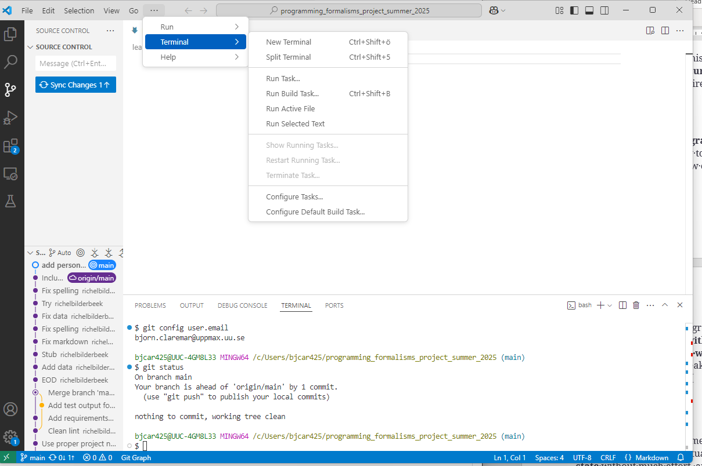

# Project introduction

!!! info "Learning outcomes"

    Learners ...

    - understand what the project is about
    - understand why the course project is set up as such
    - are a collaborator of the course project's GitHub repository
    - can modify the content of the course project's GitHub repository
      from GitHub

??? question "For teachers"

    Prior:

    - You work together with someone. How would you set up the project?
    - What is GitHub?
    - What is a GitHub repository?
    - What is a GitHub issue?
    - What is a Markdown?
    - What is a Markdown file?
    - What do we mean when we say 'This shows the rendered file'?

## Why we set up the project as such

This project

## The research project

## Exercises


## Exercise 1: become member of the course project

Login to GitHub.

Share your GitHub name [at this issue](https://github.com/programming-formalisms/programming_formalisms_project_summer_2026/issues/1)

???- question "What happens then?"

    The teachers will make you a member of the learners' project

## Exercise 2: share your hypothesis to test

Read [the research project](#the-research-project).

In a file, write down one or more hypotheses one could test with that
data.

???- question "Does it matter what kind of file?"

    No. A Word document is fine, a plain-text file is fine too.

Check your email for a GitHub invitation to the course project,
or find this message in the GitHub notifications.
Accept the invitation. Welcome to the project!

???- question "Where are the GitHub notifications?"

    These are at the top-right of your GitHub pages:

    
    
    Click on it and your will see your GitHub notifications,
    which will look similar to this:

    

In the course repository website,
navigate into the `learners` folder.

???- question "How do I do this?"

    To navigate into the `learners` folder, click on the text `learners`:
    
    

In the course repository website,
create a new file.

???- question "How do I do this?"

    At the top-left, click on 'Add file | Create new file':
    
    

???- question "Huh? I am not allowed to do this...?"

    You did not yet accept the GitHub invitation to this project.
    Take a closer look at the previous step.
    Else, notify a teacher.


In the editor:

- name the file `[your_name].md`, e.g. `sven.md`
- copy-paste your hypotheses to this file

When done, click on the 'Commit' button

???- question "How does this look like?"

    

Check if your file has been created.

???- question "How do I check this?"

    There are two indications:
    
    - The so-called 'commit message' shows above the files in the folder
    - In the folder, you can see the file's name

    

View the file.

???- question "How do I do this?"

    Click on the file:
    
    

    You will now see the rendered file:
    
    

You now see the rendered file.
It may look different than the text you copy-pasted.
However, your text is absolutely there as you have copy-pasted it.
To view the file in its original form, view the file in its raw form.

???- question "How do I do this?"

    Click on the file:
    
    

    You will now see the raw file:
    
    

## (optional) Exercise 3

Explore the learners' project GitHub repository.
Where can you find the things below?

The folder to put documentation

???- question "Answer"

    The `doc` folder.
    
    This is a standard and standarized name for documentation.

The folder for the learners to put their notes

???- question "Answer"

    The `learners` folder.
    
    Us teachers picked this name.

The folder to put code.

???- question "Answer"

    The `src` folder.
    
    This is a standard and standarized name for source code.

The folder to put tests.

???- question "Answer"

    The `tests` folder.
    
    This is a standard and standarized name for a folder that
    contains code to assure everything works as it should.

The folder containing the scripts to work on the project.

???- question "Answer"

    The `scripts` folder.
    
    Us teachers picked this name.

The folder containing the GitHub Actions scripts

???- question "Answer"

    The `.github/worksflows` folder.
    
    This is the standarized name used by GitHub

The folder containing the GitHub Actions scripts


## References

- `[Perez-Riverol et al., 2016]`
  Perez-Riverol, Yasset, et al. "Ten simple rules for taking advantage
  of Git and GitHub." PLoS computational biology 12.7 (2016): e1004947.
  [Paper homepage](https://doi.org/10.1371/journal.pcbi.1004947)

<!--

## Summary of `[Perez-Riverol et al., 2016]`

This paper shared 10 simple rules to take advantage of `git` and GitHub:

- Rule 1: Use GitHub to Track Your Projects
- Rule 2: GitHub for Single Users, Teams, and Organizations
- Rule 3: Developing and Collaborating on New Features:
  Branching and Forking
- Rule 4: Naming Branches and Commits: Tags and Semantic Versions
- Rule 5: Let GitHub Do Some Tasks for You: Integrate
- Rule 6: Let GitHub Do More Tasks for You: Automate
- Rule 7: Use GitHub to Openly and Collaboratively Discuss,
  Address, and Close Issues
- Rule 8: Make Your Code Easily Citable, and Cite Source Code!
- Rule 9: Promote and Discuss Your Projects: Web Page and More
- Rule 10: Use GitHub to Be Social: Follow and Watch

-->


## Old

## VS Code terminal

- We will work as much as possible (almost) in the VS Code graphical interface for Git
- However, some things are better (or only) handled from a terminal/command line.

- You find the Git Bash terminal From the menu (different on mac and windows)



## Before we continue we need to configure Git

!!! attention

    - Start VS Code

??? warning "This should have been done already"

    - We hope also that you have already done these steps
      [at the 'Prerequisites' page of this course](../../misc/faq.md/#prerequisites)
    - **Git and GitHub should be configured prior to the course**
        - Note that Mac users may need to run a command from the terminal to be able to run ``git``: ``sudo xcodebuild -license accept``
        - [Configure Git](https://nbis-reproducible-research.readthedocs.io/en/course_2104/setup/#configure-git)
            - like: ``git config --global user.name "Mona Lisa"``
            - like: ``git config --global user.email "mona_lisa@gmail.com"``

## Get a local clone of the project

???- question "Exercise 2a: clone course project using VS code (4 min)"

    - Start VS code
    - Start new window

    - In GitHub, locate the **Code** button, select **SSH** and click the **copy** symbol to the right

    ???- question "Where is this?"

        ``https://github.com/programming-formalisms/programming_formalisms_project_summer_2026``

    ???- question "How will the address to clone look like?"

        ``https://github.com/programming-formalisms/programming_formalisms_project_autunr_2025.git``

    - In VS code: Clone Git repository
        - The repo may show up automatically if you are already part of the project. Then click it.
        - Otherwise paste the copied URL
    - Open folder where you want to have your project
        - Create a new one if necessary in the "Open folder File explorer"
    - Select as Repository Destination

???- question "Exercise 2b: (Alternative with command line) clone course project and create folders (4 min)"

    - You may want to create a directory on your computer for this course.
    - You can do it in the normal way or use your terminal, like this, in a good place (like "Courses" if you have that)
    - ``mkdir Programming_formalisms``
    - ``cd Programming_formalisms``
    - In GitHub, locate the **Code** button, select **SSH** and click the **copy** symbol to the right
    - Back in your terminal type ``git clone`` followed by pasting the copied text.
    - The result shall look something like this:

     ```console
     git clone git@github.com:programming-formalisms/programming_formalisms_project_summer_2026.git
     ```

    **What just happened?**

    - `cd` the new directory that was created
    - list the files with `ls`

!!! summary

    - You should now hopefully be connected to the project and have a local copy of it!
    
