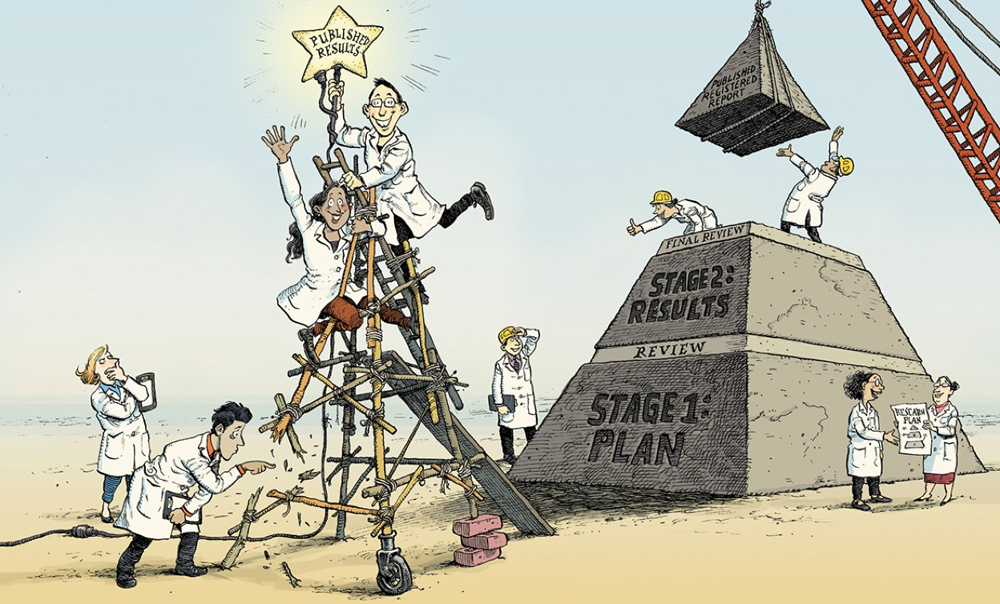
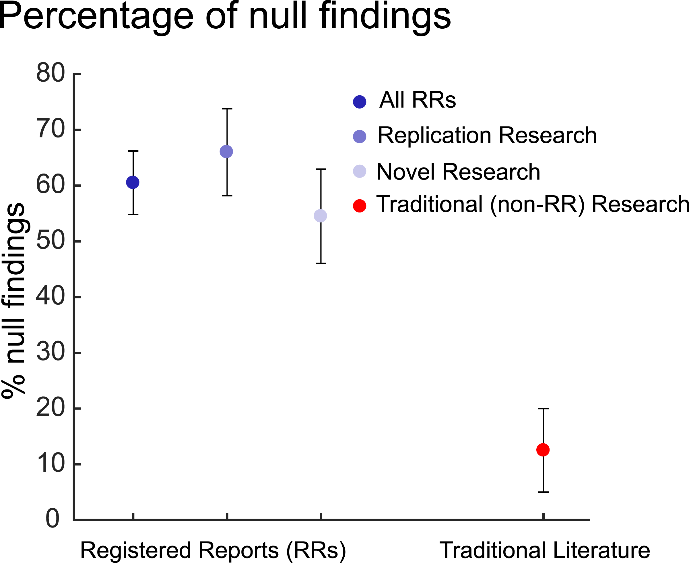
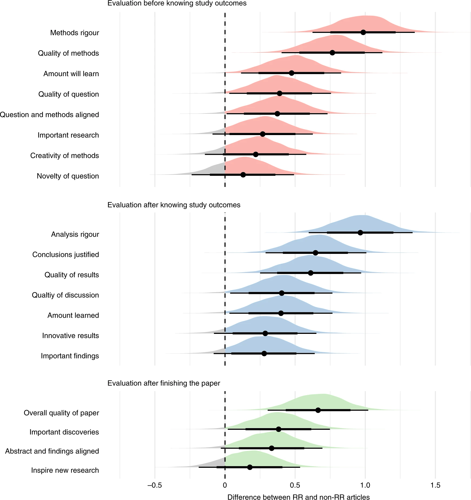
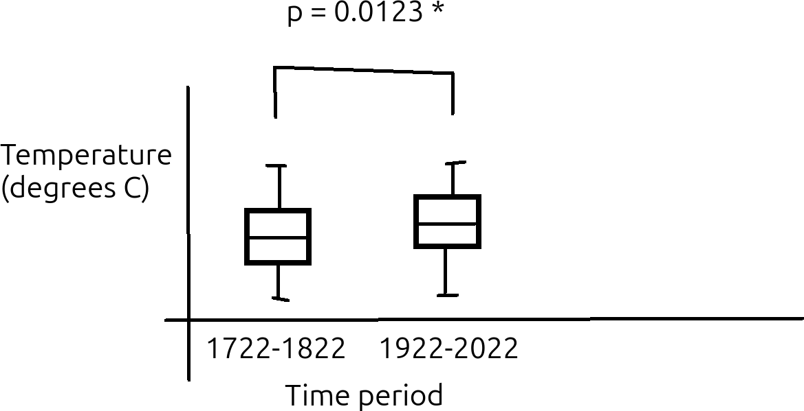

# Registered report

!!! info "Learning outcomes"

    Learners ...

    - understand what a registered report is
    - understand the goal of the learners project
    - create an informal design document

??? question "For teachers"

    Prior:

    - How do you design your research project?
    - How does an ideal program looks like?
    - What is a registered report?

## What is a registered report?



It is research that is peer-reviewed twice,
where the first peer-review takes place before
doing an experiment. The paper before the experiment
(with its hypotheses, methods, ways to draw a conclusion)
is made public upon publication.

## Why use a registered report?

- to make science more reproducible `[Munafò et al., 2017]`
- to report null findings more honestly `[Allen and Mehler, 2019]`
- to do better science `[Soderberg et al., 2021]`

???- question "How are null findings reported more honestly?"

    Figure 3 in `[Allen and Mehler, 2019]` shows this difference,
    between 'traditional' papers and registered reports:

    

    One can see that traditional papers report a null finding
    around four times less often.

???- question "How much better is the science?"

    Figure 3 in `[Soderberg et al., 2021]` shows this difference,
    between 'regular' papers and registered reports:

    

    In this experiment, researches selected 'regular' papers
    and registered reports. The researchers then asked reviewers
    to score papers on the feature shown in the figure,
    where these reviewers were unaware of this experimental variable.

    The values are in the standardized effect size metric, i.e.
    a value of 1.0 means that this value is 1.0 standard deviations higher.

## How does a registered report blend with this course?

A registered report is a more informal form of design,
that is close to what scientists are familiar with,
that fits perfectly well with the phase of the course.

## An example draft registered report

!!! info "An example draft registered report"

    **Research question**

    Have temperatures risen in Uppsala in the period 1722 to 2022?

    **Hypotheses**

    Temperatures remain the same

    **Methods**

    We test our hypothesis by comparing the average yearly temperatures
    at the start and end of our measurement period. To prevent that the
    temperatures are too related, we compare the first third of the
    measurements (i.e. 1722-1822) with the last third of the measurements
    (i.e. 1922-2022) and ignoring the measurements in between.
    We only consider years that are measured completely, to remove seasonal
    effects, which means that the first year (1722) will be ignored.

    We compare these yearly average tempares with a two-sided
    Kolmogorov-Smirnov test (so to avoid assuming an increase/decrease,
    nor a distribution on these average temperatures),
    with the null hypothesis that these distributions are identical.
    We use an alpha value of 0.05. If the measured p value is below the alpha,
    then we reject the null hypothesis that the distributions are identical
    and we conclude that the temperatures have changed.

    **Results**

    

    > Figure: temperature distribution (TODO: replace sketch with real figure)

    **Discussion**

    This is only a correlational study, with no direct link
    between temperature and industrialization being measured.

## Exercises

## Exercise 1: the ideal program

In this course, we will create a Python package for a research project.
This package should create all texts, tables and figures needed for
publication.

What would be your ideal use of this Python package?
That is, how would you **ideally** document the Python code
on how to (re)do the experiment?

???- question "Answer"

    This answer is personal.

    However, I (Richel) think the following use is close to ideal:

    ```python
    import weather
    weather.do_experiment()
    ```

    I use `weather` as the name of the Python package, but any reasonable
    name will do.

    I think this code is ideal, as it is both readable and short.

Do you agree with the answer?

## Exercise 2: output from the ideal program

Assume an ideal program to do the experiment described
at ['an example draft registered report'](#an-example-draft-registered-report).

What should this program produce *at least*?
Can you imagine other things that may be produced that can be
used in the final paper?

???- question "Answer"

    It should at least produce:

    - The p value of the statistical experiment

    It may also produce:

    - A figure showing the two distribution of weather temperatures
      (i.e. the first/earliest third and the last/latest third),
      with an indication if these distributions differ.
      A sketch of this figure is shown in the draft registered report.

## Exercise 3: your draft registered report

In an earlier exercises, you've written down a hypothesis.

In this exercise, expand on this hypothesis and turn it into
a draft registered report. Make the report as minimal as possible:
it should serve as an informal design document,
not be a full journal submission. You are allowed to make things up
if needed.

Save your results in the learners project, in the `learners` folder.

## References

- `[Allen and Mehler, 2019]` Allen, Christopher, and David MA Mehler.
  "Open science challenges, benefits and tips in early career and beyond."
  PLoS biology 17.5 (2019): e3000246.
  [Paper homepage](https://doi.org/10.1371/journal.pbio.3000246)

- `[Chambers, 2019]` Chambers, Chris. "What’s next for registered reports?."
  Nature 573.7773 (2019): 187-189.
  [Comment (i.e. it is not a paper) homepage](https://doi.org/10.1038/d41586-019-02674-6)

- `[Munafò et al., 2017]` Munafò, Marcus R., et al.
  "A manifesto for reproducible science."
  Nature human behaviour 1.1 (2017): 0021.
  [Paper homepage](https://doi.org/10.1038/s41562-016-0021)

- `[Soderberg et al., 2021]` Soderberg, Courtney K., et al.
  "Initial evidence of research quality of registered reports
  compared with the standard publishing model."
  Nature Human Behaviour 5.8 (2021): 990-997.
  [Paper homepage](https://doi.org/10.1038/s41562-021-01142-4)
