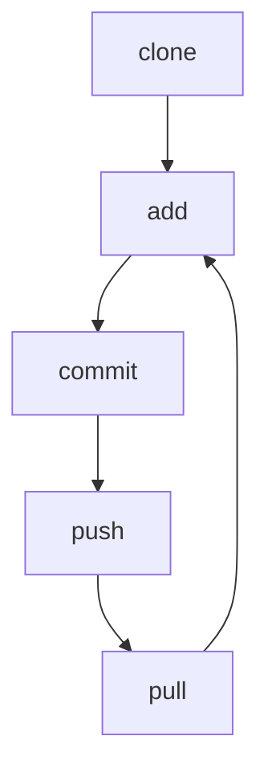

# Version control

!!! info "Learning outcomes"

    Learners ...

    - understand what version control is

??? question "For teachers"

    Prior:

    - What is meant by 'Version control'?
    - What is a version control system?
    - Could you name a tool or program that is a version control system?

## What is version control?

## Why is version control important?

## The file status in version control

File status |Description
------------|---------------------------------------------------
Untracked   |File(s) without version control
Staged      |File(s) on the stage
Committed   |File(s) that are part of a change
Unmodified  |File(s) that are indentical to the online version
Changed     |File(s) that are different than the online version
  
## The verbs in version control

Verb  |Description
------|--------------------------------------------------------
status|Get the status
clone |Download
add   |Stage one or more files
commit|Give a name to the change(s) made to the staged file(s)
push  |Upload
pull  |Update

## The version control workflow

## Exercises

## Exercise 1: clone the learners project

???- question "Prefer a video?"

    Watch the YouTube video
    [How to use VSCode to (git) clone a repository](https://youtu.be/bcYFlBh9WUk?si=H6a2LG6XuIUw1DoC)

## Exercise 2: change a file

