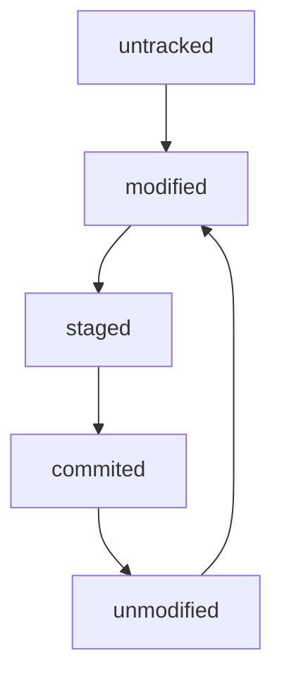
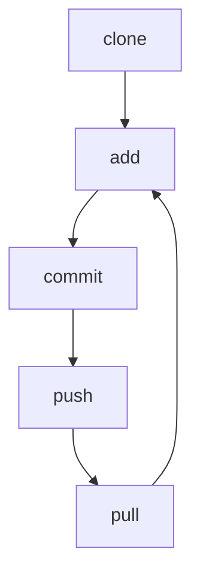
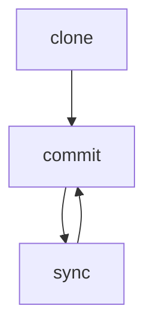
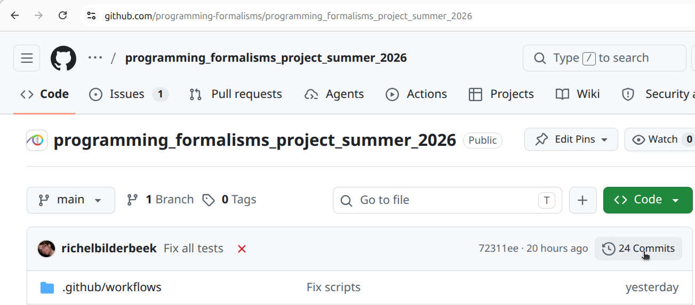
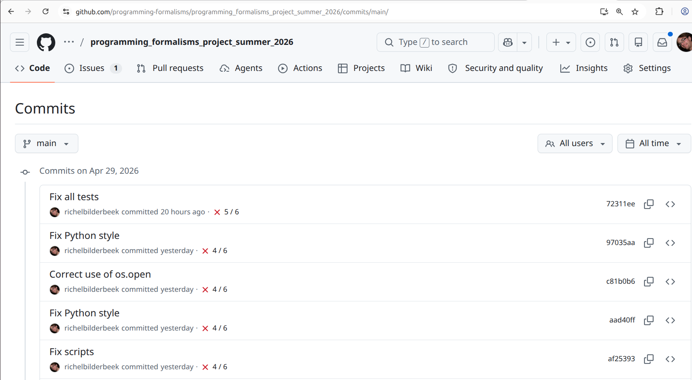
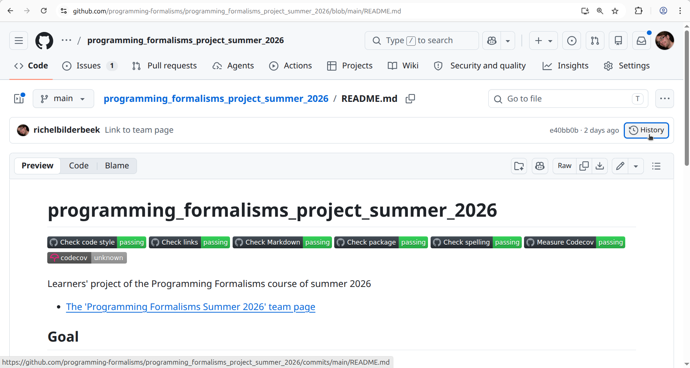
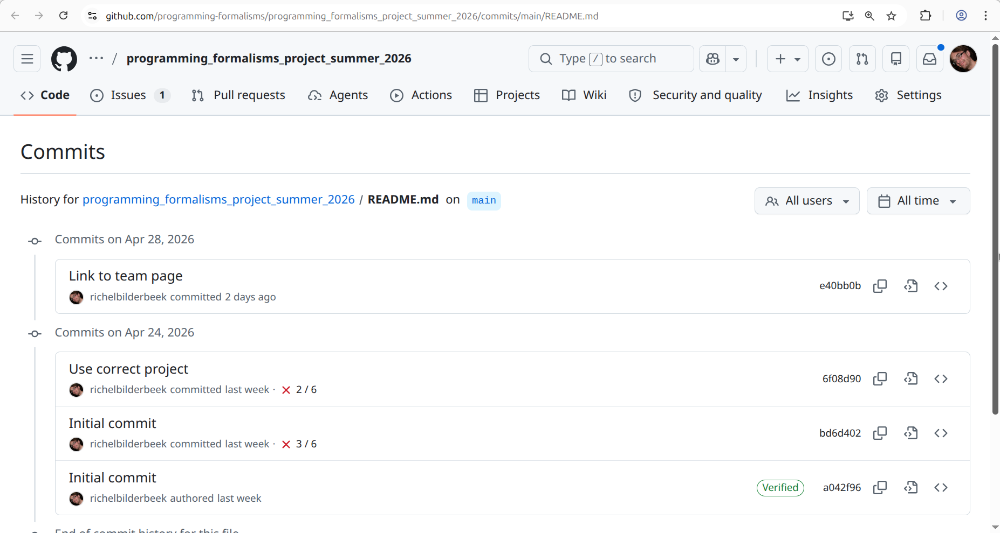
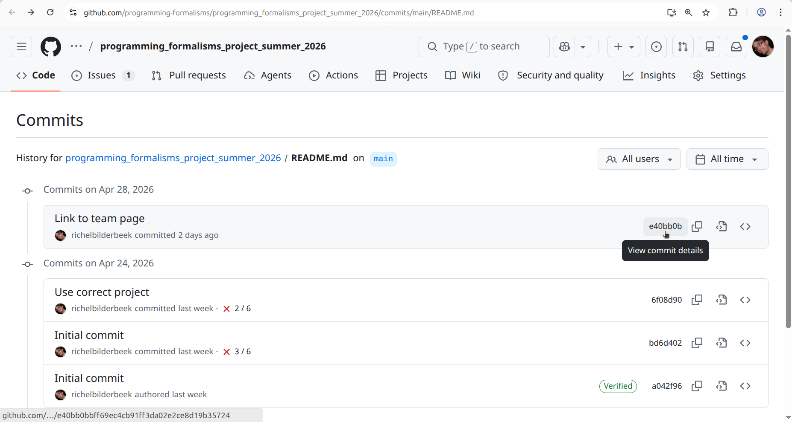
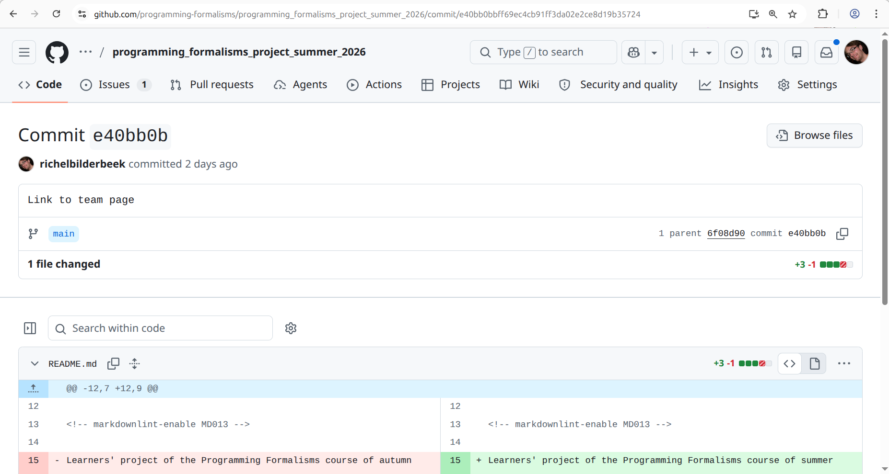

# Version control

!!! info "Learning outcomes"

    Learners ...

    - understand what version control is
    - can see the history of a project
    - experience a problem with the repository web interface
    - understand when to commit

??? question "For teachers"

    Prior:

    - What is meant by 'Version control'?
    - What is a version control system?
    - Could you name a tool or program that is a version control system?
    - What is a commit?
    - What is a commit hash?
    - When should you commit?

## What is version control?

Version control is the tracking of the different states that
your file are in over time.

For example, when you modify a file, it adds this operation
to the history of what happened to your files.
As such a modification **adds** history, this step can also be undone.
Hence, when you use version control, you can undo changes.

This also holds true for file deletion:
deleting a file **adds** history.
Hence, when you use version control,
deleting a file is reversible.

## Why is version control important?

It allows you:

- see the history of your files
- undo every mistake

This allows you to **work together**,
as no collaborator can truly destroy your work.

## What does the literature say?

- Use version control for all production artifacts `[Forsgren et al., 2018]`
- Use a code hosting website with version control
  to track your projects `[Perez-Riverol et al., 2016]`. The articles
  recommends GitHub to do so.
- In machine learning research, use versioning for data,
  the machine learning model, its configuration and
  its training scripts `[Serban et al., 2020]`
- Use code versioning `[Visser et al., 2016]`
- As a best practice in scientific computing, use a version control system `[Wilson et al., 2014]`
- As a good enough practice in scientific computing, use a version control system `[Wilson et al., 2017]`

## The file status in version control

From a version control perspective,
a file one of these Three Stages `[Chacon and Straub, 2014]` (chapter 1.3,
paragraph 'The Three Stages'):

File status |Description
------------|---------------------------------------------------
Modified    |File(s) that are different than the online version
Staged      |File(s) on the stage
Committed   |File(s) that are part of a change

There are two more statuses:

File status |Description
------------|---------------------------------------------------
Untracked   |File(s) without version control
Unmodified  |File(s) that are identical to the online version

Here is the cycle of these file statuses:


  
## The verbs in version control

Verb  |Description
------|--------------------------------------------------------
status|Get the status
clone |Download
add   |Stage one or more files
commit|Give a name to the change(s) made to the staged file(s)
push  |Upload
pull  |Update

Here is the cycle of these verbs:




VS Code simplifies this somewhat to this:



## Exercises

## Exercise 1: view the learners project history from the web interface

The learners project has a history.
Search the web interface on how to view it.
Tip: look for the word 'Commits'.
View it using the web interface.

???- question "Where is it?"

    It is at the top-right side:

    

???- question "How does it look like?"

    It will look similar to this:

    

Now we have seen a commit history, how would you define what a commit is?

???- question "Answer"

    The answer is similar to this definition:

    A commit is one or more changes to one or more files
    that has a short message that describes the change(s).

Judge the commit messages.
What would be your rule for a good commit message?

???- question "Answer"

    This is not an easy answer, as the academic literature is divided.

    However, a common theme is that a good commit messages describes:

    - What: the summary of the code change
    - Why: the motivation/reason behind it

    Then recommended is:

    - A good commit message should have both `[Li and Ahmed, 2023]`
    - A good commit message can be either `[Tian et al, 2022]`

    Would I (Richel) come up with a rule, it would be:
    a commit message should match
    what you would say to a human to help him/her understand the reason of
    the change in a place where communication is hard (e.g. a place with
    loud music, so that you need to yell, while having a sore throat)

## Exercise 2: change a file using the GitHub web interface

Change a file you created in the `learners` folder (if there is none,
create one).

View the history of the file.

???- question "Where do I need to click?"

    Click at the top-right, on the 'History' button:

    

???- question "How does it look like?"

    You will see something similar to this:

    

Assume you want to undo/revert the last commit.
To do so (without going into detail)
you will need the *commit hash*,
i.e. the unique ID for your commit.
Find and click on the latest commit hash
of your file

???- question "Where do I need to click?"

    Click at the top-right, at the hexadecimal number.

    

What do you see?

???- question "Answer"

    You see the commit details.

    

In which scenario is it useful to see the commit details?

???- question "Answer"

    When you want to know what were the exact changes
    of a certain commit.

## Exercise 3: change a file twice at the same time

Imagine two people editing the same file using the web interface.

The content of the file, before editing, was:

```text
Once upon a time ...
```

The first person intends to commit this text:

```text
Once upon a time, there was a prince.
```

The second person intends to commit this text:

```text
Once upon a time ... ... and they lived happily every after.
```

The first person then commits. Then the second person commits.

What would you say **should** happen?

???- question "Answer"

    My feeling is that the changes should be merged to:

    ```text
    Once upon a time, there was a prince. ... and they lived happily ever after.
    ```

Test this. What happens?

???- question "Answer"

    The final text will be the text submitted by the second person.

Why is this a problem?

???- question "Answer"

    Because it completely ignored the work of the first person.

This problem is solved better when using an
[integrated development environment](../ide/README.md)
or when using the version control system locally.

Let's say we accept that this problem exists.
How do we reduce the problem of this?

???- question "Answer"

    By committing often.

    The manta goes:

    > Commit early, commit often


## References

- `[Chacon and Straub, 2014]` Chacon, Scott, and Ben Straub.
  Pro git. Springer Nature, 2014.
  [Book homepage](https://git-scm.com/book/en/v2).

- `[Forsgren et al., 2018]` Forsgren, Nicole, Jez Humble, and Gene Kim.
  Accelerate: The science of lean software and devops:
  Building and scaling high performing technology organizations.
  IT Revolution, 2018.

- `[Perez-Riverol et al., 2016]`
  Perez-Riverol, Yasset, et al. "Ten simple rules for taking advantage
  of Git and GitHub." PLoS computational biology 12.7 (2016): e1004947.
  [Paper homepage](https://doi.org/10.1371/journal.pcbi.1004947)

- `[Serban et al., 2020]` Serban, Alex, et al.
  "Adoption and effects of software engineering best practices
  in machine learning." Proceedings of the 14th ACM/IEEE
  International Symposium on Empirical Software Engineering and
  Measurement (ESEM). 2020.
  [Paper homepage](https://doi.org/10.1145/3382494.3410681)

- `[Visser et al., 2016]` Visser, Joost, et al.
  Building software teams: Ten best practices for
  effective software development. " O'Reilly Media, Inc.", 2016.

- `[Wilson et al., 2014]` Wilson, Greg, et al.
  "Best practices for scientific computing."
  PLoS biology 12.1 (2014): e1001745.
  [Paper homepage](https://doi.org/10.1371/journal.pbio.1001745)

- `[Wilson et al., 2017]` Wilson, Greg, et al.
  "Good enough practices in scientific computing."
  PLoS computational biology 13.6 (2017): e1005510.
  [Paper homepage](https://doi.org/10.1371/journal.pcbi.1005510)
