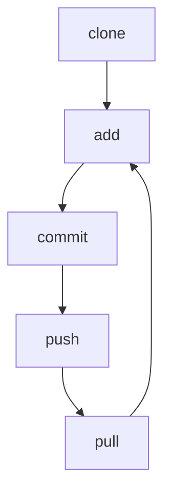

# Version control

!!! info "Learning outcomes"

    Learners ...

    - understand what version control is

??? question "For teachers"

    Prior:

    - What is meant by 'Version control'?
    - What is a version control system?
    - Could you name a tool or program that is a version control system?

## What is version control?

Version control is the tracking of the different states that
your file are in over time.

For example, when you modify a file, it adds this operation
to the history of what happened to your files.
As such a modification **adds** history, this step can also be undone.
Hence, when you use version control, you can undo changes.

This also holds true for file deletion:
deleting a file **adds** history.
Hence, when you use version control,
deleting a file is reversible.

## Why is version control important?

It allows you:

- see the history of your files
- undo every mistake

This allows you to **work together**,
as no collaborator can truely destroy your work.

## What does the literature say?

- Use version control for all production artifacts `[Forsgren et al., 2018]`
- Use a code hosting website with version control
  to track your projects `[Perez-Riverol et al., 2016]`. The articles
  recommends GitHub to do so.
- In machine learning research, use versioning for data,
  the machine learning model, its configuration and
  its training scripts `[Serban et al., 2020]`
- Use code versioning `[Visser et al., 2016]`
- As a best practice in scientific computing, use a version control system `[Wilson et al., 2014]`
- As a good enough practice in scientific computing, use a version control system `[Wilson et al., 2017]`

## The file status in version control

File status |Description
------------|---------------------------------------------------
Untracked   |File(s) without version control
Staged      |File(s) on the stage
Committed   |File(s) that are part of a change
Unmodified  |File(s) that are identical to the online version
Changed     |File(s) that are different than the online version
  
## The verbs in version control

Verb  |Description
------|--------------------------------------------------------
status|Get the status
clone |Download
add   |Stage one or more files
commit|Give a name to the change(s) made to the staged file(s)
push  |Upload
pull  |Update

## The version control workflow

Git based stages                                                      |VS Code stages
----------------------------------------------------------------------|----------------------------------------------------------------------
`mermaid graph TB; clone --> add --> commit --> push --> pull --> add`|`mermaid graph TB; clone --> commit --> sync --> commit`

Git based:



VS Code:

```
graph TB
  clone --> commit --> sync --> commit
```

## Exercises

## Exercise 1: view the learners project history from the GitHub web interface

## Exercise 2: change a file from the GitHub web interface

## Exercise 3: clone the learners project from VS Code

???- question "Prefer a video?"

    Watch the YouTube video
    [How to use VSCode to (git) clone a repository](https://youtu.be/bcYFlBh9WUk?si=H6a2LG6XuIUw1DoC)

## Exercise 4: view the learners project history from VS Code

## Exercise 5: change a file from VS Code

## References

- `[Forsgren et al., 2018]` Forsgren, Nicole, Jez Humble, and Gene Kim.
  Accelerate: The science of lean software and devops:
  Building and scaling high performing technology organizations.
  IT Revolution, 2018.

- `[Perez-Riverol et al., 2016]`
  Perez-Riverol, Yasset, et al. "Ten simple rules for taking advantage
  of Git and GitHub." PLoS computational biology 12.7 (2016): e1004947.
  [Paper homepage](https://doi.org/10.1371/journal.pcbi.1004947)

- `[Serban et al., 2020]` Serban, Alex, et al.
  "Adoption and effects of software engineering best practices
  in machine learning." Proceedings of the 14th ACM/IEEE
  International Symposium on Empirical Software Engineering and
  Measurement (ESEM). 2020.
  [Paper homepage](https://doi.org/10.1145/3382494.3410681)

- `[Visser et al., 2016]` Visser, Joost, et al.
  Building software teams: Ten best practices for
  effective software development. " O'Reilly Media, Inc.", 2016.

- `[Wilson et al., 2014]` Wilson, Greg, et al.
  "Best practices for scientific computing."
  PLoS biology 12.1 (2014): e1001745.
  [Paper homepage](https://doi.org/10.1371/journal.pbio.1001745)

- `[Wilson et al., 2017]` Wilson, Greg, et al.
  "Good enough practices in scientific computing."
  PLoS computational biology 13.6 (2017): e1005510.
  [Paper homepage](https://doi.org/10.1371/journal.pcbi.1005510)
