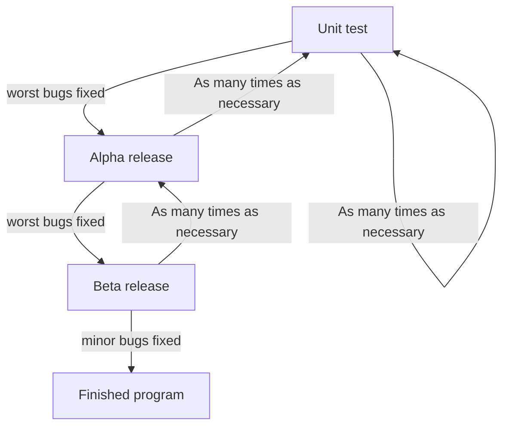

# Programming formalisms — Shared document Oct 2025

- Zoom: `[removed]`
    - Passcode: `[removed]`

- Course material:
    - <https://uppmax.github.io/programming_formalisms>
- Shared project:
    - <https://github.com/programming-formalisms/programming_formalisms_project_autumn_2025>

## Day 1
## Introduction

## What do you develop for?

- Björn: Analysis, modelling
- Richel: analysis of data (Python and R), tools for process of data, workflows, modelling/simulation
    - theoretical biology, e.g. C++
    - phylogenetics, e.g. the babette and pirouette R packages
    - immunology
- Lorena: analysis of data, workflows, tools for processing data (simple ones ...)
- Anna-Lena: analysis of data, modelling
- Alice: analysis of data, modelling
- Carlos: Analysis of data, workflows and modelling
- Cibi Sundaram : data analysis, statistics, simulations
    - applied nuclear physics at UU
    - python, SERPENT, MCNP
    - mainly working with simulation data and data from reactors
- Hyewon: language modeling and statistical analysis

## Markdown tests
### Example by Sven
**Bold** and *emphasized*.

A|B|C
-|-|-
1|x|y
2|m|n

## UML tests (optional)
### Example

## Retrospect

### What helped us learn (let us move forward)

- A: Real examples to explain the the theory. Small size groups
- A:
- A:Real-life examples and practicals
- A:
- A:Examples and direct explanations, Exercises
- A:
- A:Real examples and exercises/explanations
- A:
- A:

### What stopped us from learning (What held us back)

- A: Technical issues with git/VS, having to check own VS and shared zoom window at the same time (on one screen), never used VS before, too little use of terminal. Assigments not discussed together/explained too well before delving into them.
- A:Unfamiliar with VSCode, confusing git intro because everyone tried to commit at the same time
- A:
- A:
- A:I appreciate the industry examples but sometimes I find it hard to translate it into the academic context. x2 the unfamiliarity with VS Code. I would rather see the raw `git` commands first rather than getting lost in the many options of the graphical interphase.
- A:
- A: Sometimes the assignements are unclear (most of the time they are though)
- A:Too fast on the first git commit as I had to create a new branch cause someone had already commited and pushed changes
- A: Some examples/concepts are clear for SWE but when I applied to AI/ML/stats projects it is not as inuitive
- A: Sometimes the pace is too fast in the small groups

### What could we do to improve learning (What can we invent)

- A: State clearly what the assigment is before letting the students delve into it, use terminal instead of VS code.Otherwise, explain the VS interface at least once before using it. A bit confusing as well with the GitHub notes instead of more structured course material - like slides.
- A:Explain the structure of the repo before hand. I think the people that ended up in the "advanced" git session were not explained that there was a "learners" folder and that became confusing later on. 5
- A: 
- A:Sometimes it is difficult to follow because people are on different levels, would need better explanation. Intro to VSCode, not everyone is familiar
- A:
- A:

## What will we do(Act) [Teachers only]

- Lars clearify excersises
- Time management, make morning session more hands on less theory
- Change from twice a year to only spring. to allow for more prep time for teachers.
- Define clear roles before.

## Confidence Report: (10min)

Give you confidence levels of the following statements,
using this scale:

- 0: I don't know even what this is about ...?
- 1: I have no confidence I can do this
- 2: I have low confidence I can do this
- 3: I have some confidence I can do this
- 4: I have good confidence I can do this
- 5: I absolutely can do this!

 I can connect to the course repo:

- A: 5
- A: 5
- A:
- A:
- A:5
- A:
- A:

I can find the needs/buissnes requirments:

- A: 1
- A: 3
- A: 3
- A: 3
- A: 4
- A: 3
- A: 2
- A: 4
- A: 2
- A: 3

I can do a simple FMEA:

- A: 2
- A: 2
- A:2
- A:2
- A:
- A:
- A:

I know what FMEA stands for:

- A: 0
- A: 4
- A:4
- A:4
- A:
- A:
- A:

I can make an issue in the project:

- A: 5
- A: 5
- A:5
- A: 5
- A:
- A:
- A:

I know basic Git:

- A: 5
- A: 4
- A:5
- A:5
- A:
- A:
- A:

I know what a Requirement is:

- A: 5
- A: 5
- A: 3
- A: 5
- A:
- A:
- A:

I know how to write a formal requiremnts documentation:

- A: 3
- A: 4
- A: 3
- A: 3
- A:
- A:
- A:

I know how a remote repo works:	

- A: 5
- A: 5
- A: 4
- A: 4
- A:
- A:
- A:

I know why we specify requirments:

- A: 4
- A: 5
- A: 4
- A: 5
- A:
- A:
- A:

I know the purpose of formalism in Computer Science:

- A: 3
- A: 4
- A: 3
- A: 3
- A:
- A:
- A:

I know what are the outcomes of a program:

- A: 3
- A: 4
- A:
- A:
- A:
- A:
- A:

I know what are the steps of development:

- A: 4
- A: 3
- A:
- A:
- A:
- A:
- A:

I know what is the Software development life cycle:

- A: 3
- A: 3
- A:
- A:
- A:
- A:
- A:

I know what is the importance of Documentation:

- A: 5
- A: 5
- A:
- A:
- A:
- A:
- A:

I know what is the different kinds of documentation:

- A: 3
- A: 4
- A:
- A:
- A:
- A:
- A:
