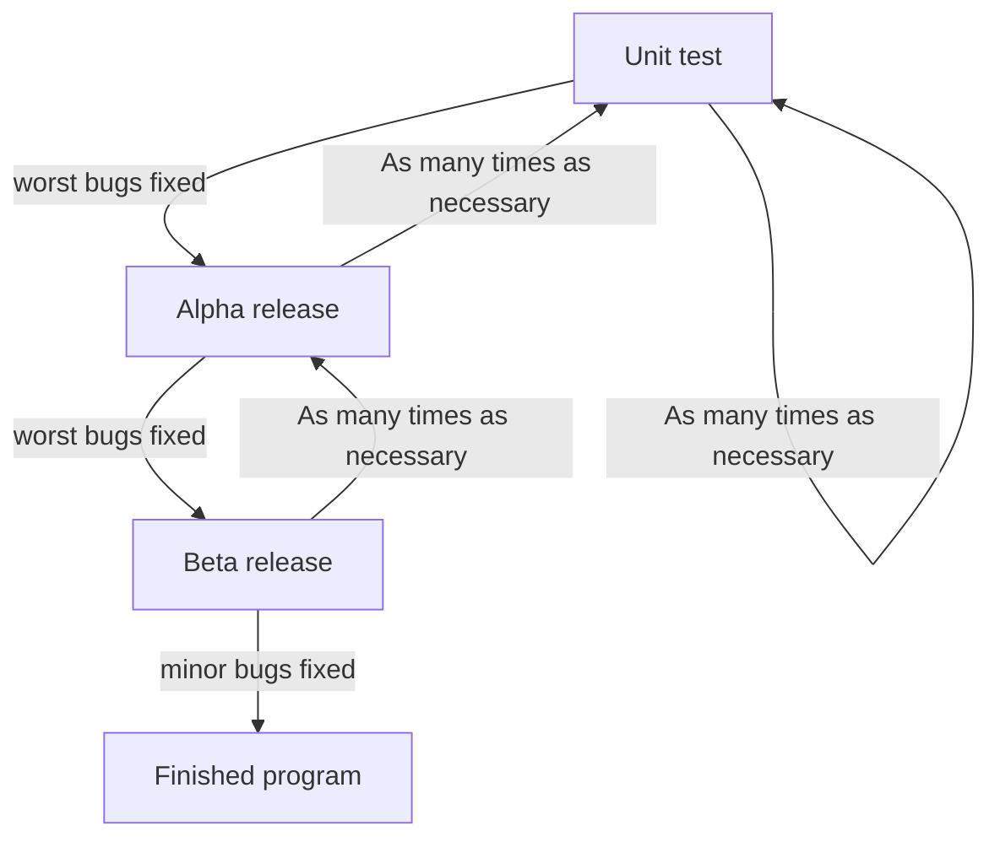

# Programming formalisms — Shared document Oct 2025

- Zoom: `[removed]`
    - Passcode: `[removed]`

- Course material:
    - <https://uppmax.github.io/programming_formalisms>
- Shared project:
    - <https://github.com/programming-formalisms/programming_formalisms_project_autumn_2025>

## Day 1
### Introduction

#### What do you develop for?

- Björn: Analysis, modelling
- Richel: analysis of data (Python and R), tools for process of data, workflows, modelling/simulation
    - theoretical biology, e.g. C++
    - phylogenetics, e.g. the babette and pirouette R packages
    - immunology
- Lorena: analysis of data, workflows, tools for processing data (simple ones ...)
- Anna-Lena: analysis of data, modelling
- Alice: analysis of data, modelling
- Carlos: Analysis of data, workflows and modelling
- Cibi Sundaram : data analysis, statistics, simulations
    - applied nuclear physics at UU
    - python, SERPENT, MCNP
    - mainly working with simulation data and data from reactors
- Hyewon: language modeling and statistical analysis

#### Markdown tests
##### Example by Sven
**Bold** and *emphasized*.

A|B|C
-|-|-
1|x|y
2|m|n

#### UML tests (optional)
##### Example

## 

## day 3
### Retrospect

##### What helped us learn (let us move forward)

- A:
- A:The live-examples and the exercises were very helpful. I appreciated the example from big to small programming. (I also appreciate the breaks!)
- A:
- A: I was happy with the pair programming concepts and the last group exercises.
- A: Live examples and pair programming very funny !
- A: pair exercises and live examples
- A:
- A:Exercises in pairs
- A:Thorough explanation of TDD method to create the weather code
- A:
- A:Good way to learn TDD through Pair programming!
- A:Today's session had more pratical exercises which helped us learn hands-on! Good job to the instructors!

##### What stopped us from learning (What held us back)

- A:
- A: Nothing to declare.
- A:
- A: I can't think of anything 
- A: Still some issues with VSCode, but it worked in the end. Time for group exercises and off topic questions were a bit short. 
- A: Technical issue in the morning with Git website rendering - don't know how that could be avoided though
- A: Using GitHub web interface and git commands and VS code, I think we should agree on one single method, or at least mostly use one
- A:
- A: Maybe some more time with the group exercises would be appreciated!
- A:
- A:
- A:

##### What could we do to improve learning (What can we invent)

- A: Maybe bit more on how to integrate these in our discipline specific programming would be appreciated, like some of us work on data analysis/exploration where the data might not be a spefic value but a dataframe or numpy array, how do we integrate the assert to such cases? Also, most of us work involves data cleaning and others, but how do we check if the data is cleaned or not?
- A:
- A: Maybe some more clarity in stating the purpose/methods to be used in the morning exercises - but it might as well just be me not functioning on Monday morning 
- A:
- A: Can't think of anything
- A:
- A: Was a good session!
- A:
- A:
- A:
- A: Good session overall!
- A:

#### What will we do(Act) [Teachers only]
### Confidence Report: (maximum 10min) You can leave when you are done.

Give you confidence levels of the following statements,
using this scale:

- 0: I don't know even what this is about ...?
- 1: I have no confidence I can do this
- 2: I have low confidence I can do this
- 3: I have some confidence I can do this
- 4: I have good confidence I can do this
- 5: I absolutely can do this!

I can create, switch and delete a git branch locally

    - A: 5
    - A: 5
    - A:5
    - A: 5
    - A: 5
    - A:
    - A:

I can do Pull requests

    - A: 5
    - A: 5
    - A: 5
    - A:5
    - A:5
    - A:
    - A:

I can do a code review (in GitHub)

    - A: 5
    - A: 4
    - A: 4
    - A:
    - A:4
    - A:
    - A:4

I can explain and evaluate the usefulness of branches

    - A: 5
    - A: 5
    - A: 4
    - A:4
    - A:
    - A:4
    - A:

I can manage merge conflicts locally

    - A: 5
    - A:
    - A: 5
    - A: 3
    - A:5
    - A:
    - A:4

I can manage merge conflicts on GitHub

    - A: 5
    - A: 4
    - A: 4
    - A:
    - A:5
    - A:
    - A:4

I can merge locally

    - A: 5
    - A: 4
    - A: 4
    - A:
    - A:5
    - A:4
    - A:

I can merge on GitHub

    - A: 5
    - A:
    - A: 4
    - A: 4
    - A:5
    - A:
    - A:4
    
I feel confidence and motivation in making my code open-source

    - A: 5
    - A: 4
    - A: 5
    - A:
    - A:5
    - A:5
    - A:
    
I have an idea about how to contribute as an external contributor

    - A: 4
    - A: 5
    - A: 4
    - A:
    - A:4
    - A:4
    - A:
    
I understand when a forked workflow is recommended

    - A: 5
    - A: 5
    - A:4
    - A: 4
    - A:4
    - A:
    - A:

I understand how to do TDD at a larger scale

    - A: 4
    - A: 4
    - A:4
    - A: 2
    - A:5
    - A:
    - A:

I understand why pair programming is important

    - A: 5
    - A: 5
    - A: 4
    - A:5
    - A:
    - A:
    - A:4
    
I understand what good pair programming looks like

    - A: 4
    - A: 4
    - A: 4
    - A:
    - A:3
    - A:4
    - A:
    
##
## day 4

What helped us learn (let us move forward) 2 min

    - A: As usual, group exercises
    - A: The possibility to ask questions and get extensive answers. Thank you for your patience!
    - A: 
    - A:Group work, practical exercises
    - A: 
    - A: Continous Integration and group work
    - A: Nice group work.
    - A: The team exercises, in particular for writing clases. The session on automated testing workflows within GitHub (and locally) were very interesting.
    - A: 
    - A:
    - A: the testing exercise was good! Finding out the options to automate the testing was nice.
    - A: Ruff - was a good extension
    
       
What stopped us from learning (What held us back) 2 min¶

    - A: Maybe the schedule was a bit messy today, I would gladly have had class design before OOD
    - A:
    - A: I found some text, in particular the Object-oriented programming section, hard to read because of typos. I wish it wasn't so much like bullet points. It often asks us about a concept and only give bullet points but we have to go to some alternative reading material to find the answer. Many concepts were remain a bit abstract even after the explanations...I also got lost with many exercises because they were a bit vague or use terms before getting explanations about it (e.g., refactoring)
    - A: Maybe some more clarifications about object oriented programming would have been helpful. Less theory and more examples.
    - A:
    - A: assignments were not always clear, confused about what we should actually do...
    - A: a bit confused about the reverseb classroom situtation, since we didn't have time to read up upon it before (and text didn't alwyas provide the answers that were asked there)
    - A:
    - A: Most concepts introduced today was a hard to intrepret in our discipline specific examples
    - A: The concepts of object and class were a little hard.
    - A: Time, short answers, no too deep explainations and typos in documentation.
    -A: 
    - A: Unit test lessons were unclear
    - A: Little time to complete all the exercises, would have appreciated less to do but with more time to focus
    
 
    
What could we do to improve learning (What can we invent) 2 min¶

    - A: I think in general it would be beneficial to focus on easier tasks and not too much on the weather exercise, with more discussion. Baby steps and more time to digest.
    - A:
    - A: Better material with less bullet points and more structure and explanations would help
    - A: As much as I appreciate working with teams, sometimes I wish I could read on my own without other people around. I find it distracting because I feel pressure to finish faster. I prefer when we get examples explained by the teacher before diving into the exercises.
    - A: more explanation of terms and basic "vocabulary", more straigth forward assignments, clearer instructions
    - A:
    - A: More examples before working on our own, sometimes it is hard to figure out everything on your own
    - A:
    - A: Also, sometimes the concepts are too simple and feels difficult to relate to our discipline, maybe more examples to show how it looks would be appreciated
    - A: Maybe a solid example/exercises on object & class diagrams would be good
    - A:
    - A: More self-contained examples with answers that we can revisit later on. Add more links to external videos on hands-on coding for every or most concepts.
    
What will we do(Act) [Teachers only]¶
-Lars Imporve learning material especially eplanatory sections of the excercise, more theory in the material.
-Lars Introduce concepts both in material and in "lecture"
-Lars don't be afraid to lift things to plenum if it seems to be of general intrest.
-Lars Ask for spelling correction, spell checker not enough (Dyslexia issue) (for example in places where markdown formatting may make the text unreadable for the lexical)
-Lars Add more and deeper text, discipline specific examples, how to apply in real world. (Extend and rework the examples on class design(weather staion example) Show how the object design corresponds to the actual weatherstation example and how to arrive at those conclusions. Show where each concept ties in to the example not just the finnished product but how I think which principles I apply when I do the objects.

## Confidence Report: (maximum 10min) You can leave when you are done.

Give you confidence levels of the following statements,
using this scale:

- 0: I don't know even what this is about ...?
- 1: I have no confidence I can do this
- 2: I have low confidence I can do this
- 3: I have some confidence I can do this
- 4: I have good confidence I can do this
- 5: I absolutely can do this!

I understand why Continuous Integration is useful

    - A: 5
    - A: 5
    - A: 5
    - A:
    - A: 3
    - A:
    - A:
    - A:
    - A:
    - A:
    - A:
    - A: 4

I can find the error messages given by the Continuous Integration tests

    - A: 5
    - A: 5
    - A: 5
    - A:
    - A:4
    - A:
    - A:
    - A:
    - A:
    - A:
    - A:
    - A: 5

I can (choose to) write code that is Good Enough

    - A: 4
    - A: 3
    - A: 4
    - A:
    - A:
    - A:3
    - A:
    - A:
    - A:
    - A:
    - A: 5
    - A:

I understand what a Semantic gap is?

    - A: 4
    - A: 1
    - A: 3
    - A:
    - A:1
    - A:
    - A:
    - A:
    - A:
    - A: 3
    - A:
    - A:
 

I Comprehend the principles of object-oriented development, such as information hiding

    - A: 5
    - A:
    - A: 4
    - A:
    - A: 3
    - A: 3
    - A:
    - A:2
    - A:
    - A:
    - A:
    - A:
 
I know what modular programming is

    - A: 3
    - A: 5
    - A: 3
    - A:
    - A: 3
    - A:
    - A:
    - A:3
    - A:
    - A:
    - A:
    - A:

I have an idea when use classes is worth it (and when not)

    - A: 3
    - A:
    - A: 4
    - A: 3
    - A: 4
    - A:
    - A:2
    - A:
    - A:
    - A:
    - A:
    - A:

I can give some features of good class design

    - A: 4
    - A: 2
    - A:
    - A:
    - A: 2
    - A:
    - A: 2
    - A:
    - A:2
    - A:
    - A:
    - A:
 
I can write a simple class

    - A: 4
    - A: 3
    - A:
    - A:
    - A:3
    - A:
    - A: 3
    - A:
    - A:
    - A: 4
    - A:
    - A:
    
I understand the type of relation 'composition'

    - A: 3
    - A:
    - A: 2
    - A:
    - A:2
    - A:
    - A: 2
    - A:
    - A:
    - A: 1
    - A:
    - A:
 
Iterative refactoring

    - A: 5
    - A: 2
    - A:
    - A:2
    - A:
    - A: 1
    - A:
    - A: 3
    - A:
    - A:
    - A:
    - A: 
 
Learn about common interfaces, protocols, and their role in modular programming.

    - A: 3
    - A:
    - A:
    - A: 1
    - A:
    - A:  1
    - A:
    - A:1
    - A:
    - A: 1
    - A:
    - A:
 
Learn the definition and characteristics of an object, 

    - A: 5
    - A:
    - A: 3
    - A:
    - A: 3
    - A:
    - A: 4 (after intensive discussion with Lars)
    - A:
    - A:2
    - A:
    - A:
    - A:
 
Recognize and address tight coupling in code to improve modularity.

    - A: 3
    - A:
    - A:
    - A: 2
    - A:
    - A: 3
    - A:
    - A: 1
    - A:2
    - A:
    - A:
    - A: 
 
Recognize the importance of relationships between classes including coposition and association

    - A: 4
    - A:
    - A:
    - A: 1
    - A: 1
    - A:
    - A: 2
    - A:2
    - A:
    - A:
    - A:
    - A:
 
Understand the benefits of object-oriented development

    - A: 4
    - A:
    - A: 3
    - A:
    - A:
    - A: 4
    - A:
    - A:2
    - A:
    - A:
    - A:
    - A: 
 
Understand the concept of code smells and design smells

    - A: 5
    - A: 4
    - A:
    - A: 3
    - A:
    - A: 2
    - A:
    - A:
    - A:2
    - A:
    - A:
    - A:
 
Understand the definition and structure of a class as a collection of objects 

    - A: 5
    - A:
    - A:
    - A: 2
    - A:
    - A: 4
    - A: 2
    - A:
    - A:
    - A:2
    - A:
    - A:
    
    
          
   
