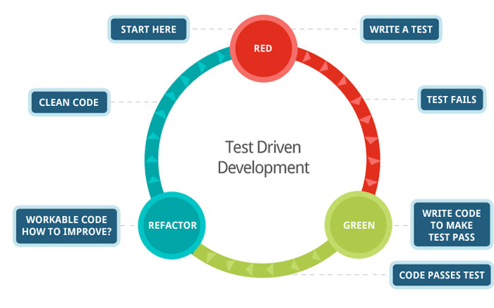
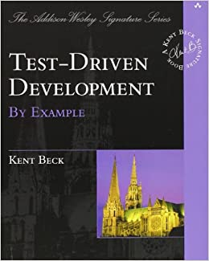
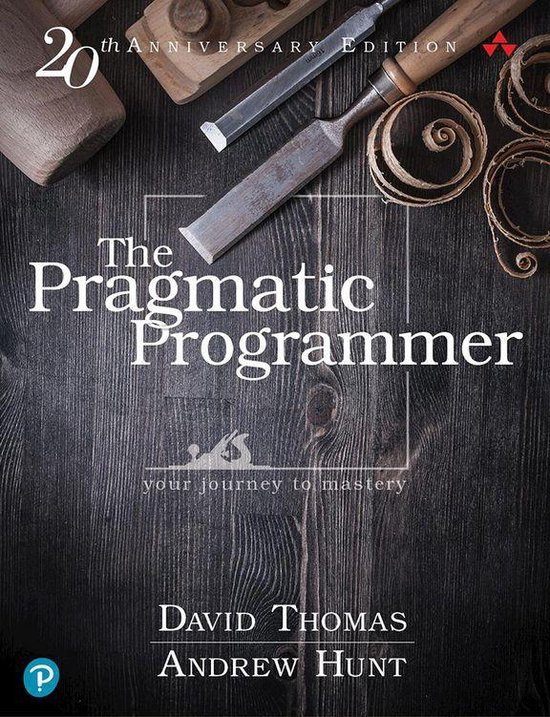

---
tags:
  - TDD
  - Test-driven development
  - is_zero
  - is_even
  - is_odd
  - is_probability
---

# TDD

!!!- info "Learning objectives"

    - Understand what TDD is
    - Be able to do TDD

???- question "For teachers"

    Video durations:

    - Lecture: 4:48
    - `is_zero`: 8:19

    Prerequisites are:

    - Learners have practiced pair programming
    - Learners can do the git basic workflow on `master`

    Teaching goals are:

    - Learners understand what TDD is
    - Learners understand why TDD is important
    - Learners have done multiple TDD cycles

    Teaching form used:

    - Pair programming
    - `master` branch

    Prior knowledge questions:

    - How do you grow/develop your code?
    - How do others grow/develop their code?
    - Why would it be important to have a formal way to grow/develop your code?
    - When have you tested your code enough? Is it ever enough?

    Lesson plan:

    ```mermaid
    gantt
      title Lesson plan TDD 1
      dateFormat X
      axisFormat %s
      Pair programming: done, 0, 30
      Theory: extra, 30, 45
    ```

    ```mermaid
    gantt
      title Lesson plan TDD 2
      dateFormat X
      axisFormat %s
      Exercise 1: crit, exercise_1, 0, 20s
      Feedback 1: feedback_1, after exercise_1, 10s
      Retrospect: crit, 30, 15s
    ```

## Why?

???- question "Prefer this lecture as video?"

    See it [on YouTube](https://youtu.be/gw_4jVrkDok?si=PU74XKfw9xQGwHn_).

The code of a project changes.
You want to change code methodically
in a time efficient way.

## What is TDD?

Test-driven development (TDD) is a systematic way to grow code,
used in academia and industry. It works `[Martin, 2011]`!


> A TDD developer

When doing TDD, you do TDD cycles:



> The TDD cycle

The cycle has three phases:

- Red: you write a test that fails
- Green: you make the test pass
- Blue/refactor: you refactor the code, you clean up the code,
  you push the code

Every cycle adds a (facet of) a new feature,
so it is a way to add features.
Alternatively, the test that fails can be an exposed bug.
In this case, there is no feature added,
but a bug is removed permanently instead.

The TDD cycles end when you cannot break your function anymore `[Beck, 2022][Langr, 2013]`.

## Features of TDD

Advantages of TDD are:

- TDD makes developers more productive `[Erdogmus & Morisio, 2005]`
- TDD increases quality of the code
  `[Erdogmus & Morisio, 2005][Alkaoud & Walcott, 2018][Janzen & Saiedian, 2006]`
    - There are plenty of costly programming mistakes documented!
- TDD helps shape the project architecture `[Mayr, 2005]`
- TDD helps better modularisation `[Madeyski et al., 2010]`

Developers do really do this `[Beck, 2022][Langr, 2013]`, even
though TDD takes longer (but note `[Uncle Bob, 2024]` for an example that
it is faster, but feels slower):

Study                       | Extra time | Effect
----------------------------|------------|-------------------------------
`[George & Williams, 2004]` | 16%        | 18% more black-box tests pass
`[Bhat & Nagappan, 2006]`   | 15%        | 2x higher code quality
`[Nagappan et al., 2008]`   | 15-35%     | 40%-90% less defects

We will discuss formal testing later, but now note that
testing is not about finding bugs `[Thomas & Hunt, 2019, tip 66]`,
instead a test is the first user of your code `[Thomas & Hunt, 2019, tip 67]`.

## Express yourself in Python

This course does not teach Python.
To save time, here are English statements and their
Python (more-or-less) equivalent.

### I assume `my_function` to have documentation

```python
assert my_function.__doc__
```

### My function has documentation

```python
def my_function():
    """This is documentation"""
```

### I assume `my_function` to return a value, e.g. `42`

```python
assert my_function() == 42
```

### My function returns a number, e.g. `42

```python
def my_function():
    return 42
```

### My function returns not a number, e.g. not `42

```python
assert not my_function() == 42
```

### I assume `my_function` raises an exception when given nonsense input

```python
has_thrown = False
try:
    my_function("nonsense")
except:
    has_thrown = True
assert has_thrown
```

???- question "What is all this code?"

    We call this code 'scaffolding'.
    Like when repairing a building, there are scaffolds being
    built, it is about the building and not the scaffolding.

    In our case, the scaffolding is built around this line:

    ```python
    my_function("nonsense")
    ```

    This function should raise an exception.
    Raising an exception causes our tests to crash,
    so we need to 'catch' (this is a formal Python term!)
    the exception. This would change our code to:

    ```python
    try:
        my_function("nonsense")
    except:
        # Do nothing
    ```

    Now the function `my_function` may or may not raise an exception.
    We want the test the function to raise an exception.
    The next step would be to store that is did:

    ```python
    try:
        my_function("nonsense")
    except:
        has_raised = True # Yay!
    ```

    And we want to test that indeed the exception is raised:

    ```python
    try:
        my_function("nonsense")
    except:
        has_raised = True # Yay!

    assert has_raised == True
    ```

    This would not compile, as `has_raised` has not been declared before
    the `try-except` block, so we make it into:

    ```python
    has_raised = False
    try:
        my_function("nonsense")
    except:
        has_raised = True # Yay!

    assert has_raised == True
    ```

    We initialize `has_raised` with `False`, as, well,
    no exception has been raised yet.

    If no exceptions is raised, `has_raised` will remain `False`
    and our test fails.


### My function raises an exception when the input `x` is not integer

```python
def my_function(x):
    if not isinstance(x, int):
        raise TypeError("'x' must be of type int")
```

## Exercises

Below are some TDD exercise,
with the goal of practicing TDD.

Work in the `src/learners` folder and create a file named
after you, e.g. `sven.py`.

If you use R and it would help, at [the 'Videos' subsection](#videos),
you can find videos of doing the same in R. After seeing
such a video, try to write the Python code (i.e. do not stick with
writing R, how annoying this may feel).

If you feel comfortable enough with TDD,
move to the next session.

### Exercise 1: `is_zero`

- If you are more used to R than Python,
  consider watching [this video, 'R and TDD: is_one'](https://youtu.be/IPGfW4lrxOc)
- Watch [this video called
  'Programming Formalisms, session TDD, exercise 1: `is_zero`'](https://youtu.be/RGJpzMXDi6Q)
  until you understand the thought process of TDD
- If you want to know more about `assert`, you can peek at
  [the session about 'assert'](../assert/README.md)
- Develop the function `is_zero` (see specifications below)
  yourself, using TDD
  To prove you've done so in an exemplary way,
  do a `git push` at each blue/refactor phase.

!!! note "`is_zero`"

    - Function name: `is_zero`
    - Output:
        - Returns `True` if the input is zero
        - Returns `False` if the input is not zero
        - :warning: Gives an error when the input is not a number

???- info "Answer"

    Note that the practice of TDD is the goal of the exercise,
    not the exact outcome.

    Here is a possible solution:

    ```python
    def is_zero(x):
        """Determines if the input is one integer that is zero"""
        if not isinstance(x, int):
            raise TypeError("'x' must be of type int")
        if x == 0:
            return True
        return False

    assert is_zero.__doc__
    assert is_zero(0)
    assert not is_zero(1)

    has_thrown = False
    try:
        is_zero("nonsense")
    except TypeError:
        has_thrown = True
    assert has_thrown
    ```


### Exercise 2: `is_even`

Develop a function called `is_even`:

???+ note "`is_even`"

    - Function name: `is_even`
    - Output:
        - Returns `True` if the input is even
        - Returns `False` if the input is not even
        - :warning: Gives an error when the input is not a number

???- info "Answer"

    Note that the practice of TDD is the goal of the exercise,
    not the exact outcome.

    Here is a possible solution:

    ```python
    def is_even(x):
        if not isinstance(x, int):
            raise TypeError("'x' must be of type int")
        """Determine if the input is one integer that is even"""
        return x % 2 == 0

    assert is_even.__doc__
    assert is_even(2)
    assert not is_even(1)

    # 'is_even("nonsense")' throws a TypeError
    # because of the modulo operator

    has_thrown = False
    try:
        is_even(0.0)
    except TypeError:
        has_thrown = True
    assert has_thrown

    ```

???- question "Need a video?"

    Here are a videos that show how to develop `is_even`:

    - [Python](https://youtu.be/ZcgJEdaRRpc)
    - [R](https://youtu.be/4NBsCis584U?si=A7k5w9fLAwAJc3ta)

### Exercise 3: `is_odd`

Develop a function called `is_odd`:

???+ note "`is_odd`"

    - Function name: `is_odd`
    - Output:
        - Returns `True` if the input is odd
        - Returns `False` if the input is not odd
        - :warning: Gives an error when the input is not a number

Consider using the `is_even` function.

???- info "Answer"

    Note that the practice of TDD is the goal of the exercise,
    not the exact outcome.

    Here is a possible solution:

    ```python
    def is_even(x):
        """Determine if the input is one integer that is even"""
        if not isinstance(x, int):
            raise TypeError("'x' must be of type int")
        return x % 2 == 0

    assert is_even.__doc__
    assert is_even(2)
    assert not is_even(1)

    # 'is_even("nonsense")' throws a TypeError
    # because of the modulo operator

    has_thrown = False
    try:
        is_even(0.0)
    except TypeError:
        has_thrown = True
    assert has_thrown

    def is_odd(x):
        """Determine if the input is one integer that is odd"""
        return not is_even(x)

    assert is_odd.__doc__
    assert is_odd(1)

    # Already passes, consider not putting it in
    # assert not is_odd(2)

    # Already passes, consider not putting it in
    # has_thrown = False
    # try:
    #     is_odd(0.0)
    # except TypeError:
    #     has_thrown = True
    # assert has_thrown
    ```

???- question "Need a video?"

    Here is a videos that show how to develop `is_odd`:

    - [Python](https://youtu.be/BxyIsJw3E14)
    - [R](https://youtu.be/Lah3fm3lUiA?si=40JdVJAO3oBcjrkH)

### Exercise 4: `is_probability`

Develop a function called `is_probability`.

!!! note "`is_probability`"

    - Function name: `is_probability`
    - Output:
        - Returns `True` if the input is in the range [0.0, 1.0],
        that is from (and including) zero to (and including) one.
        - Returns `False` if the input is not a probability
        - :warning: Gives an error when the input is not one number

???- info "Answer"

    Note that the practice of TDD is the goal of the exercise,
    not the exact outcome.

    Here is a possible solution:

    ```python
    def is_probability(x):
        """Determine if `x` is a probability.

        Determine if `x` is a probability,
        i.e. a value between 0.0 and 1.0, including both 0.0 and 1.0.
        If `x` is not a floating point number, a `TypeError` is raised.

        Returns `True` if `x` is a probability
        """
        if not isinstance(x, float):
            msg = "'number' must be a floating point number. "
            raise TypeError(
                msg,
                "Actual type of 'number': ", type(x),
            )
        min_probability = 0.0
        max_probability = 1.0
        return x >= min_probability and x <= max_probability
    ```

### Exercise 5: `is_prime`

Develop a function called `is_prime`.

!!! note "`is_prime`"

    - Function name: `is_prime`
    - Output:
        - Returns `True` if the input is a prime number.
        - Returns `False` if the input is not a prime number.
        - :warning: Gives an error when the input is not one number

???- question "Need a video?"

    Here is a videos that show how to develop `is_prime`:

    - [Python](https://youtu.be/qVtHieuwM1M)
    - [R](https://youtu.be/JtM_YSrbiek?si=KgumBG-S0e_3daUU)

## Conclusion

- This session, we wrote **unit tests**
- It is only those your boss may read
- The literature assumes a responsible programmer writes tests,
    in C++ `[Stroustrup & Sutter, 2017]`,
    R `[Wickham, 2019]` and Python `[PEP 8]`

## Discussion

- We only test manually
- We only test on our own computer
- We are not sure if our functions are tested completely
- We do not test the code for style
- We should consider using a testing framework

## Videos

Title                        |Length   | YouTube
-----------------------------|---------|----------------------------------------
TDD 1/3: TDD                 |  5 mins | [Python](https://youtu.be/gw_4jVrkDok)
TDD 2/3: `is_zero`           | 16 mins | [Python](https://youtu.be/VddlrNOeodg)
TDD 3/3: Introduce `is_even` |  3 mins | [Python](https://youtu.be/7V-zE__S6M8)
Solution `is_even`           | 12 mins | [Python](https://youtu.be/ZcgJEdaRRpc)
.                            | 12 mins | [R](https://youtu.be/4NBsCis584U?si=OI0wJKVyw92mpSh-)
TDD 2: introduce `is_odd`    |  7 mins | [Python](https://youtu.be/f4MCy9f8oAM)
Solution `is_odd`            |  7 mins | [Python](https://youtu.be/BxyIsJw3E14)
.                            | 12 mins | [R](https://youtu.be/Lah3fm3lUiA?si=VzYum9nmkDPCQEzf)
TDD 3: TDD bottom line       |  4 mins | [Python](https://youtu.be/633qwj2DUNc)
Solution `is_prime`          |  9 mins | [Python](https://youtu.be/qVtHieuwM1M)
.                            |       . | [R](https://youtu.be/JtM_YSrbiek?si=KgumBG-S0e_3daUU)

## References

- `[Alkaoud & Walcott, 2018]` Alkaoud, Hessah, and Kristen R. Walcott.
  "Quality metrics of test suites in test-driven designed applications."
  International Journal of Software Engineering Applications (IJSEA)
  2018 (2018).



- `[Beck, 2022]` Beck, Kent. Test driven development: By example.
  Addison-Wesley Professional, 2022.
- `[Bhat & Nagappan, 2006]` Bhat, Thirumalesh, and Nachiappan Nagappan.
  "Evaluating the efficacy of test-driven development: industrial case
  studies." Proceedings of the 2006 ACM/IEEE international symposium on
  Empirical software engineering. 2006.
- `[Erdogmus & Morisio, 2005]` Erdogmus, Hakan, Maurizio Morisio, and
  Marco Torchiano. "On the effectiveness of the test-first approach to
  programming." IEEE Transactions on software Engineering 31.3 (2005): 226-237.
- `[George & Williams, 2004]` George, Boby, and Laurie Williams.
  "A structured experiment of test-driven development."
  Information and software Technology 46.5 (2004): 337-342.
- `[Janzen & Saiedian, 2006]` Janzen, David S., and Hossein Saiedian.
  "Test-driven learning: intrinsic integration of testing into the CS/SE
  curriculum." Acm Sigcse Bulletin 38.1 (2006): 254-258.


- `[Langr, 2013]` Langr, Jeff. Better, Code, and Sleep Better.
  "Modern C++ Programming with Test-Driven Development." (2013).
- `[Madeyski et al., 2010]` Madeyski, Lech, and
  Gestión de sistemas de información.
  Test-driven development: An empirical evaluation of agile practice.
  Heidelberg: Springer, 2010.


- `[Martin, 2011]` Martin, Robert C.
  The clean coder: a code of conduct for professional programmers.
  Pearson Education, 2011.
- `[Mayr, 2005]` Mayr, Herwig.
  Projekt Engineering: Ingenieurmäßige Softwareentwicklung in Projektgruppen.
  Hanser Verlag, 2005.
- `[Nagappan et al., 2008]` Nagappan, Nachiappan, et al.
  "Realizing quality improvement through test driven development:
  results and experiences of four industrial teams."
  Empirical Software Engineering 13 (2008): 289-302.
- `[PEP 8]` Van Rossum, Guido, Barry Warsaw, and Nick Coghlan.
  "PEP 8–style guide for python code." Python. org 1565 (2001): 28.
- `[Stroustrup & Sutter, 2017]`
  Stroustrup, Bjarne, and Herb Sutter.
  "C++ Core Guidelines (2017)."
  [here](http://isocpp.github.io/CppCoreGuidelines/CppCoreGuidelines).
  (Cited on pages 100 and 103) (2015).
- `[study I cannot find]` in one of the classics, there was a bar chart that
  showed developers write functions such as `is_prime` with and without TDD
  and showed that TDD was twice as fast. TODO: find this reference



- `[Thomas & Hunt, 2019]` Thomas, David, and Andrew Hunt.
  The Pragmatic Programmer: your journey to mastery.
  Addison-Wesley Professional, 2019.
- `[Wickham, 2019]` Wickham, Hadley. Advanced R. Chapman and Hall/CRC, 2019.


- `[Zen of Python]`
  [Zen Of Python: 'Errors should never pass silently'](https://peps.python.org/pep-0020/#the-zen-of-python)

- `[Uncle Bob, 2024]` [YouTube video 'Is Test Driven Development Slow?' by Uncle Bob](https://youtu.be/hFRq2vONviM?si=rt8KQQC69yqVpxz2)
