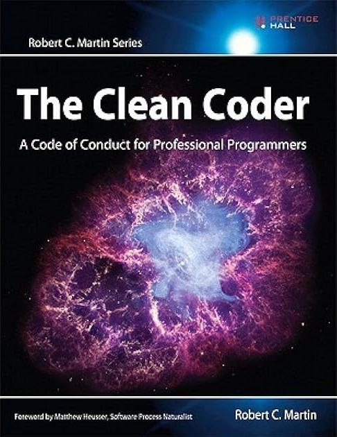

# TDD

!!!- info "Learning objectives"

    - Understand what TDD is
    - Understand why TDD is important
    - Practice TDD

???- question "For teachers"

    Prerequisites are:

    - Learners have practiced pair programming
    - Learners can do the git basic workflow on `master`

    Teaching goals are:

    - Learners understand what TDD is
    - Learners understand why TDD is important
    - Learners have done multiple TDD cycles

    Teaching form used:

    - Pair programming
    - `master` branch

    Prior knowledge questions:

    - How do you grow/develop your code?
    - How do others grow/develop their code?
    - Why would it be important to have a formal way to grow/develop your code?

    Lesson plan:

    ```mermaid
    gantt
      title Lesson plan TDD 1
      dateFormat X
      axisFormat %s
      Pair programming: done, 0, 30
      Theory: extra, 30, 45
    ```

    ```mermaid
    gantt
      title Lesson plan TDD 2
      dateFormat X
      axisFormat %s
      Exercise 1: crit, exercise_1, 0, 20s
      Feedback 1: feedback_1, after exercise_1, 10s
      Retrospect: crit, 30, 15s
    ```


## Introduction

Test-driven development (TDD) is a systematic way to grow code, 
used in academia and industry. It works [Martin, 2011]!


> A TDD developer


> The TDD cycle

The TDD cycles end when you cannot break your function anymore [Beck, 2022][Langr, 2013].

Advantages of TDD are:

- TDD makes developers more productive [Erdogmus & Morisio, 2005]
- TDD increases quality of the code [Erdogmus & Morisio, 2005][Alkaoud & Walcott, 2018][Janzen & Saiedian, 2006]
  -   There are plenty of costly programming mistakes documented!
- TDD helps shape the project architecture [Mayr, 2005]
- TDD helps better modularisation [Madeyski et al., 2010]
- TDD works great with Xtreme programming and CI

Developers do really do this [Beck, 2022][Langr, 2013], even
though TDD takes longer:

Study                     | Extra time | Effect
--------------------------|------------|-------------------------------
[George & Williams, 2004] | 16%        | 18% more black-box tests pass 
[Bhat & Nagappan, 2006]   | 15%        | 2x higher code quality
[Nagappan et al., 2008]   | 15-35%     | 40%-90% less defects

## Exercises

!!! note "Technical rules"

    -   Use the GitHub repository for the learners of this course, <https://github.com/programming-formalisms/programming_formalisms_project_autumn_2023>
    -   Work on the main branch
    -   Work in a file called `learners/[your_name]/is_zero.py`, where `[your_name]` is the person with first name first in alphabet
    -   [Zen Of Python: 'Errors should never pass silently'](https://peps.python.org/pep-0020/#the-zen-of-python)

!!! note "Social rules"

    -   Ping-Pong Pair programming
    -   Discuss how and when to switch roles first!
    -   Person with first name first in alphabet starts
    -   Try to be **an exemplary duo**

### Exercise 0: `is_zero`

!!! note "Learning objectives"

    - First practice of TDD by re-doing a function that has been developed

Develop the function `is_zero` with the technical and social rules
showed at 'Exercises'.

!!! note "`is_zero`"

    - Function name: `is_zero`
    - Output:
      - Returns `True` if the input is zero
      - Returns `False` if the input is not zero
      - :warning: Gives an error when the input is not a number

???- question "Need a video?"

    Here are two videos that show how to develop `is_zero` for Python and R:

    - [**Python video for 'is_zero'**](https://youtu.be/VddlrNOeodg), from 3:02
    - [R video for 'is_one'](https://youtu.be/IPGfW4lrxOc)


### Exercise 1: `is_even`

-   Time: 30 mins

Develop a function called `is_even`:

!!! note "`is_even`"

    - Function name: `is_even`
    - Output:
      - Returns `True` if the input is even
      - Returns `False` if the input is not even
      - :warning: Gives an error when the input is not a number

### Exercise 2: `is_odd`

-   Time: 30 mins

Develop a function called `is_odd`:

!!! note "`is_odd`"

    - Function name: `is_odd`
    -   Output:
      -   Returns `True` if the input is odd
      -   Returns `False` if the input is not odd
      -   :warning: Gives an error when the input is not a number

Consider using the `is_even` function.

### Exercise 3: `is_probability`

-   Time: 30 mins

Develop a function called `is_probability`.

!!! note "`is_probability`"

    - Function name: `is_probability`
    - Output:
      - Returns `True` if the input is in range `[0.0, 1.0]`
      - Returns `False` if the input is outside that range
      - :warning: Gives an error when the input is not a floating point number

## Conclusion

-   This session, we wrote **unit tests**
-   It is only those your boss may read
-   The literature assumes a responsible programmer writes tests, in C++ @stroustrup2018cpp, R @wickham2019advanced and Python @van2001pep

## Discussion

-   We only test manually
-   We only test on our own computer
-   We are not sure if our functions are tested completely
-   We do not test the code for style
-   We should consider using a testing framework

## Course material

 * Lecture slides:
   * [PDF](tdd_lecture.pdf) 
   * [qmd](tdd_lecture/tdd_lecture.qmd)

## Videos

Title                        |Length   |Download                                                                |YouTube
-----------------------------|---------|---------------------------------------------------------
TDD 1/3: TDD                 |  5 mins | [YouTube](https://youtu.be/gw_4jVrkDok)
TDD 2/3: `is_zero`           | 16 mins | [YouTube](https://youtu.be/VddlrNOeodg)
TDD 3/3: Introduce `is_even` |  3 mins | [YouTube](https://youtu.be/7V-zE__S6M8)
Solution `is_even`           | 12 mins | [YouTube](https://youtu.be/ZcgJEdaRRpc) 
TDD 2: introduce `is_odd`    |  7 mins | [YouTube](https://youtu.be/f4MCy9f8oAM)
Solution `is_odd`            |  7 mins | [YouTube](https://youtu.be/BxyIsJw3E14)
TDD 3: TDD bottom line       |  4 mins | [YouTube](https://youtu.be/633qwj2DUNc)
Solution `is_prime`          |  9 mins | [YouTube](https://youtu.be/qVtHieuwM1M)

## Videos on GitHub workflows

  1. [Modify README on main branch using GitHub web interface](https://youtu.be/xBH2xZoKof4?si=ohdG6-y8lzarSqIa)
  2. [Modify README on topic branch using GitHub web interface](https://youtu.be/vPyHWsnbXw8?si=XjD6a3WDY44I97Se)
  3. [Modify README on main branch using git](https://youtu.be/A85wZTiCMTc?si=oUyrg_53gVlqEanb)
  4. [Modify README on topic branch using git](https://youtu.be/ZkfjAfu9Wo4?si=myBTkJ179n9fXHrS)
  5. [Merge topic branch to develop yourself](https://youtu.be/1fKdU1m3Uug?si=qox0K-EdZ-tDpcRY)
  6. [Merge topic branch to develop with a code review](https://youtu.be/VexyXysb-BM?si=uCOuqCVuZ_ylsUtI)

## Links

 * [this workshop gives a general idea already](https://github.com/richelbilderbeek/nlseb_tdd_20210420)
 * `https://leetcode.com/problemset/all/`: many simple questions
 * [Project Euler](https://projecteuler.net/archives): plenty of programming problems

## References

 * [Alkaoud & Walcott, 2018] Alkaoud, Hessah, and Kristen R. Walcott. "Quality metrics of test suites in test-driven designed applications." International Journal of Software Engineering Applications (IJSEA) 2018 (2018).

 

 * [Beck, 2022] Beck, Kent. Test driven development: By example. Addison-Wesley Professional, 2022.
 * [Bhat & Nagappan, 2006] Bhat, Thirumalesh, and Nachiappan Nagappan. "Evaluating the efficacy of test-driven development: industrial case studies." Proceedings of the 2006 ACM/IEEE international symposium on Empirical software engineering. 2006.
 * [Erdogmus & Morisio, 2005] Erdogmus, Hakan, Maurizio Morisio, and Marco Torchiano. "On the effectiveness of the test-first approach to programming." IEEE Transactions on software Engineering 31.3 (2005): 226-237.
 * [George & Williams, 2004] George, Boby, and Laurie Williams. "A structured experiment of test-driven development." Information and software Technology 46.5 (2004): 337-342.
 * [Janzen & Saiedian, 2006] Janzen, David S., and Hossein Saiedian. "Test-driven learning: intrinsic integration of testing into the CS/SE curriculum." Acm Sigcse Bulletin 38.1 (2006): 254-258.


 * [Langr, 2013] Langr, Jeff. Better, Code, and Sleep Better. "Modern C++ Programming with Test-Driven Development." (2013).
 * [Madeyski et al., 2010] Madeyski, Lech, and Gestión de sistemas de información. Test-driven development: An empirical evaluation of agile practice. Heidelberg: Springer, 2010.



 * [Martin, 2011] Martin, Robert C. The clean coder: a code of conduct for professional programmers. Pearson Education, 2011.
 * [Mayr, 2005] Mayr, Herwig. Projekt Engineering: Ingenieurmäßige Softwareentwicklung in Projektgruppen. Hanser Verlag, 2005.
 * [Nagappan et al., 2008] Nagappan, Nachiappan, et al. "Realizing quality improvement through test driven development: results and experiences of four industrial teams." Empirical Software Engineering 13 (2008): 289-302.


 * [Thomas & Hunt, 2019] Thomas, David, and Andrew Hunt. The Pragmatic Programmer: your journey to mastery. Addison-Wesley Professional, 2019.


 * [Zen of Python] [Zen Of Python: 'Errors should never pass silently'](https://peps.python.org/pep-0020/#the-zen-of-python)
