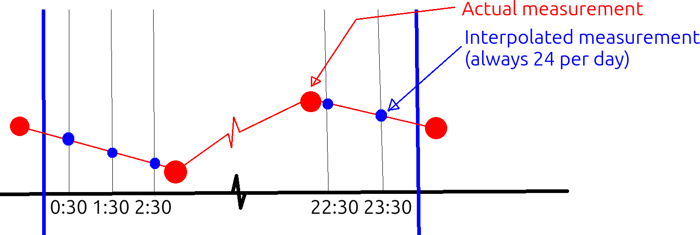

---
tags:
  - TDD
  - Test-driven development
  - big
  - complex
---

# TDD at a bigger scale

!!!- info "Learning outcomes"

    - Understand end-to-end development
    - Understand how to develop with TDD at a bigger scale
    - Be able to develop with TDD at a bigger scale

???- question "For teachers"

    Prerequisites are:

    - Learners can have practiced TDD

    Teaching goals are:

    - .

    Teaching form used:

    - Individual work
    - `main` branch

    Prior knowledge questions:

    - How can TDD be used for bigger projects?
    - How does one test more complex functions?

## 1. Why use test-driven development at a bigger scale?

Again, test-driven development (TDD) is a systematic way to grow code,
used in academia and industry. There are many benefits to use TDD (see
[the session on TDD for references](../tdd/README.md))
and they apply to big code too.

## 2. End-to-end development

There are multiple ways to find a part where to begin development
of a project:

<!-- markdownlint-disable MD013 --><!-- Tables cannot be split up over lines, hence will break 80 characters per line -->

Type        |Description                                                                            |Features
------------|---------------------------------------------------------------------------------------|--------------------------------------------------------------------------------------------------------------------------------------------------------------------------
Small-to-big|Start with the core function and build the rest around it                              |Natural starting point for beginners. Easy to get lost in details and lose overview. Software architecture typically clumsy
Big-to-small|Start with high-level code and gradually add details                                   |Feels unnatural for a beginner. Bad architectural decisions postponed until the low-level functions are developed
End-to-end  |Start with big to small, yet develop more detailed functions when encountered naturally|Recommended. A good mix between high-level thinking to ensure overview is maintained, yet the low-level functions are tested early enough to detect architectural mistakes

<!-- markdownlint-enable MD013 -->

## 3. An example

Imagine that you are part of a team that works on writing a pre-registration
on the weather project data. This part of the draft paper is as below:

!!! info "Part of the paper"

    **Research question**

    Have temperatures risen in Uppsala?

    **Hypotheses**

    Hypothesis 1: temperatures remain the same

    **Methods**
    
    We test hypothesis 1 by comparing the average yearly temperatures of the
    first half of the measurements with the second.

    We only consider years that are measured completely, to remove seasonal
    effects.

    To calculate the average yearly temperature, we take the average daily
    temperature.

    To calculate the average daily temperate, we take the average of
    interpolated temperatures measured at 0:30, 1:30, etc.,
    until and including 23:30. (note to others: see the sketch below)
    (note to others: what to do with daylight saving time?).

    

    > My sketch. Todo: remove this from final paper

    We compare these yearly average tempares with a two-sided
    Kolmogorov-Smirnov test (so to avoid assuming an increase/decrease,
    nor a distribution on these average temperatures),
    with the null hypothesis that these distributions are identical.

    We use an alpha value of 0.05. If the measured p value is below the alpha,
    then we reject the null hypothesis that the distributions are identical
    and we conclude that the temperatures have changed.

A caricature of a small-to-big developer may write the following tests early
(and maybe these are quite clumsy ones):

```python
assert interpolate("0:30", 10, "1:30", 20, "1:00") == 15
assert ks_test([10, 12, 11], [1000, 1002, 1001]) < 0.05
```

A caricature big-to-small developer may write the following tests early
(and maybe these are quite clumsy ones):

```python
assert is_hypothesis_1_true() == True or is_hypothesis_1_true() == False
assert get_hypothesis_1_p_value() >= 0.0
```

The end-to-end developer will start big and then will prioritize to write
meaningful tests when these naturally arrive.

```python
assert is_ks_test_result(do_ks_test(get_first_half_temperatures(), get_second_half_temperatures()))
assert is_ks_test_result(do_ks_test(get_test_distribution_1(), get_test_distribution_2()))
```

Note how many function names are introduced here.
These functions will start as stubs.
The implementation of each of these function can be an issue
that you can assign to your fellow team members.

## 5. Exercises

## References

- `[Alkaoud & Walcott, 2018]` Alkaoud, Hessah, and Kristen R. Walcott.
  "Quality metrics of test suites in test-driven designed applications."
  International Journal of Software Engineering Applications (IJSEA)
  2018 (2018).


- `[Beck, 2022]` Beck, Kent. Test driven development: By example.
  Addison-Wesley Professional, 2022.
- `[Bhat & Nagappan, 2006]` Bhat, Thirumalesh, and Nachiappan Nagappan.
  "Evaluating the efficacy of test-driven development: industrial case
  studies." Proceedings of the 2006 ACM/IEEE international symposium on
  Empirical software engineering. 2006.
- `[Erdogmus & Morisio, 2005]` Erdogmus, Hakan, Maurizio Morisio, and
  Marco Torchiano. "On the effectiveness of the test-first approach to
  programming." IEEE Transactions on software Engineering 31.3 (2005): 226-237.
- `[George & Williams, 2004]` George, Boby, and Laurie Williams.
  "A structured experiment of test-driven development."
  Information and software Technology 46.5 (2004): 337-342.
- `[Janzen & Saiedian, 2006]` Janzen, David S., and Hossein Saiedian.
  "Test-driven learning: intrinsic integration of testing into the CS/SE
  curriculum." Acm Sigcse Bulletin 38.1 (2006): 254-258.
- `[Langr, 2013]` Langr, Jeff. Better, Code, and Sleep Better.
  "Modern C++ Programming with Test-Driven Development." (2013).
- `[Madeyski et al., 2010]` Madeyski, Lech, and
  Gestión de sistemas de información.
  Test-driven development: An empirical evaluation of agile practice.
  Heidelberg: Springer, 2010.
- `[Martin, 2007]` Martin, Robert C.
  "Professionalism and test-driven development."
  IEEE Software 24.3 (2007): 32-36.
- `[Martin, 2009]` Martin, Robert C.
  Clean code: a handbook of agile software craftsmanship.
  Pearson Education, 2009.
- `[Martin, 2011]` Martin, Robert C.
  The clean coder: a code of conduct for professional programmers.
  Pearson Education, 2011.
- `[Martin, 2017]` Martin, Robert C. "Clean architecture." 12 Sep. 2017,
- `[Mayr, 2005]` Mayr, Herwig.
  Projekt Engineering: Ingenieurmäßige Softwareentwicklung in Projektgruppen.
  Hanser Verlag, 2005.
- `[Nagappan et al., 2008]` Nagappan, Nachiappan, et al.
  "Realizing quality improvement through test driven development:
  results and experiences of four industrial teams."
  Empirical Software Engineering 13 (2008): 289-302.
- `[PEP 8]` Van Rossum, Guido, Barry Warsaw, and Nick Coghlan.
  "PEP 8–style guide for python code." Python. org 1565 (2001): 28.
- `[Stroustrup & Sutter, 2017]`
  Stroustrup, Bjarne, and Herb Sutter.
  "C++ Core Guidelines (2017)."
  [Website](http://isocpp.github.io/CppCoreGuidelines/CppCoreGuidelines).
  (Cited on pages 100 and 103) (2015).
- `[study I cannot find]` in one of the classics, there was a bar chart that
  showed developers write functions such as `is_prime` with and without TDD
  and showed that TDD was twice as fast. TODO: find this reference
- `[Thomas & Hunt, 2019]` Thomas, David, and Andrew Hunt.
  The Pragmatic Programmer: your journey to mastery.
  Addison-Wesley Professional, 2019.
- `[Wickham, 2019]` Wickham, Hadley. Advanced R. Chapman and Hall/CRC, 2019.

<!-- markdownlint-disable MD013 --><!-- Weirdly the last url fails to be ignored, hence will break 80 characters per line -->

- `[Yuan et al., 2014]`
  Yuan, Ding, et al.
  "Simple testing can prevent most critical failures:
  An analysis of production failures in distributed data-intensive systems."
  11th USENIX Symposium on Operating Systems Design and Implementation
  (OSDI 14). 2014.
- `[Zen of Python]`
  [Zen Of Python: 'Errors should never pass silently'](https://peps.python.org/pep-0020/#the-zen-of-python)
- `[Uncle Bob, 2024]` [YouTube video 'Is Test Driven Development Slow?' by Uncle Bob](https://youtu.be/hFRq2vONviM?si=rt8KQQC69yqVpxz2)

<!-- markdownlint-enable MD013 -->
