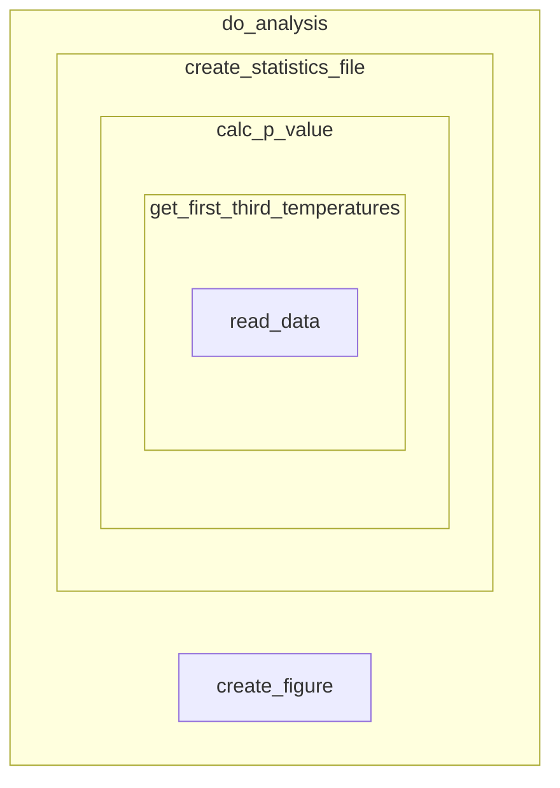
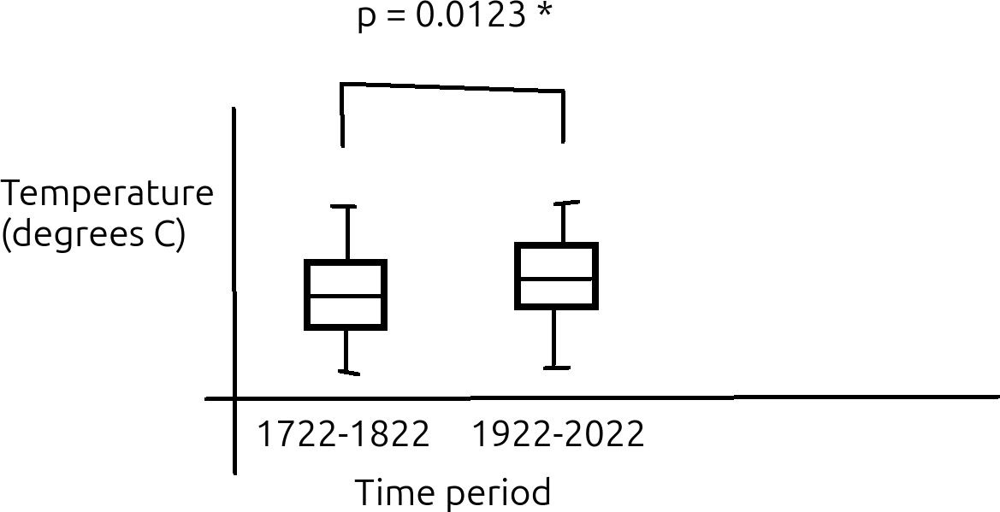

---
tags:
  - TDD
  - Test-driven development
  - big
  - complex
---

# TDD at a bigger scale

!!!- info "Learning outcomes"

    - Understand end-to-end development
    - Understand how to develop with TDD at a bigger scale
    - Be able to develop with TDD at a bigger scale

???- question "For teachers"

    Prerequisites are:

    - Learners can have practiced TDD

    Teaching goals are:

    - .

    Teaching form used:

    - Individual work
    - `main` branch

    Prior knowledge questions:

    - How can TDD be used for bigger projects?
    - How does one test more complex functions?

## 1. Why use test-driven development at a bigger scale?

Again, test-driven development (TDD) is a systematic way to grow code,
used in academia and industry. There are many benefits to use TDD (see
[the session on TDD for references](../tdd/README.md))
and they apply to big code too.

## 2. End-to-end development

There are multiple ways to find a part where to begin development
of a project:

<!-- markdownlint-disable MD013 --><!-- Tables cannot be split up over lines, hence will break 80 characters per line -->

Type        |Description                                                                            |Features
------------|---------------------------------------------------------------------------------------|--------------------------------------------------------------------------------------------------------------------------------------------------------------------------
Small-to-big|Start with the core function and build the rest around it                              |Natural starting point for beginners. Easy to get lost in details and lose overview. Software architecture typically clumsy
Big-to-small|Start with high-level code and gradually add details                                   |Feels unnatural for a beginner. Bad architectural decisions postponed until the low-level functions are developed
End-to-end  |Start with big to small, yet develop more detailed functions when encountered naturally|Recommended. A good mix between high-level thinking to ensure overview is maintained, yet the low-level functions are tested early enough to detect architectural mistakes

<!-- markdownlint-enable MD013 -->

In the example below we go end-to-end,
starting at a high-level function called `do_analysis`
until the low-level function called `read_data`.
The functions in that example can be displayed
as the figure below:



## 3. An example

## 3.1. Draft paper

Imagine that you are part of a team that works on writing a paper
on the weather project data. Part of the draft paper is as below:

!!! info "Part of the paper"

    **Research question**

    Have temperatures risen in Uppsala in the period 1722 to 2022?

    **Hypotheses**

    Hypothesis: temperatures remain the same

    **Methods**
    
    We test our hypothesis by comparing the average yearly temperatures
    at the start and end of our measurement period. To prevent that the
    temperatures are too related, we compare the first third of the
    measurements (i.e. 1722-1822) with the last third of the measurements
    (i.e. 1922-2022) and ignoring the measurements in between.
    We only consider years that are measured completely, to remove seasonal
    effects, which means that the first year (1722) will be ignored.

    We compare these yearly average tempares with a two-sided
    Kolmogorov-Smirnov test (so to avoid assuming an increase/decrease,
    nor a distribution on these average temperatures),
    with the null hypothesis that these distributions are identical.
    We use an alpha value of 0.05. If the measured p value is below the alpha,
    then we reject the null hypothesis that the distributions are identical
    and we conclude that the temperatures have changed.

    **Results**

    

    > Figure: temperature distribution

## 3.2. Small to big

A caricature of a small-to-big developer may write the following test early:

```python
# Use super different values, so the difference is significant
assert ks_test([10, 12, 11], [1000, 1002, 1001]) < 0.05

plot_boxplot([1.9, 2.3, 1.8], [0.1, -4.1, 2.8], "test_figure.png")
assert file_exists("test_figure.png")
```

These tests introduce **three** functions that need to be written.
Although these tests may be reasonably fine (as the problem is
simple enough), it is the **timing** that can be improved.

## 3.3. Starting point

Here is a superior starting point:

```python
do_analysis()
assert do_analysis.__doc__
assert file_exists("figure.png")
assert file_exists("statistics_results.txt")
```

It is important to, as a team, agree on the tests.
The tests should make sense.

???- question "How do these tests make sense?"

    Because their English equivalents make sense:

    <!-- markdownlint-disable MD013 --><!-- Tables cannot be split up over lines, hence will break 80 characters per line -->

    Test                                          |English
    ----------------------------------------------|--------------------------------------------------------------
    `assert do_analysis.__doc__`                  |The function should have documentation
    `assert file_exists("figure.png")`            |After the analysis, there should be a file of the saved plot
    `assert file_exists("statistics_results.txt")`|After the analysis, there should be a file with the statistics results

    <!-- markdownlint-enable MD013 -->

???- question "Do you see the weakness in these test?"

    One weakness in these tests, is that it does not guarantee that the
    files are recreated: if these are created once, then these tests will
    continue to pass.
    It would be better to check if these files exist before
    the test, and delete these if they do.

    Another weakness in these tests, is that the filenames are hardcoded:
    one needs to **know** that `do_analysis` creates these files.
    It would be better to supply these filename as arguments to
    `do_analysis`, for example:

    ```python
    def do_analysis(plot_filename, statistics_filename):
        # ...
        # At the end of the code:
        assert file_exists(plot_filename)
        assert file_exists(statistics_filename)
    ```
    
Below is an example test that does not make sense:

```python
assert file_exists("figure.png", "1722-1822", 0.05)
```

???- question "How do this tests not make sense?"

    Because its English equivalent does not make sense:

    <!-- markdownlint-disable MD013 --><!-- Tables cannot be split up over lines, hence will break 80 characters per line -->

    Test                                                 |English
    -----------------------------------------------------|--------------------------------------------------------------------------------------
    `assert file_exists("figure.png", "1722-1822", 0.05)`|After the analysis, there should be a file with some text with some significance level

    <!-- markdownlint-enable MD013 -->

It will be easy to make these tests pass:

```python
def do_analysis():
    """Do the analysis as described in the paper."""
    figure_file = open("figure.png", "w")
    figure_file.close()

    statistics_file = open("statistics_results.txt", "w")
    statistics_file.close()

do_analysis()
assert file_exists("figure.png")
assert file_exists("statistics_results.txt")
```

???- question "Should `do_analysis` check if it has created its files?"

    Indeed, `do_analysis` can check if it has created its files:

    ```python
    def do_analysis():
        # ...
        assert file_exists("figure.png")
        assert file_exists("statistics_results.txt")
    ```

    One can argue that this is good: we assume that these files are created
    at the end of the function.

    One can also argue that this is bad: we have our tests that check
    this (this assumes we do TDD!), so there is no need to check twice.

    Because both reasonings are valid, it is up to taste and context
    what to do.

    I have seen cases where I have added these `assert`s
    and I've seen cases where I have removed these `assert`s, both
    for good reasons.
    
Although it may feel you have not done anything useful, you actually
have: you've sketched the outline of the analysis.
Sure, things will change and even this architecture already has its flaws,
it is Good Enough.

## 3.4. First iteration

There are many ways to go forward here and multiple ways are equally fine.

The thing that annoys me most is that `do_analysis` already uses two
variables: one for each file. Also, these variables live longer than they
need (i.e. nothing stops me from re-opening the first file and working
on it again). I feel there is no need that these
variables are in the same function. Hence, I will split up the function:

```python
def do_analysis():
    """Do the analysis as described in the paper."""
    create_figure()
    create_statistics_file()

assert create_figure.__doc__
create_figure()
assert file_exists("figure.png")

assert create_statistics_file.__doc__
create_statistics_file()
assert file_exists("statistics_results.txt")
```

This refactoring consists of moving code around:

```python
def create_figure():
    """Create the boxplot of temperatures."""
    file = open("figure.png", "w")
    file.close()

def create_statistics_file():
    """Create the file with the statistics needed."""
    file = open("statistics_results.txt", "w")
    file.close()
```

Note that I can shorten the variables names `figure_file`
and `statistics_file` now: each function now has its own `file` variable.
Variable that have a life that is as short as needed is a good idea.

## 3.5. Second iteration

There are many ways to go forward here and multiple ways are equally fine.

I think working on the statistics file is the best way forward:
I can imagine that I can test if a file contains a line of text
with a p-value (e.g. `p-value: 0.123`). Images are harder to test, hence
I try to avoid writing tests on images. I even predict I will not even need
to write such a test in the end...

I feel writing a p-value to the statistics file is a good start:

```python
def create_statistics_file():
    """Create the file with the statistics needed."""
    file = open("statistics_results.txt", "w")
    p_value = calc_p_value()
    assert p_value >= 0.0
    assert p_value <= 1.0
    file.write("p value:" + str(p_value))
    file.close()


assert calc_p_value.__doc__
assert calc_p_value() >= 0.0
assert calc_p_value() <= 1.0
```

This would be a good enough stub for `calc_p_value`:

```python
def calc_p_value():
    """Create the p value of the statistics test."""
    return 0.5
```

## 3.6. Third iteration

There are many ways to go forward here and multiple ways are equally fine.

I feel making the `calc_p_value` function actually *do* something
would be most useful. Also, it annoys me that `calc_p_value`
has no arguments: how can I test such a function? Let's first make
the function testable: a Good Idea!

So I start with writing a test, that forces me to improve `calc_p_value`:

```python
assert calc_p_value([1, 2, 3], [4, 5, 6]) >= 0.0
```

Remembering the second law of TDD ('You may not write more of a unit test
than is sufficient to fail, and not compiling is failing' `[Martin, 2007]`)
I know I am on the right track: the code will give a syntax error.

The code will give a syntax error, because I have two tests that conflict:

```python
# Earlier
assert calc_p_value.__doc__
assert calc_p_value() >= 0.0
assert calc_p_value() <= 1.0

# Newer
assert calc_p_value([1, 2, 3], [4, 5, 6]) >= 0.0
```

The earlier tests assume that there are default values for all function
arguments. That can be fixed:

```python
def calc_p_value(values_1 = [1.2, 3.4, 5.6], values_2 = [7.8, 9.0, 1.2]):
    """Create the p value of the statistics test."""
    return 0.5
```

## 3.7. Fourth iteration

There are many ways to go forward here and multiple ways are equally fine.

I feel making the `calc_p_value` function actually *do* something
would be most useful. Now we can!

I add these tests:

```python
expected_p_value = 0.0326 # From https://agentcalc.com/kolmogorov-smirnov-test-calculator
assert calc_p_value([1, 2, 3], [4, 5, 6]) >= expected_p_value - 0.001
assert calc_p_value([1, 2, 3], [4, 5, 6]) <= expected_p_value + 0.001
```

I obtained the expected p-value from
[an online Kolmogorov-Smirnov test calculator](https://agentcalc.com/kolmogorov-smirnov-test-calculator).
I assume this online calculator is correct.

This forces me to write a useful `calc_p_value` function.
To write it, I searched the web for `Python Kolmogorov Smirnov test`
and found
[documentation to an implementation](https://docs.scipy.org/doc/scipy/reference/generated/scipy.stats.kstest.html),
from which I conclude that this may work:

```python
def calc_p_value(values_1 = [1.2, 3.4, 5.6], values_2 = [7.8, 9.0, 1.2]):
    """Create the p value of the statistics test."""
    from scipy import stats
    return stats.kstest(values_1, values_2).pvalue
```

When running this code, my tests failed!

This means there is a mismatch between the Python implementation and the
website. Luckily, the website has a worked-out example:

> Worked Example
>
> Consider two manufacturing processes that produce slightly different
> measurements for a critical component.
> Suppose sample A consists of the diameters [5.01, 4.98, 5.03, 5.00, 5.02]
> millimeters, while sample B produces [4.97, 4.99, 5.04, 5.01, 4.96].
> When these values are entered into the calculator,
> the sorted ECDFs reveal a maximum deviation of
> D. With both samples containing five observations,
> the approximation above yields a p‑value around 0.70.

We change the tests to the worked-out example:

```python
expected_p_value = 0.0326 # From https://agentcalc.com/kolmogorov-smirnov-test-calculator
values_1 = [5.01, 4.98, 5.03, 5.00, 5.02]
values_2 = [4.97, 4.99, 5.04, 5.01, 4.96]
assert calc_p_value(values_1, values_2) >= expected_p_value - 0.001
assert calc_p_value(values_1, values_2) <= expected_p_value + 0.001
```

Also these tests fail! Adding a `print` statement ...

```python
print(calc_p_value(values_1, values_2))
```

... reveals that the actually generated p-value is around 0.87.

Let's check another [online Kolmogorov Smirnov calculator](https://agricarehub.com/kolmogorov-smirnov-test-calculator/),
which does not even give us a p-value: the sample size is too small!
It seems our test must include at least 10 values. Let's update our test:

```python
expected_p_value = 0.8810 # From https://agentcalc.com/kolmogorov-smirnov-test-calculator
# expected_p_value = 0.8659 # From https://www.statskingdom.com/kolmogorov-smirnov-two-calculator.html

values_1 = [1, 2, 3, 4, 5, 6, 7, 8, 9, 10]
values_2 = [1, 2, 3, 4, 5, 6, 7, 8, 9, 10, 11, 12, 13]
print(calc_p_value(values_1, values_2))
assert calc_p_value(values_1, values_2) >= expected_p_value - 0.1
assert calc_p_value(values_1, values_2) <= expected_p_value + 0.1
```

This prints a value of around 0.84, which we consider good enough.
It seems that there are multiple implementations of this algorithm
and it seems like we are doing well enough.

I feel that this is good enough for now and I will create an issue
to remind myself to double-check this calculation with another set of values.

## 3.8. Fifth iteration

There are many ways to go forward here and multiple ways are equally fine.

I feel making the `calc_p_value` function use the actual values
from the dataset would be most useful.
Here I rewrite `calc_p_value`:

```python
def calc_p_value(values_1 = get_first_third_temperatures(), values_2 = get_last_third_temperatures()):
    # Function body stays the same
```

Remembering the second law of TDD ('You may not write more of a unit test
than is sufficient to fail, and not compiling is failing' `[Martin, 2007]`)
I know I am on the right track: the code will give an error that
`get_first_third_temperatures` and `get_last_third_temperatures` are
missing. Let's implement these:

```python
def get_first_third_temperatures():
    return [1.2, 3.4, 5.6]

def get_last_third_temperatures():
    return [7.8, 9.0, 1.2]
```

All tests pass again!

## 3.9. Sixth iteration

There are many ways to go forward here and multiple ways are equally fine.

I feel making the `get_first_third_temperatures` function use the actual values
from the dataset would be most useful.
Here I write the tests for `get_first_third_temperatures`:

```python
assert get_first_third_temperatures.__doc__
assert len(get_first_third_temperatures()) > 10
```

This is good enough to make me work on `get_first_third_temperatures`:

```python
def get_first_third_temperatures():
    """Get the first third of temperatures.
    This excludes the year 1722, as this year is not completely measured."""
    table = read_data()

    # Assert 'table' is a table
    # Assert 'table' has a column called 'Year'

    table = table[table["Year"] > 1722 && table["Year"] <= 1822]

    # Assert 'table' has a column called 'Temperature'

    return table["Temperature"]                          
```

And here we finally get into the more technical things, such
as reading a table and selecting rows and columns from it!

???- question "Could you show me the complete code?"

    Here is the complete code,
    except for the last version of `collect_first_third_temperatures`:

    ```python

    def collect_first_third_temperatures():
        return range(1, 100)
                                         
    def get_first_third_temperatures():
        """Get the first third of temperatures.
        This excludes the year 1722, as this year is not completely measured."""
        return collect_first_third_temperatures()

    assert len(get_first_third_temperatures()) > 10

    def get_last_third_temperatures():
        return [7.8, 9.0, 1.2]

    def calc_p_value(values_1 = get_first_third_temperatures(), values_2 = get_last_third_temperatures()):
        """Create the p value of the statistics test."""
        from scipy import stats
        return stats.kstest(values_1, values_2).pvalue


    expected_p_value = 0.8810 # From https://agentcalc.com/kolmogorov-smirnov-test-calculator
    # expected_p_value = 0.8659 # From https://www.statskingdom.com/kolmogorov-smirnov-two-calculator.html

    values_1 = [1, 2, 3, 4, 5, 6, 7, 8, 9, 10]
    values_2 = [1, 2, 3, 4, 5, 6, 7, 8, 9, 10, 11, 12, 13]
    assert calc_p_value(values_1, values_2) >= expected_p_value - 0.1
    assert calc_p_value(values_1, values_2) <= expected_p_value + 0.1

    def file_exists(filename):
        return True


    def create_figure():
        """Create the boxplot of temperatures."""
        file = open("figure.png", "w")
        file.close()

    assert create_figure.__doc__
    create_figure()
    assert file_exists("figure.png")

    def create_statistics_file():
        """Create the file with the statistics needed."""
        file = open("statistics_results.txt", "w")
        p_value = calc_p_value()
        assert p_value >= 0.0
        assert p_value <= 1.0
        file.write("p value:" + str(p_value))
        file.close()


    assert create_statistics_file.__doc__
    create_statistics_file()
    assert file_exists("statistics_results.txt")

    def do_analysis():
        """Do the analysis as described in the paper."""
        create_figure()
        create_statistics_file()

    do_analysis()
    assert do_analysis.__doc__
    assert file_exists("figure.png")
    assert file_exists("statistics_results.txt")
    ```

## 5. Exercises

## 5.1. Discuss the steps shown

Go through the steps shown above together.
Make sure you follow along with the code on your own screen,
as in each little discussion, there will be no screen shared.

- Do you agree that the steps taken are reasonable? If not, why?
- Do you think a mistake has been made? If yes, where?
- Would you trust the results of this analysis? Why?

## References

- `[Alkaoud & Walcott, 2018]` Alkaoud, Hessah, and Kristen R. Walcott.
  "Quality metrics of test suites in test-driven designed applications."
  International Journal of Software Engineering Applications (IJSEA)
  2018 (2018).
- `[Beck, 2022]` Beck, Kent. Test driven development: By example.
  Addison-Wesley Professional, 2022.
- `[Bhat & Nagappan, 2006]` Bhat, Thirumalesh, and Nachiappan Nagappan.
  "Evaluating the efficacy of test-driven development: industrial case
  studies." Proceedings of the 2006 ACM/IEEE international symposium on
  Empirical software engineering. 2006.
- `[Erdogmus & Morisio, 2005]` Erdogmus, Hakan, Maurizio Morisio, and
  Marco Torchiano. "On the effectiveness of the test-first approach to
  programming." IEEE Transactions on software Engineering 31.3 (2005): 226-237.
- `[George & Williams, 2004]` George, Boby, and Laurie Williams.
  "A structured experiment of test-driven development."
  Information and software Technology 46.5 (2004): 337-342.
- `[Janzen & Saiedian, 2006]` Janzen, David S., and Hossein Saiedian.
  "Test-driven learning: intrinsic integration of testing into the CS/SE
  curriculum." Acm Sigcse Bulletin 38.1 (2006): 254-258.
- `[Langr, 2013]` Langr, Jeff. Better, Code, and Sleep Better.
  "Modern C++ Programming with Test-Driven Development." (2013).
- `[Madeyski et al., 2010]` Madeyski, Lech, and
  Gestión de sistemas de información.
  Test-driven development: An empirical evaluation of agile practice.
  Heidelberg: Springer, 2010.
- `[Martin, 2007]` Martin, Robert C.
  "Professionalism and test-driven development."
  IEEE Software 24.3 (2007): 32-36.
- `[Martin, 2009]` Martin, Robert C.
  Clean code: a handbook of agile software craftsmanship.
  Pearson Education, 2009.
- `[Martin, 2011]` Martin, Robert C.
  The clean coder: a code of conduct for professional programmers.
  Pearson Education, 2011.
- `[Martin, 2017]` Martin, Robert C. "Clean architecture." 12 Sep. 2017,
- `[Mayr, 2005]` Mayr, Herwig.
  Projekt Engineering: Ingenieurmäßige Softwareentwicklung in Projektgruppen.
  Hanser Verlag, 2005.
- `[Nagappan et al., 2008]` Nagappan, Nachiappan, et al.
  "Realizing quality improvement through test driven development:
  results and experiences of four industrial teams."
  Empirical Software Engineering 13 (2008): 289-302.
- `[PEP 8]` Van Rossum, Guido, Barry Warsaw, and Nick Coghlan.
  "PEP 8–style guide for python code." Python. org 1565 (2001): 28.
- `[Stroustrup & Sutter, 2017]`
  Stroustrup, Bjarne, and Herb Sutter.
  "C++ Core Guidelines (2017)."
  [Website](http://isocpp.github.io/CppCoreGuidelines/CppCoreGuidelines).
  (Cited on pages 100 and 103) (2015).
- `[study I cannot find]` in one of the classics, there was a bar chart that
  showed developers write functions such as `is_prime` with and without TDD
  and showed that TDD was twice as fast. TODO: find this reference
- `[Thomas & Hunt, 2019]` Thomas, David, and Andrew Hunt.
  The Pragmatic Programmer: your journey to mastery.
  Addison-Wesley Professional, 2019.
- `[Wickham, 2019]` Wickham, Hadley. Advanced R. Chapman and Hall/CRC, 2019.

<!-- markdownlint-disable MD013 --><!-- Weirdly the last url fails to be ignored, hence will break 80 characters per line -->

- `[Yuan et al., 2014]`
  Yuan, Ding, et al.
  "Simple testing can prevent most critical failures:
  An analysis of production failures in distributed data-intensive systems."
  11th USENIX Symposium on Operating Systems Design and Implementation
  (OSDI 14). 2014.
- `[Zen of Python]`
  [Zen Of Python: 'Errors should never pass silently'](https://peps.python.org/pep-0020/#the-zen-of-python)
- `[Uncle Bob, 2024]` [YouTube video 'Is Test Driven Development Slow?' by Uncle Bob](https://youtu.be/hFRq2vONviM?si=rt8KQQC69yqVpxz2)

<!-- markdownlint-enable MD013 -->
