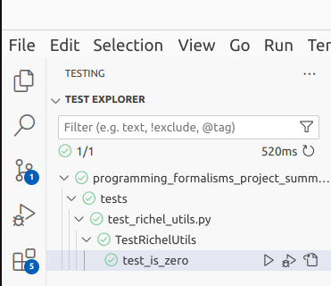

---
tags:
  - Test
  - Testing
  - Testing framework
  - unittest
  - Unit test
  - Unit tests
  - Unit testing
---

# Using a formal testing framework

!!!- info "Learning outcomes"

    - understand the benefit of using a testing framework
    - put the files of my code in the right locations
    - write tests using a formal testing framework

???- question "For teachers"

    Prerequisites are:

    - Learners have some idea of the benefit of using a testing framework
    - Learners have practiced writing tests within a formal testing framework

    ```mermaid
    gantt
      title Lesson plan using a testing framework
      dateFormat X
      axisFormat %s
      Introduction: intro, 0, 5s
      Theory 1: theory_1, after intro, 5s
      Exercise 1: crit, exercise_1, after theory_1, 25s
      Feedback 1: feedback_1, after exercise_1, 10s
    ```

    Prior questions:

    - When do you trust your code?
    - When do you trust code written by others?
    - How do you convince other developers of a bug?

## Why use tests?

???- question "Prefer this lecture as a video?"

    See [this YouTube video](https://youtu.be/FXdEtzl-wws)

Testing *helps* ensure the correctness of code.

- Coding errors are extremely common `[Baggerly & Coombes, 2009]`
- Contribute to the reproducibility crisis in science `[Vable et al., 2021]`,
  e.g. `[Rahman & Farhana, 2020]`
- Simple testing can prevent most critical failures `[Yuan et al., 2014]`

## Why use a testing framework?

You want to write tests in the recommended way
and put their files in a recommended place.
You want your tests to be found by most of the tools
in the Python ecosystem.

## Testing framework

There are multiple testing frameworks, here is an incomplete overview:

Testing framework                                            |Features
-------------------------------------------------------------|----
[`unittest`](https://docs.python.org/3/library/unittest.html)|Part of Python standard library, heavily used, VSCode can find it, allows Hamcrest notation, needs scaffolding
[`pytest`](https://docs.pytest.org/en/stable/)               |Uses `assert`, minimal scaffolding
[`nose`](https://pypi.org/project/nose/)                     |Extends `unittest`

In this project, we use a testing framework, because:

- A formal way to write tests
- Failed tests give better error messages

Drawback of `unittest` (and many other testing frameworks):

- Takes some scaffolding

## Example test: test if something is true

No testing framework:

```python
assert 1 + 1 == 2
```

Using `unittest`:

```python
import unittest

class TestSmall(unittest.TestCase):
    def test_is_true(self):
        self.assertIsTrue(1 + 1 == 2)
```

Mostly scaffolding here...

## Example test: test if something is equal

No testing framework:

```python
assert 1 + 1 == 2
```

Using `unittest`:

```python
import unittest

class TestSmall(unittest.TestCase):
    def test_is_equal(self):
        self.assertEqual(1 + 1, 2)
```

Hamcrest notation can give better error message.

## Example test: test if something raises an exception

No testing framework:

```python
def raise_error():
    raise RunType("Raise an error!")

has_raised = False
try:
    raise_error()
except:
    has_raised = True
assert has_raised
```

Using `unittest`:

```python
import unittest

class TestSmall(unittest.TestCase):
    def test_raises(self):
        self.assertRaises(RunTimeError, raise_error)
```

Here using a formal testing framework saves typing.

## File setup

A testing framework needs files to be in standarized places.

One can search the web for this,
or [use an existing project](https://github.com/programming-formalisms/programming_formalisms_example_project)
as reference.

For the `unittest` framework, the actual functions are put in the
`src/[package_name]` folder, for example `src/bacsim/sven_utils.py`.
With or without a testing framework, source code should be put in the `src`
folder `[Wilson et al, 2017]`.

???- question "How does this look like in VSCode?"

    

???- question "How does such a file look like?"

    Here is how such a file could look like:

    ```python
    """Sven's utility functions"""

    def is_zero(x):
        """Determine if `x` is zero.

        If `x` is not a number, a `TypeError` is raised.

        Returns `True` if `x` is zero
        """
        if not isinstance(x, (int, float)):
            msg = "'number' must be a number. "
            raise TypeError(
                msg,
                "Actual type of 'number': ", type(x),
            )
        return x == 0
    ```

The testing functions are put in the
`tests` folder and all files have `test_` added.
For example, the file to test `src/bacsim/richel_utils.py`
is called `tests/test_richel_utils.py`.

???- question "How does this look like in VSCode?"

    

???- question "How does such a file look like?"

    Here is how such a file could look like:

    ```python
    """Tests all function in src.bacsim.richel_utils."""
    import unittest

    from src.bacsim.richel_utils import is_zero

    class TestRichelUtils(unittest.TestCase):

        """Class to test the functions in src.bacsim.richel_utils."""

        def test_is_zero(self):
            """Test 'is_zero'."""
            self.assertIsNotNone(is_zero.__doc__)
            self.assertTrue(is_zero(0))
            self.assertTrue(is_zero(0.0))
            self.assertFalse(is_zero(1))
            self.assertRaises(TypeError, is_zero, {1, 2})
            self.assertRaises(TypeError, is_zero, "I am a string")
    ```

## Running a test

???- question "Get error `ModuleNotFoundError: No module named 'src'`?"

    You will get the error `ModuleNotFoundError: No module named 'src'`
    when you click 'Run' on your file with tests.

    

    > Clicking on 'Run' (see the red rectangle at the top-left)
    > for a file that has tests
    > will give the error `ModuleNotFoundError: No module named 'src'`.
    > Click the green 'Testing' tab at the right instead.

    Instead, click on the green 'Testing' tab at the right.

Click on the 'Testing' tab (with the erlenmeyer flask) at the right.

If you do this for the first time, you get some blue buttons.

???- question "How does that look like?"

    

Click on 'Configure Python Tests'.

???- question "How does that look like?"

    

Select 'unittest Standard Python test framework'

???- question "How does that look like?"

    

Select `tests` as the testing folder.

???- question "How does that look like?"

    

Select `test_*.py` as the test file pattern.

???- question "How does that look like?"

    

Now the tests are present at the left side in a folded up state.
One can unfold these.

???- question "How does that look like?"

    

Clicking on the 'Run'/'Play' button to run the tests.

???- question "Something went wrong?"

    An easy fix is to delete the file `.vscode/setting.json`
    and restart VS Code

## Exercises

### Exercise 1: get the existing tests to work

In this exercise, we get the tests to work within our IDE.

???- question "Don't use VS Code?"

    If you do not use VS Code, try to get it to run on your IDE.
    The steps for VS Code may be simular to those in your IDE.

- Follow the steps at [running a test](#running-a-test)
- Run all the tests of the package
- Are all tests passing? If not, can you see the error message?

Fixing the failing tests is beyond the scope of this exercise.

### Exercise 2: put example code to fit the testing framework

In this exercise, we will put worked-out code at the right spots.
This code is known to work, so our package will keep working.

- Create a file for the actual code, called, e.g. `src/bacsim/[name]_utils.py`,
  e.g. `src/bacsim/sven_utils.py`
- Copy-paste the following (familiar) code in that file:

```python
def is_zero(number):
    """Testing if the number is zero."""
    if not isinstance(number, int):
        raise TypeError("'number' must be of type int.")
    if number == 0:
        return True
    return False
```

- Create a file for the tests of that code, called,
  e.g. `tests/test_[name]_utils.py`, e.g. `tests/test_sven_utils.py`
- Copy-paste the following (familiar) code in that file:

```python
"""Tests all code in src.bacsim.sven_utils."""
import unittest

from src.bacsim.sven_utils import is_zero

class TestSvenUtils(unittest.TestCase):

    """Class to test the code in src.bacsim.sven_utils."""

    def test_is_zero_has_documentation(self):
        """The function 'is_zero' has documentation."""
        self.assertTrue(is_zero.__doc__)
        self.assertIsNotNone(is_zero.__doc__)

    def test_is_zero_responds_correctly_to_ints(self):
        """The function 'is_zero' responds correctly to integers."""
        self.assertTrue(is_zero(0))
        self.assertFalse(is_zero(1))

    def test_is_zero_raises_an_exception_upon_non_ints(self):
        """The function 'is_zero' raises an exception upon non-ints."""
        self.assertRaises(TypeError, is_zero, {1, 2})
        self.assertRaises(TypeError, is_zero, "I am a string")
```

- In that code, replace `sven` and `Sven` by your name
- Refresh the tests
- Run all tests
- Confirm that your new tests show up
- Confirm that your new tests passes
- If your tests pass, push it to the GitHub repo

### Exercise 2: put example code to fit the testing framework

In this exercise, we convert some pre-programmed code to fit the
testing framework.

We use this code (from [pythonpool](https://www.pythonpool.com/check-if-number-is-prime-in-python/)):

```python
def isprime(num):
    for n in range(2,int(num**0.5)+1):
        if num%n==0:
            return False
    return True
print(isprime(7))
print(isprime(8))
```

- Copy paste the function and put it in your file called,
  e.g. `src/bacsim/[name]_utils.py`, e.g. `src/bacsim/sven_utils.py`

???- question "Answer"

    Copy-paste the following text to your file,
    e.g. `src/bacsim/[name]_utils.py`, e.g. `src/bacsim/sven_utils.py`:

    ```python
    def isprime(num):
        for n in range(2,int(num**0.5)+1):
            if num%n==0:
                return False
        return True
    ```

- The example code has two wannabe tests. How would you convert these
  to asserts?

???- question "Answer"

    These would be reasonable asserts:

    ```python
    assert isprime(7) == True
    assert isprime(8) == False
    ```

- Use the file for the tests of that code,
  e.g. `tests/test_[name]_utils.py`, e.g. `tests/test_sven_utils.py`.
  Add tests using the testing framework.

???- question "Answer"

    This is how the file should look like:

    ```python
    """Tests all code in src.bacsim.sven_utils."""
    import unittest

    # Other imports
    from src.bacsim.sven_utils import isprime

    class TestSvenUtils(unittest.TestCase):

        # Other tests

        def test_isprime(self):
            """The function 'isprime' is correct."""
            self.assertTrue(isprime(7))
            self.assertFalse(isprime(8))
    ```

- Can you break the `isprime` function?

???- question "Answer"

    There are multiple ways.

    You may reasonably assume that the function is documented:

    ```python
    self.assertTrue(is_zero.__doc__)
    ```

    But this seems like a test that should work:

    ```python
    self.assertFalse(isprime(-1))
    ```

    Both tests fail.

It is beyond the scope of this exercise to fix this function :-)

### Exercise 3: convert your code to fit the testing framework

In this course, you've written some functions yourself.

- Pick the favorite function you've written
- Add it to the package, in the same files

## References

- `[Baggerly & Coombes, 2009]` Baggerly, Keith A., and Kevin R. Coombes.
  "Deriving chemosensitivity from cell lines: forensic bioinformatics and
  reproducible research in high-throughput biology."
  The Annals of Applied Statistics (2009): 1309-1334.
- `[Rahman & Farhana, 2020]` Rahman, Akond, and Effat Farhana.
  "An exploratory characterization of bugs in COVID-19 software projects."
  arXiv preprint arXiv:2006.00586 (2020).
- `[Vable et al., 2021]` Vable, Anusha M., Scott F. Diehl, and M. Maria Glymour.
  "Code review as a simple trick to enhance reproducibility, accelerate
  learning, and improve the quality of your team’s research."
  American Journal of Epidemiology 190.10 (2021): 2172-2177.
- `[Wilson et al, 2017]` Wilson, Greg, et al.
  "Good enough practices in scientific computing."
  PLoS computational biology 13.6 (2017): e1005510.
  [here](https://doi.org/10.1371/journal.pcbi.1005510)
- `[Yuan et al., 2014]`
  Yuan, Ding, et al.
  "Simple testing can prevent most critical failures:
  An analysis of production failures in distributed data-intensive systems."
  11th USENIX Symposium on Operating Systems Design and Implementation
  (OSDI 14). 2014.
