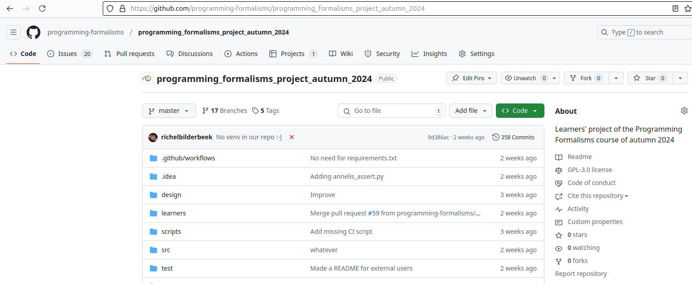
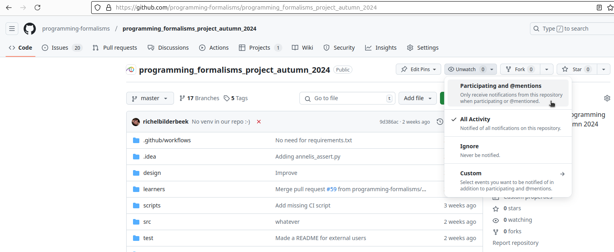
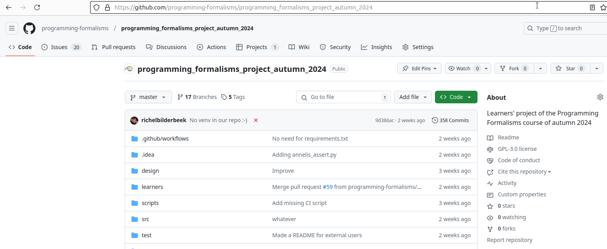

---
tags:
  - watch
  - unwatch
  - watching
---

# Watching

!!!- info "Learning outcomes"

    - Understand why watching a repository is useful
    - Be able to unwatch a repository

???- question "For teachers"

    Prior:

    - Someone made a change to the repository and breaks the code.
      How do you find out?


    Lesson plans:

    ```mermaid
    gantt
      title Lesson plan pair programming 1
      dateFormat X
      axisFormat %s
      Introduction : intro, 0, 5s
      Theory 1: theory_1, after intro, 5s
      Exercise 1: crit, exercise_1, after theory_1, 15s
      Feedback 1: feedback_1, after exercise_1, 5s
      Theory 2: theory_2, after feedback_1, 5s
      Exercise 2: crit, exercise_2, after theory_2, 10s
      Exercise 2 after the break: crit, after exercise_2, 5s
    ```

## Why?

You want to be notified of certain things, but not of all things.

## Introduction

At the start of the course, you'll be added to the learners' project.
By default, it is assumed you want to be informed on any event:
when the code breaks or when you are mentioned.

You can see this at the repository:
at the top-right, there is a button with an eye and the text 'Unwatch'.
This means you are watching all activity of the repository.



> Watching all activity of the repository

The chance that you want to see all activity is low.
Probably, you only want to be notified when you are mentioned
in an issue.

To do so, click on the button with the eye and the text 'Unwatch'.



> Change what you are watching

Click on 'Participating and mentions'.

Now, you are not watching all activity of the repository.



> Not watching all activity of the repository

## Exercises

### Exercise 1: not watching all activity of the learners' repository

- Read the text above
- Change the watching to only respond to 'Participating and mentions'
