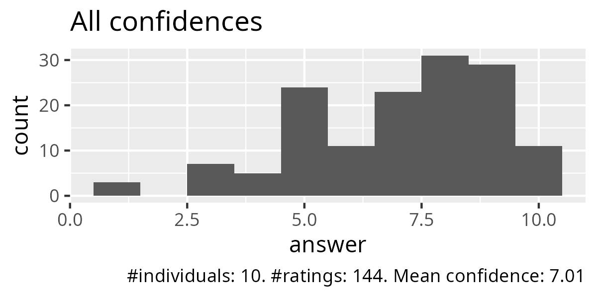
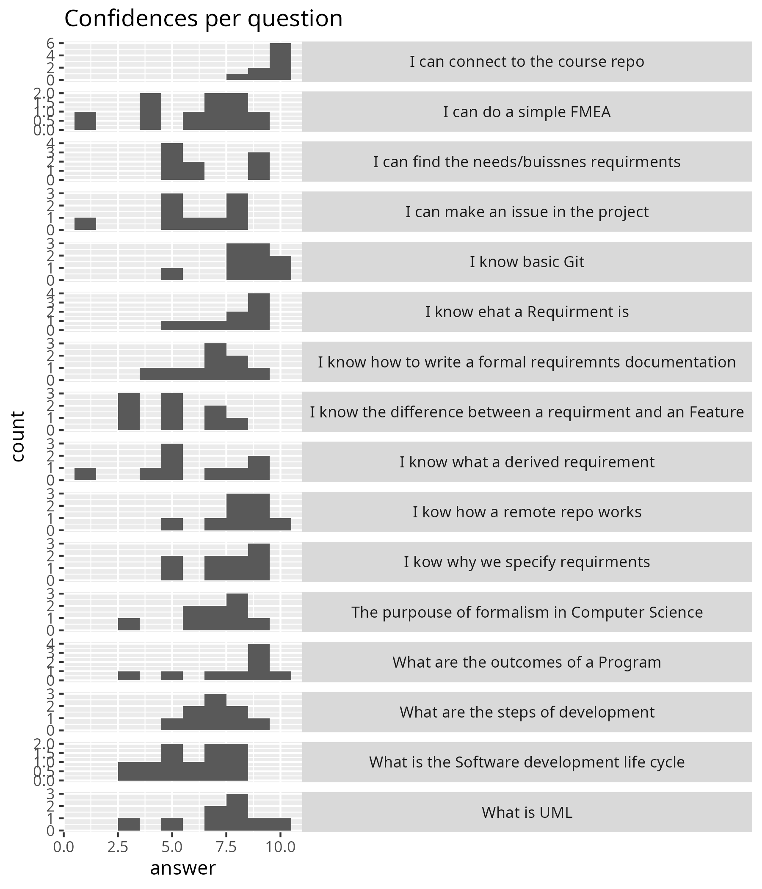
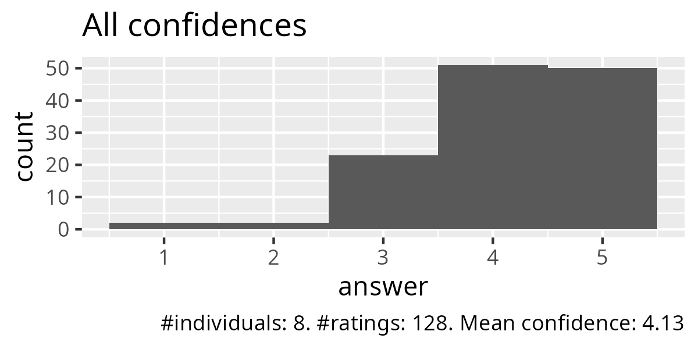
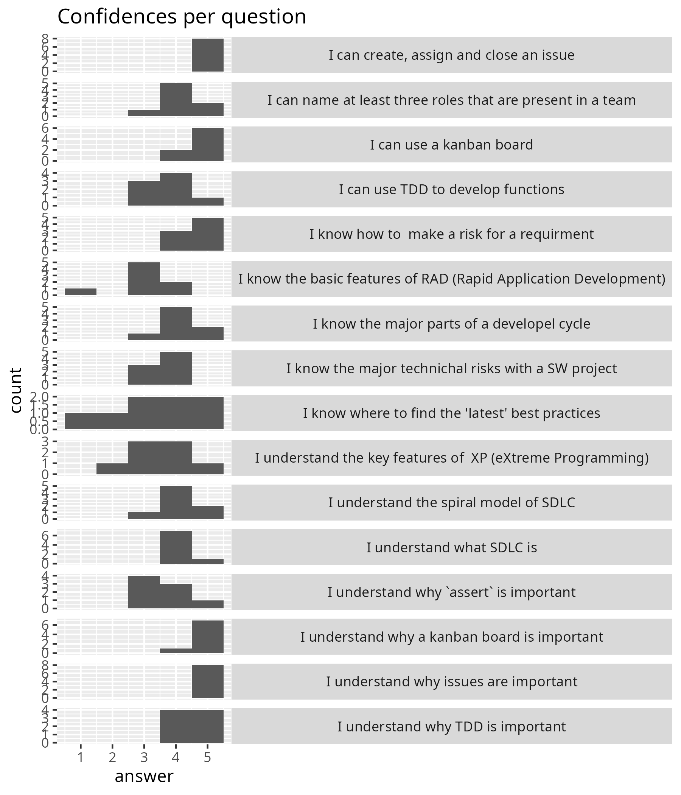
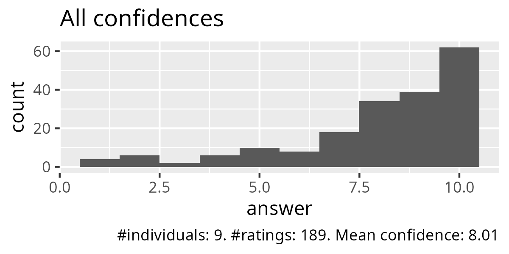
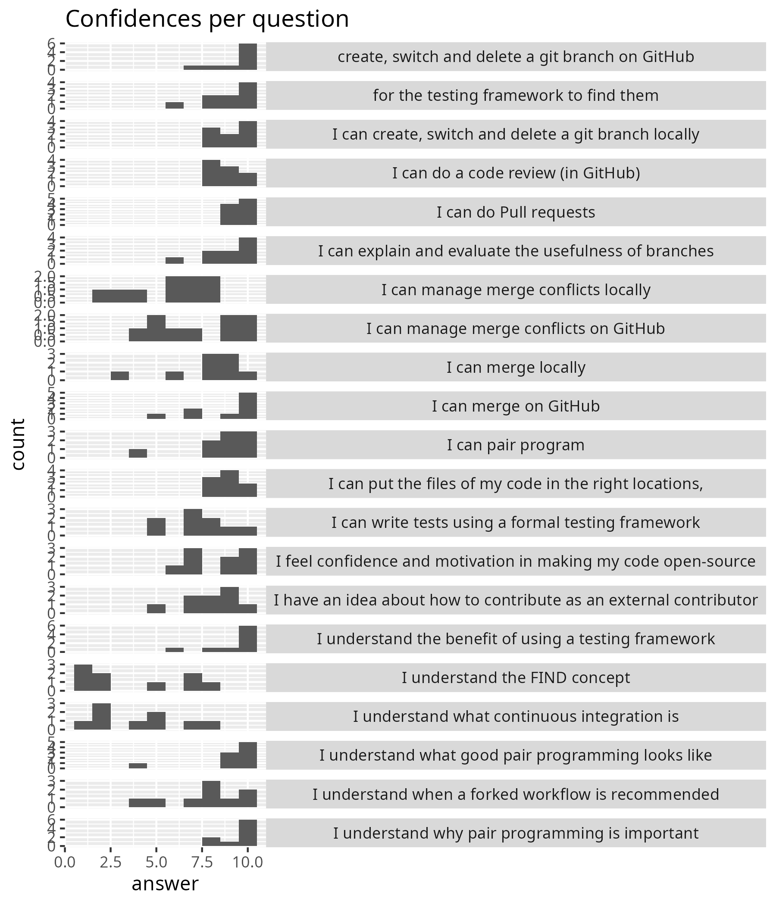
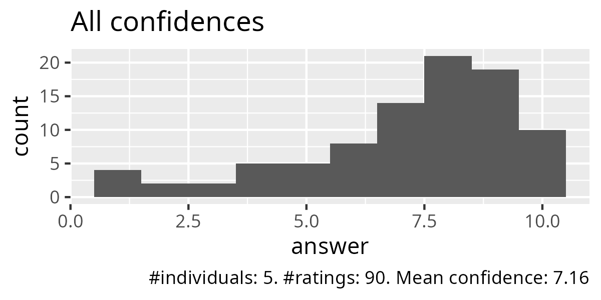
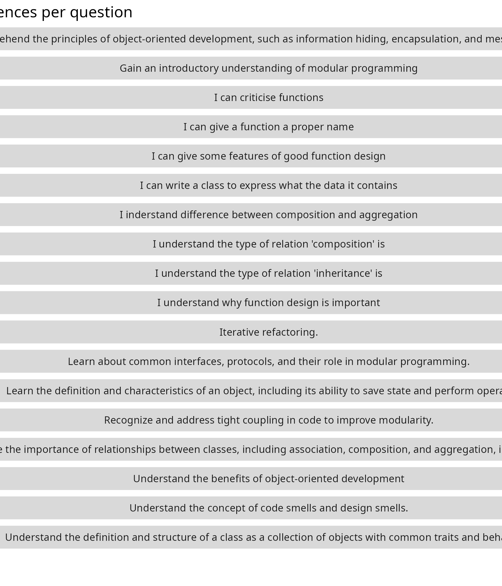
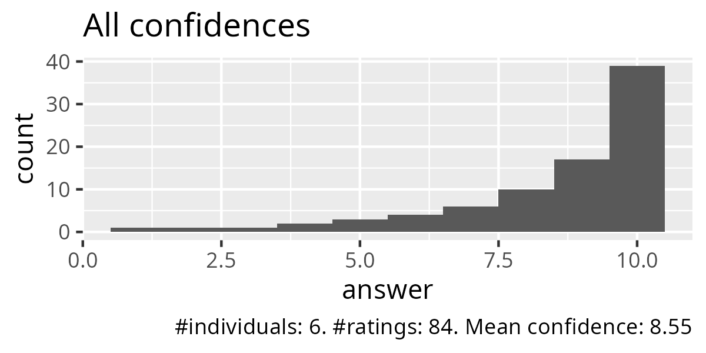
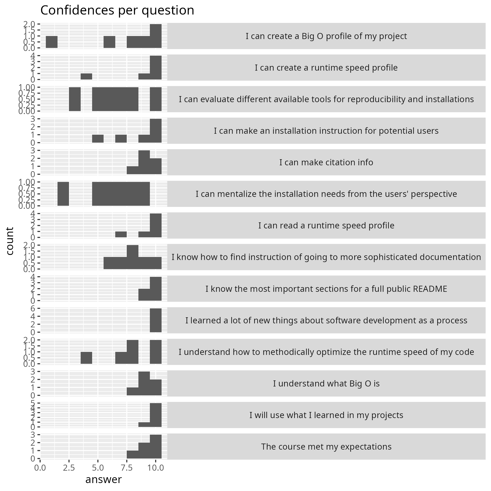

# Evaluation autumn 2024

## Monday

- [Retrospect](20241118.md)
- [Confidences per question as tally](monday_tally.csv)

## Tuesday

- [Retrospect](20241119.md)
- [Confidences per question as tally](tuesday_tally.csv)

## Wednesday

- [Retrospect](20241120.md)
- [Confidences per question as tally](wednesday_tally.csv)

## Thursday

- [Retrospect](20241121.md)
- [Confidences per question as tally](thursday_tally.csv)

## Friday

- [Retrospect](20241122.md)
- [Teacher comments](teacher_comments.csv)
- [Confidences per question as tally](friday_tally.csv)

