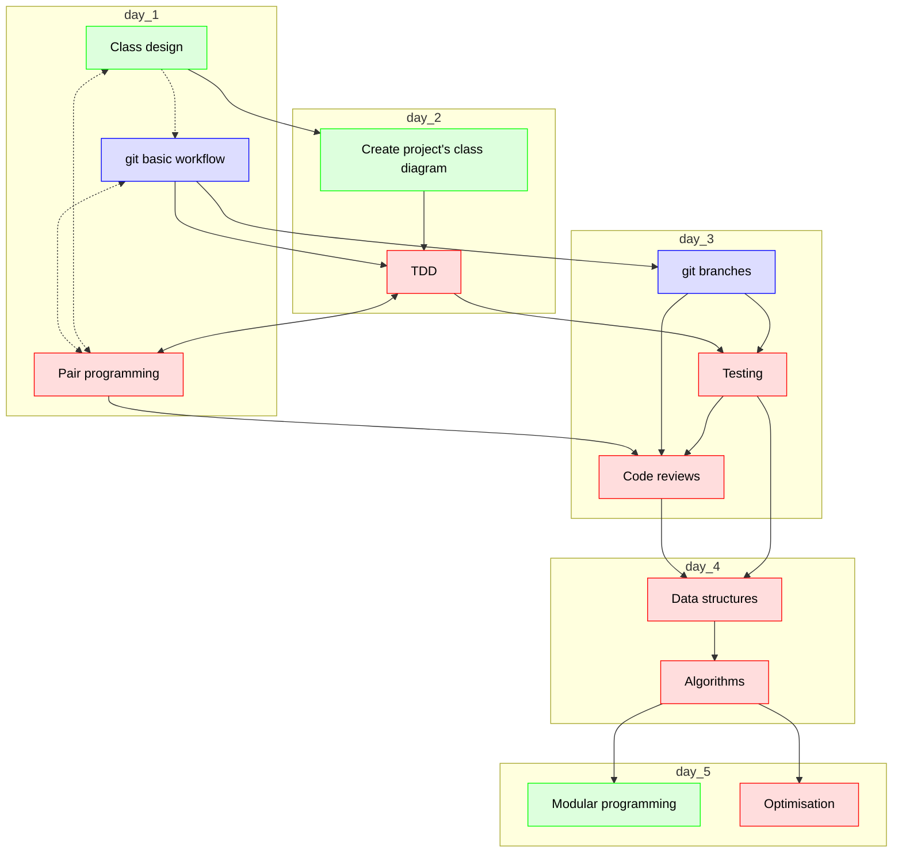

# Lesson plans

 * Autumn 2024, around April

## Suggest course schedules

These are, I'd say, the dependencies in the course:

The schedule I suggest:

Day      |Time       |Teacher|Subject
---------|-----------|-------|-----------------------------------------------------------
Monday   |09:00-12:00|Lars   |Class design (in groups, on repo, using web interface only)
Monday   |13:00-16:00|Björn  |git basic (in groups, on repo)
Tueday   |09:00-12:00|Lars   |Create project's class diagram (using git)
Tueday   |13:00-16:00|Richel |pair programming + TDD
Wednesday|09:00-12:00|Björn  |git branches
Wednesday|13:00-16:00|Richel |TDD + Code reviews
Thursday |09:00-12:00|Richel |Data structures
Thursday |13:00-16:00|Richel |Algorithms
Friday   |09:00-12:00|Lars   |Modular programming
Friday   |13:00-16:00|R (M)  |Optimisation

 * I think we should always work in groups as it is recommended by the literature,
   unless there is a good reason not to.
   Among others, these are best practices 'Principle 4: Must encourage teamwork and cooperation among students' [Saiyad et al., 2020]
   and 'Promoting group interaction, collaboration, and teamwork' [Fatimah et al., 2020]
 * I think class design should go before git, 
   as this follows the 'from big to small' idea
 * I enjoy 1 full day between git basics and git branches:
   this gives a learner some time to get to feel git

## Principles from [Saiyad et al., 2020]

 * Principle 1: Teaching–Learning methods must match curriculum and objectives
 * Principle 2: Must encourage synchronous and asynchronous teacher–student interaction
 * Principle 3: Promote higher order thinking skills and communication skills
 * Principle 4: Must encourage teamwork and cooperation among students
 * Principle 5: Must encourage active learning
 * Principle 6: Must encourage development of self-directed learning
 * Principle 7: Must provide opportunities for online summative and formative assessment
 * Principle 8: Must have an inbuilt mechanism for prompt feedback
 * Principle 9: Must encourage effective time management and timely task completion
 * Principle 10: Must communicate high expectations from each stakeholder
 * Principle 11: Must respect diverse talents and ways of learning
 * Principle 12: Must have mechanism for monitoring development and mentoring

## List of Pedagogical Skills from [Fatimah et al., 2020]

Effective online instructors should understand the fundamentals of online teaching and
pedagogy. They must demonstrate this understanding through applying a large number of principles and
strategies. These principles and strategies include:

 * Learning theories, such as learning styles, the adult learning theory, the learner-centered approach, and
collaborative learning;
 * Designing and implementing appropriate instructional strategies, as well as classroom assessment and
student engagement techniques;
 * Organizing and facilitating students’ participation and providing guidance and support as needed;
 * Using criterion-based assessment to evaluate individual and group performance;
 * Motivating students and showing enthusiasm and interest;
 * Encouraging knowledge construction based upon learners’ prior knowledge and life experience;
 * Fostering learners’ self-assessment and reflection; and
 * Promoting group interaction, collaboration, and teamwork

## References

 * [Fatimah et al., 2020] Albrahim, Fatimah A. "Online teaching skills and competencies." Turkish Online Journal of Educational Technology-TOJET 19.1 (2020): 9-20.
 * [Saiyad et al., 2020] Saiyad, Shaista, et al. "Online teaching in medical training: Establishing good online teaching practices from cumulative experience." International Journal Of Applied And Basic Medical Research 10.3 (2020): 149.
   [here](https://www.ncbi.nlm.nih.gov/pmc/articles/PMC7534709/)
