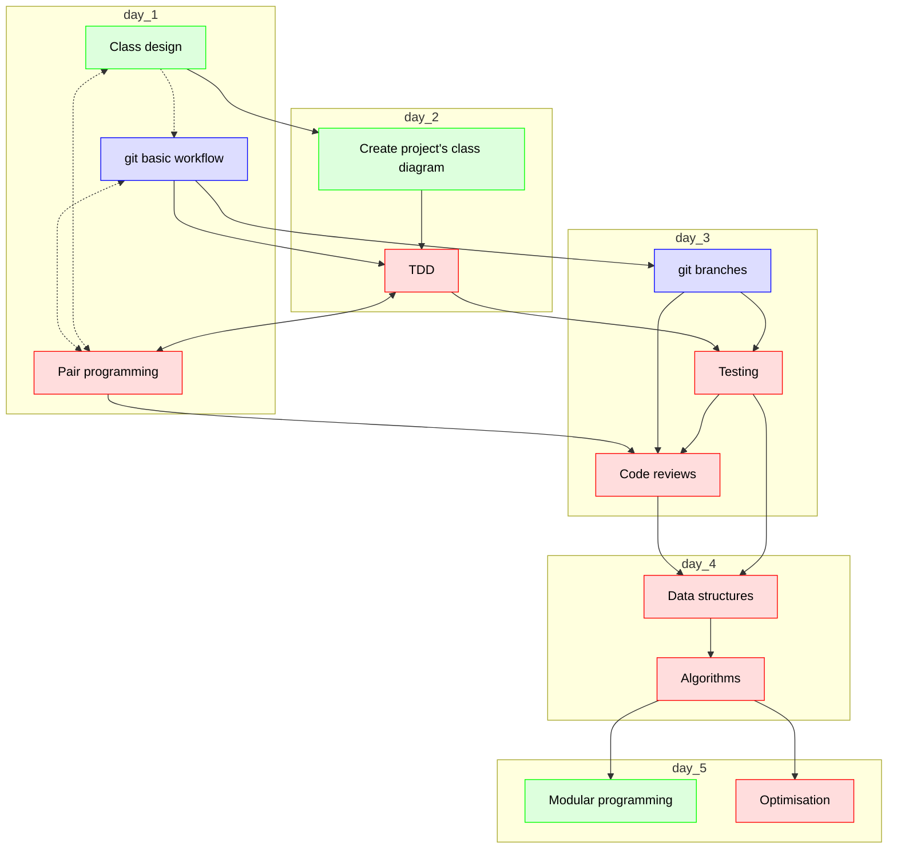

# Lesson plans

 * Autumn 2024, around April

## Suggest course schedules

These are, I'd say, the dependencies in the course:

 * MO-1: Class design (in groups, on repo, using web interface only)
 * MO-2: git basic (in groups, on repo)
 * TU-1: Create project's class diagram (using git)
 * TU-2: pair programming, DD
 * WE-1: git branches
 * WE-2: TDD
 * WE-3: Code reviews
 * TH-1: Data structures
 * TH-2: Algorithms
 * FR-1: Modular programming
 * FR-2 Optimisation
