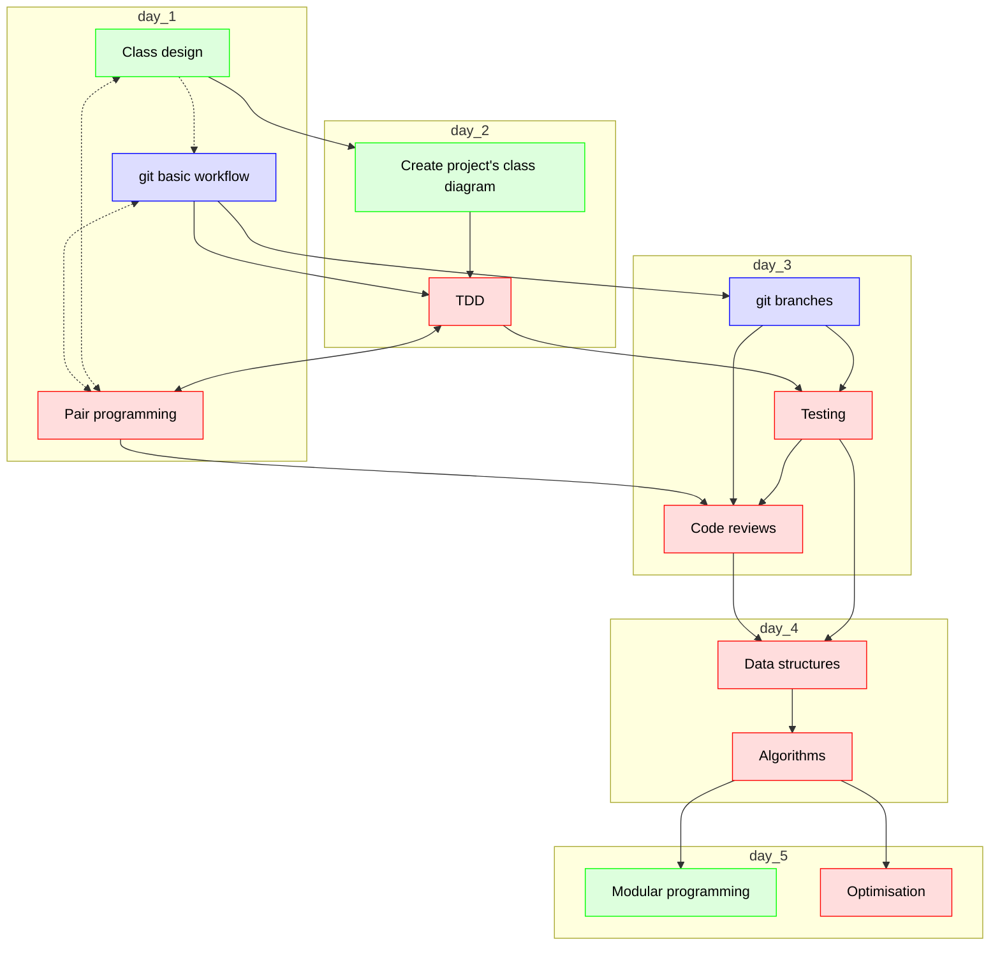

# Lesson plans

 * Autumn 2024, around April

## Suggest course schedules

These are, I'd say, the dependencies in the course:

Day      |Time       |Teacher|Subject
---------|-----------|-------|-----------------------------------------------------------
Monday   |09:00-12:00|Lars   |Class design (in groups, on repo, using web interface only)
Monday   |13:00-16:00|Björn  |git basic (in groups, on repo)
Tueday   |09:00-12:00|Richel |Create project's class diagram (using git)
Tueday   |13:00-16:00|Richel |pair programming + TDD
Wednesday|09:00-12:00|Björn  |git branches
Wednesday|13:00-16:00|Richel |TDD + Code reviews
Thursday |09:00-12:00|Richel |Data structures
Thursday |13:00-16:00|Richel |Algorithms
Friday   |09:00-12:00|Lars   |Modular programming
Friday   |13:00-16:00|R (M)  |Optimisation
