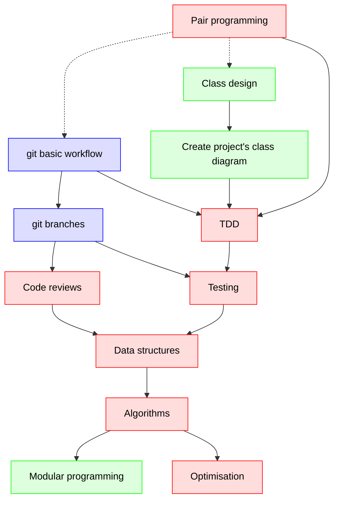

# Lesson plans

 * Autumn 2024, around April

## Suggest course schedules

These are, I'd say, the dependencies in the course:

```mermaid
flowchart TD

  classDef bjorn_node fill:#ddf,color:#000,stroke:#00f
  classDef lars_node fill:#dfd,color:#000,stroke:#0f0
  classDef richel_node fill:#fdd,color:#000,stroke:#f00

  pair_programming[Pair programming]:::richel_node
  code_reviews[Code reviews]:::richel_node
  git_basic[git basic workflow]:::bjorn_node
  git_branches[git branches]:::bjorn_node
  class_design[Class design]:::lars_node
  class_diagram[Create project's class diagram]:::lars_node
  tdd[TDD]:::richel_node
  testing[Testing]:::richel_node
  data_structures[Data structures]:::richel_node
  algorithms[Algorithms]:::richel_node
  modular_programming[Modular programming]:::lars_node
  optimisation[Optimisation]:::richel_node

  pair_programming -.-> git_basic
  pair_programming -.-> class_design
  pair_programming --> tdd
  git_basic --> git_branches
  git_branches --> code_reviews
  class_design --> class_diagram
  class_diagram --> tdd
  git_basic --> tdd
  tdd --> testing
  git_branches --> testing
  code_reviews --> data_structures
  testing --> data_structures
  data_structures --> algorithms
  algorithms --> modular_programming
  algorithms --> optimisation
```

The order then depends on if the git part is done socially or not:

