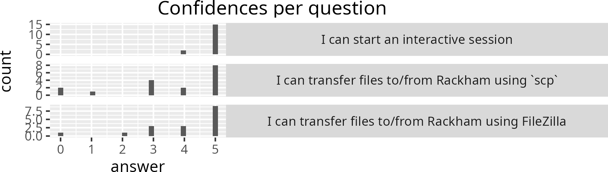

# Meeting notes 2024-10-02

- R: go through the Issues
- R: we have no Retrospects scheduled. I feel no need to, because I am
  not Jon. Do we remove Retrospects (and maybe replace these)?
  If yes, who does them?
  - Remove retrospects: R
  - Keep retrospects:
- R: instead of Retrospects, I'd enjoy another mechanism for
  evaluation and feedback.
  Do and how do we enjoy evaluation and feedback?
  - Collect no feedback:
  - Only modified NBIS survey at the end:
  - Only modified NBIS survey at the end, with a place for anonymous feedback: R
  - Modified NBIS survey at the end, daily confidence report (see below for screenshot) and with a place for anonymous feedback: R
  - Modified NBIS survey at the end and daily confidence report (see below for screenshot): 
  - Daily confidence report (see below for screenshot) and with a place for anonymous feedback: R
  - Daily confidence report (see below for screenshot):

> An example partial confidence report

- R: I miss having a video of lectures I teach for own private usage,
  such as making activity diagrams (see below)
  I can do a screen recording from my own computer and keep it someplace
  private. How to do this responsibly?

> Activity diagram of 'Intro to Bianca' on file transfer

> Activity diagram of 'Intro to Bianca' on interactive and job scheduler

> Activity diagram of 'Intro to Bianca' on legal aspects of sensitive data
