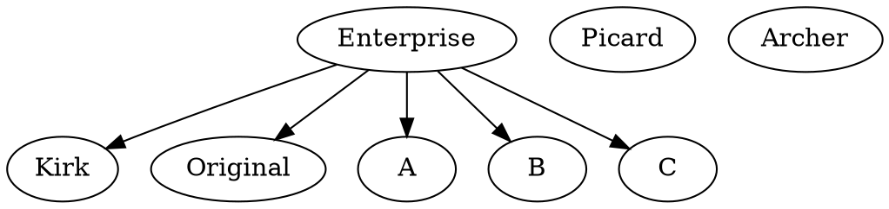

# Programming formalisms for life scientists and bioinformaticians 

Main page: https://github.com/UPPMAX/programming_formalisms
Rendered page: https://uppmax.github.io/programming_formalisms/


## Zoom meetings will be called when needed most issues shall be resolved through github issues if meeting is requested i will be posted in the slack chanell and the below meeting id will be used.

https://uu-se.zoom.us/j/63272190301 (Passcode: 880630)
## Course certificates
## Course certificates fall 2023
### Certificates

Text for course certificate
use https://rshiny.nbis.se/shiny-server-apps/shiny-certificate/ 
to create certificate
change the dates in brackets.
-------
<<name>>

has participated in the NBIS workshop Programming Formalisms
held in Online during [[April 22 – 26 2024]]
The workshop consisted of 40 hours of lectures and computer exercises.
This full 5-day workshop aims to g
an understanding of the underlying principles of software development, 
design, and programming.

This included the following topics:

    Introduction to programming formalism
    Source control and GitHub
    Introduction to UML using plantUML
    Introduction to Algorithms
    Data types and data structures
    Introduction to Software Development Lifecycle
    common models
    planning
    source/version control
    documentation
    reproducibility and sharing
    collaboration
    testing
    Introduction to Modular programming and the modular programming paradigm
    Introduction to Social Coding
    Pair Programming
    Introduction to Object orientation and Object oriented design
    Introduction to Test Driven Design and Testing (TDD)
    including to GitHub Actions
    automated testing
    Introduction Software re-usability through component based and Modular programming
    Optimization, measuring and common pitfalls

Course Leader | Lars Eklund, PhD
Applications Expert UPPMAX/NBIS
NBIS | Uppsala University
    
    

## Course spring 2024

### Dates and info

- Onboarding takes place Thursday 18th April 11:00-(max)12:00
    - [Lars, Richel] Available 11:00-11:20
    - [Lars] Write welcome letter to participants today must be done 14:30
      - Encourage strongly to have [a good Zoom setup](https://uppmax.github.io/programming_formalisms/prereqs/#a-good-zoom-setup) :-)    
      - Monday April 22nd to and including Friday  April 26th
      - Each day from 9:00-16:00
      - R volunteers to (help) write the letter if needed!

## Meeting after course

- [Richel, discuss] How many things at the same time should our learners do?
  - B: ceil(\pi - e)
  - L:
  - R: 1
- [Richel, discuss] What should the learners do in the break?
  - B: break or technical issues if OK with them
  - L:
  - R: do nothing, take a break
- [Richel, discuss] How long should a monologue be? What should happen when this duration has been  crossed?
  - B: aim to 10 minutes
      - is a demo where they can choose to do a type-along a monologue?
      - with demo it can be up to 20 I guess
  - L:
  - R: 20 minutes max, a helper should remind the teacher by voice


## Meeting April 17th Wednesday 11:00-12:00

Attendees:

- [x] Björn
- [x] Lars
- [x] Richel, only on HackMD due to eduroam connection problems

Progress:

- Week 13: learning objectives on pages: ...
  - B: ?done!
  - L: ?Monday done, need to do Tuesday and Friday
  - R: draft, need revision
- Week 14: start of draft of exercises in place: <--
  - B: added most of them (needs some updates)
  - L: started 
  - R: done
- Week 15: draft of material in place: ...
  - B: most is there but need to be restructed and shortened
  - L: started
  - R: done

Open Issue                                                  |Assigned|Progress
------------------------------------------------------------|--------|--------
<https://github.com/UPPMAX/programming_formalisms/issues/30>|BLR     |B done (minor revisions?) Mon, Wed, Fri. R will revise ASAP
<https://github.com/UPPMAX/programming_formalisms/issues/31>|BLR     |R done, need to discuss 
<https://github.com/UPPMAX/programming_formalisms/issues/33>|.       |B done (copy-paste error) yay!


Discuss:

- [L] Helpers **from Sysdev** (sorry for the confusion! eduroam is bad, so tethering and HackMD-only for me now): 
    - R enjoys Sysdev helpers during any hour of teaching, any amount of people.
- Helpers that are us (usually 1 extra teacher avail)
    - BC: Mon, Tue morning, Wed, Fri morning
    - R: can be there always, only need 1 helper from the teaching team

Day|morning|afternoon
-|-|-
Mon|R | R B
Tue|R | L
Wed|(B),(R ), L |L
Thu|L | B
Fri|R |R

*``()`` means teaching parts oneself*
- [R] Dream evaluation: use yes/no <https://github.com/UPPMAX/programming_formalisms/issues/31>
- [B] Can I get a co-teacher do demo pull request?
  - Richel volunteers! We can practice/coordinate beforehand or do so wih coffee at 8:00? You pick!
  - Thanx!

## Meeting April 10th Wednesday 11:00-12:00

Attendees:

- [X] Björn
- [x] Lars
- [x] Richel

Progress:

- Week 13: learning objectives on pages: ...
  - B: ?done!
  - L: ?Monday done, need to do Tuesday and Friday
  - R: draft, need revision
- Week 14: start of draft of exercises in place: <--
  - B: added most of them (needs some updates)
  - L: 
  - R: done
- Week 15: draft of material in place: ...
  - B: most is there but need to be restructured and shortened
  - L:
  - R: done

Open Issue                                                  |Assigned|Progress
------------------------------------------------------------|--------|--------
<https://github.com/UPPMAX/programming_formalisms/issues/29>|R       |None
<https://github.com/UPPMAX/programming_formalisms/issues/30>|BLR     |B done Mo
<https://github.com/UPPMAX/programming_formalisms/issues/31>|BLR     |R done
<https://github.com/UPPMAX/programming_formalisms/issues/33>|.       |Discuss next meeting


Discuss:

- [LR, FYI, 3 mins] L wants to have some people from other departments to help as a TA, 
  with the goal of getting to know each other.
  - R will happily set them work, especially in the pair programming! R will contact L

- [R] The goal of the prereqs page is that our learners can verify that they have installed the minimum requirements for the course. Achieved? If not, what is next plan?
    - BC makes a review again.
- [R, FYI, 3 mins] R made a more detailed overview at https://uppmax.github.io/programming_formalisms/intro/ , with project exercises at the bottom. Maybe you find it helpful too?
- [B] Demos and examples fro BC's theory part
    - Use parts of planet project!!
- [R] L seems to be lagging behind. How can we help?
    - L will report his progress on the Slack, so others an jump in
- [R] Remember to remind learners to have a proper place to talk, 
      with proper equipment
- [B] Use HackMD as a shared document? B+L+R: yes!

## Meeting April 3rd Wednesday 11:00-12:00

Attendees:

- [HOLIDAY] No Björn
- [CANCELLED] No Lars
- Richel

Progress:

Closed two Issues

Open Issue                                                  |Assigned|Progress
------------------------------------------------------------|--------|--------
<https://github.com/UPPMAX/programming_formalisms/issues/29>|R       |?
<https://github.com/UPPMAX/programming_formalisms/issues/30>|BLR     |?
<https://github.com/UPPMAX/programming_formalisms/issues/31>|BLR     |R done
<https://github.com/UPPMAX/programming_formalisms/issues/33>|.       |Discuss next meeting

- Week 13: learning objectives on pages: R done for shared days
- Week 14: start of draft of exercises in place: R done for shared days
- Week 15: draft of material in place: R done for shared days

## Meeting Wednesday 27 March 11:00-12:00

Attendees:
- Björn
- Lars
- Richel

Progress [5 mins]:

Open Issue                                                  |Assigned|Progress
------------------------------------------------------------|--------|--------
<https://github.com/UPPMAX/programming_formalisms/issues/16>|L       |WIP

5 Issues were closed.

- Björn: 
    - Made all required installations on Windows and Mac and rewrote prerequirements (took whole day last Friday)
    - started with some goals and planning for which files to start from
- Richel:
    - add all learning objectives to my pages
    - convert some Quarto lecture slides to markdown

Discuss:

- [Björn -> Richel] Can someone check the prereqs for Linux? Richel does that!
- [Björn for Lars] Please check <https://uppmax.github.io/programming_formalisms/introductions/sdlc_tools/#software-citation>
- [Richel, 5 mins] I am happy to see learning objectives on our pages, as this helps one focus on how/what to teach! Learning objectives, however, should be learner-centered, active, observable and specific, e.g. 'learners are able to do a git push', instead of vague 'We will get some theory of X'. Could we try to make all teaching objectives learner-centered, active, observable and specific? I volunteer to do Pull Requests :-)
    - [VOTED] BLR: Yes
    - [other votes] : No
- [Richel, 5 mins] I am happy to see the prereqs page and the obvious love put in it. I am unsure of the page's purpose. Could we come up with a purpose of the page and vote? As Björn will the one teaching the first sessions, however, I agree he is boss on this. Also, I volunteer to do the work. If we discuss: The goal of the prereqs page is ...
    - [VOTED] BLR: that our learners can verify that they have installed the minimum requirements for the course
    - [other votes]: [other suggestions]
- [Richel, 5 mins] I think it is useful that we do anonymous evaluations. However, when analyzing the evaluations, most questions are useless to me. Which questions are useful to the others? Below is my dream evaluation:
    - Lars: we **must** follow the NBIS parts. 
    - [TODO] Next next meeting: we all put our dream evaluation here before next meeting

```
- What should we keep doing?
- What should we improve?
- Other comments?
```

- [Richel, 5 mins] I enjoy how we all try to improve on the course. However, having too few time for exercises seems to be a running theme, although we seem to have the will to improve this. Here I suggest something to help us commit: making it an explicit retrospect and evaluation question. Dare we commit to this?
    - [VOTED] BLR: Yes
    - [other votes]: No


Retrospect example:

```
## Which section(s) scheduled enough time for exercises? <--- SUGGESTED
```

Evaluation example:

```
- Which section(s) scheduled enough time for exercises? <--- SUGGESTED
```


Future schedule:

- Week 13: learning objectives on pages [will rework a bit]
- Week 14: start of draft of exercises in place [Björn away]
- Week 15: draft of material in place
- Week 16: improve
- Week 17: teaching

## Meeting Wednesday 20 March 11:00-12:00

- Attendees: everyone

- Progress:
   - L is still working on getting a functional email
   - 15 learners have registered
   - Application form stays in place for this iteration of the course

Issue                                                       |Assigned|Progress
------------------------------------------------------------|--------|--------
<https://github.com/UPPMAX/programming_formalisms/issues/16>|L       |Forgot, will do
<https://github.com/UPPMAX/programming_formalisms/issues/21>|B       |Done
<https://github.com/UPPMAX/programming_formalisms/issues/23>|B       |Done
<https://github.com/UPPMAX/programming_formalisms/pull/26>  |R       |Approved, R will merge


- [Richel, FYI] I put an overview of the course in graph at https://uppmax.github.io/programming_formalisms/intro/ . I like it! :+1:
- [Richel, FYI] Project repo is ready at <https://github.com/programming-formalisms/programming_formalisms_project_summer_2024> :+1:
- [Richel, vote] move all schedules from HackMD to website. To see how that looks like, I put a copy at [the course website](https://uppmax.github.io/programming_formalisms/intro/)
    - [VOTED!] pro: proper version control, no duplicates that can differ
    - con: ?
    - votes: pro: BLR, con: .
- [Richel, vote] suggest to keep the general schedule general, e.g. Wednesday is 'git branches, code reviews and TD', with a detailed schedule at the course's day
    - [VOTED!] pro: right level of detail at each page
    - con: can mismatch
    - votes: pro: BLR, con: .
- [Richel, discuss] I'd enjoy a long-term schedule for preparation:, e.g.
    - Week 13: learning objectives on pages, e.g <[Learning objectives](https://uppmax.github.io/programming_formalisms/pair_programming/)>
    - Week 14: draft of exercises in place [Björn away]
    - Week 15: draft of material in place
    - Week 16: improve
    - Week 17: teaching

Next meeting: Wednesday 27 March 11:00-12:00 at https://uu-se.zoom.us/j/63272190301 (Passcode: 880630) :slightly_smiling_face:

## Meeting 2024-03-06 11.00

- Attendees: everyone
- Estimated time before meeting: 33 mins
- Actual time: 38 mins

Points:

- [Richel, FYI, 1 min] I enjoy [the new course website](https://uppmax.github.io/programming_formalisms/). Thanks Björn!
- [Richel, FYI, 1 min] The mermaid `git` graphs are great, e.g. <https://uppmax.github.io/programming_formalisms/git/apply_merge/#exercise-2-practice-merge-conflicts-between-branches>!
- [Richel, FYI, 1 min] git exercises are ready, including teaching goals
- [Richel, vote, 5 mins] Agree on <https://github.com/UPPMAX/programming_formalisms/issues/20> yes/no? Richel: Yes, Björn: yes. Lars: yes. 
  - Björn: We should mention PlantUML in the tools session but point to the ReadExtra section. Lars: I will do that!
- [Richel, discuss, 5 mins] Discuss <https://github.com/UPPMAX/programming_formalisms/issues/21>. 
  - Bjorn wiloblemsl do this
- [Richel, discuss, 5 mins] Discuss <https://github.com/UPPMAX/programming_formalisms/issues/22>
  - Richel will do this
- [Richel, discuss with Björn, 3 mins] I'd like to link to a git book, over writing own content. [Pro Git](https://git-scm.com/book/en/v2) is an authority. What about using it? If not, which book?
  - Björn will check the book and picks a book, Richel will follow
  - Lars: Book should be in the reading materials. Richel: it is already there :+1: 
- [Richel, discuss, 3 mins] Is there a moment learners can get help with setting up? If yes, when?
  - Onboarding takes place Thursday 18th April 11:00-(max)12:00!
  - Lars and Björn and Richel show up
  - possibly individual help later on if huge problems
- [Richel, discuss, 3 mins] Some courses schedule an hour to train the TAs. Do we have TAs? If yes, should we schedule this? FYI, I wrote down the breakout room policy at (where I describe my exercises' procedure)[https://uppmax.github.io/programming_formalisms/misc/exercise_procedure/]
  - Lars: no TAs yet, we can ask NBIS if we discover we need some
- [Richel, discuss, 3 mins] Discuss <https://github.com/UPPMAX/programming_formalisms/issues/23>
  - Björn does it
- [Richel, discuss, 3 mins] Discuss moving schedule from this doc to course website, under 'About the course -> Schedule'
  - Björn does it
- [Lars, FYI] Lars prepares the NBIS course landing pages tomorrow/Thursday 7th March
  - Björn: link to NBIS Anmälan in InfoGlue? Lars: when ready, I will contact you
- Björn: How many applications? Lars: a few already
- [Lars, FYI] We now have a formal NBIS email address for the course.
  Lars will fix getting access to that email address
- [Lars, FYI] We need a Canvas page, I will make it link to the course pages
- Björn: need Richel and Lars coordinate? Nope, they work quite isolated :-)
- Lars: need Richel and Marcus coordinate? Richel will coordinate :-)
  - [ ] TODO: Richel updates Marcus :-)
- Next meeting: Wednesday 20 March 11:00-12:00 (next week is teaching week)
- Lars allows everyone to fix his spelling errors

## Meeting 2024-03-04 13.00

- Attendees: Björn + Lars

- Status 
    - more structure now
        - days in menu
            - intro files to anounce the content/schedule of the day
        - some files and folders
    - Björn has migrated some of his material

- To discuss
    - Tree
        - [x] intro [name=bjorn]
        - [x] project_overview
        - [x] project start
        - [x] design_development
        - [x] git [name=bjorn]
        - [x] test_TDD [name=Richel]
        - [x] data_structures [name=Richel]
        - [x] modularity [name=Lars]
        - [x] algorithms [name=Richel + Lars?]
        - [x] optimisation [name=Richel]
        - [x] deployment [name=bjorn]
        - [x] extra_BC [name=bjorn]
        - [x] reading [name=Lars]

    - Code editor
        - VS code but own choice

## Meeting 2024-02-28 13.00
- Björn + Richèl

- Richel is happy with Björns ideas and the initial mkdocs setup and agrees to the voted stuff!
- We need to discuss Wednesday:

Day      |Time       |Teacher|Subject
---------|-----------|-------|-----------------------------------------------------------
Wednesday|09:00-10:00|Björn  |understand git branches, git merge
Wednesday|10:15-11:00|Richel |apply git branches
Wednesday|11:15-12:00|Björn  |understand git pull request with code review
Wednesday|13:00-14:00|Richel |apply code review 
Wednesday|14:15-15:00|Richel |understand TDD (+data structures)
Wednesday|15:15-15:45|Richel |apply TDD (+data structures)
Wednesday|15:45-16:00|Richel |retrospect

- [VOTED yes] no dependencies until Friday, which has deployment
- which Python graphics framework: Richel and Lars decide, Björn does not vote on that

- Wednesday (Richèl and Björn together)
    - git branches (merging, issues, pull requests)
        - activities
            - features? 
    - More TDD (??) + code reviews (issues/pull requests)
    - These can be more or less merged?
    - Q: How much time is required here?
        - Can we move something from the last days here?
        - (Data structures)


## Meeting 2024-02-28 11.00
- Discuss
    - structure of mkdocs **web** tree
        1. daily in upper menus :+1::+1:
            - pro: very clear for students during course
        3. topics in upper menu
            - pro: clear after course 


    - structure in mkdocs **file** tree
        1. daily directories
            - pro: simple
        3. topic directories :+1:
            - pros: 
                - easier to rearrange later 
                - just move existing directories, almost...
    - reading with topics in sub menus :+1::+1:
    - extra reading with topics in sub menus :+1::+1:

- Teaching
    - **mkdocs website with lesson structure** which is very easy to follow for students that are missing parts.
    - slides and movies:
      - **if teacher wants to use them**, but has to be linked to from the md lesson material

- Responsibilites
    - all are responsible in populating the docs with their md material
    - Björn starts to make some more structure of https://uppmax.github.io/programming_formalisms/

## Meeting 2024-02-21 

- [Richel, 5 mins] Discuss the word 'theoretical': 
  - the content of the course can be as practical or theoretical as Lars wants it to be. I have no problem with content being about theory.
  - teaching time consists out of lecturing and exercises. Here I misused the terms 'theoretical' for 'lecturing' and 'practical' for 'exercises'. Here we know that whatever the content is, there must be exercises, see among others [Bell, 2020] for an evidence-based 5 step model (1. Prior knowledge, 2. Present, 3. Challenge, 4. Feedback, 5. Repeat), that overlaps with [Hattie, 2008].
      - We agree :-)
- [Richel, 5 mins] The course goals use 'understand' a lot. This is commonly mapped to the one-but-lowest level in Bloom's taxonomy (Wikipedia: https://en.wikipedia.org/wiki/Bloom%27s_taxonomy#Cognitive_domain_(knowledge-based), see 'Comprehension')(pretty picture: https://www.alfaandfriends.com/wp-content/uploads/2020/10/revised-blooms-taxonomy.jpg). Is this word really properly chosen? If not, could we use the right verbs? I feel we do aim at higher levels, but maybe I should change my teaching. In any case: how do we test for this level being achieved (spoiler: exercises)? 
    - We tend to drift to the Apply level, yet also sometimes to Design. Some of us try to be more precise in writing down teaching goals.
    - We (intend to) teach at the Apply level and if there is more time, we go up higher
- [VOTED] Vote for using MkDocs
- [Björn, 20m] Discuss schedule below
    - Examples: 
        - If two teacher on one day, we all agree to mix up the day itself
        - Merging Wed somehow: yes, will work!
        - shortening Thu if possible?: done!
        - shortening Fri if possible: done!
        - this is to fit with wrapping-up of project: done!

- ToDos:
    - We are basically two teachers per day. Let's plan for 2-person meetings!
    - Björn
    - Lars
    - Richèl
 
 
### Schedule

- Remember: The initial aims for the course
  - give scientists with some experience in programming and scripting:
    - an **understanding** of the **underlying principles** of software development, design, and programming.
  - strengthen the **understanding** of:
    - more **advanced programming concept**s
    - **ability to produce** more reusable scripts through modular programming
    - enable a better **understanding** of how to evaluate a script or programs **performance**.
  - encourage the **use of software development tools**, like:
    - Unified Model Language
    - Git and Github
  - convince the benefits of **sharing and social coding**

- So... practicals are very important but also the theory of whats and whys

### Proposed schedule Björn modified from Richèl's, see below

Day      |Time       |Teacher|Subject
---------|-----------|-------|-----------------------------------------------------------
Monday   |09:00-12:00|Lars   |Parts from Björn's intro and Class design (in groups, on repo, using web interface only)
Monday   |13:00-16:00|Björn  |Start project git basic on documents (no coding?) (in groups, on repo)
|||
Tuesday  |09:00-12:00|Lars   |Create project's class diagram (using git)
Tuesday  |13:00-16:00|Richel |pair programming + TDD
|
Wednesday|09:00-10:00|Björn  |understand git branches, git merge
Wednesday|10:15-11:00|Richel |apply git branches
Wednesday|11:15-12:00|Björn  |understand git pull request with code review
Wednesday|13:00-14:00|Richel |apply code review 
Wednesday|14:15-15:00|Richel |understand TDD (+data structures)
Wednesday|15:15-15:45|Richel |apply TDD (+data structures)
Wednesday|15:45-16:00|Richel |retrospect
|||
Thursday |09:00-12:00|Richel |Data structures (+ algorithms)
Thursday |13:00-16:00|R (+M) |Algorithms + Optimisation
|
Friday   |09:00-12:00|Lars   |Modular programming deep
Friday   |13:00-16:00|Björn  |Deployment


- Monday (Björn and Lars together)
    - overview
        - Lessons
            - Less "what is programming/scripting"
            - SDLCs 
            - risk analys
            - modules intro
            - oo intro (students ready for Tue morning)
            - (paradigms/formalised devel)
            - tools (all presented) [name=Björn]
        - Activities
            - discussions
    - Start project with planning
        - Week Project with interspersed theory
            - initiate git/github [name=Björn] 
            - UML, (pseudocode), design
            - object (early process)
            - initial documentation (how) [name=Björn]
- Tuesday (Lars and Richèl together) (+ Björn?)
    - Class diagrams (45 theory)
    - reproducibility (part of everything) ([name=Lars] and all)
        - sharing etc
    - Pair programming 
    - TDD (also overview of testing?)
        - Activities
            - coding


- Wednesday (Richèl and Björn together)
    - git branches (merging, issues, pull requests)
        - activities
            - features? 
    - More TDD (??) + code reviews (issues/pull requests)
    - These can be more or less merged?
    - Q: How much time is required here?
        - Can we move something from the last days here?
        - (Data structures)
- Thursday (Richèl alone?)
    - (Data structures)
    - Algorithms
    - Optimisation
    - (Modular programming)
- Friday (Lars and Richèl) (+ Björn?)
    - (Modular programming)
       - Packaging, virtualenv (do it!)
    - Deployment
        - Packaging, virtualenv (do it!)
    - (Wrap up with documentation and package)


### Proposed schedule Richèl
Day      |Time       |Teacher|Subject
---------|-----------|-------|-----------------------------------------------------------
Monday   |09:00-12:00|Lars   |Class design (in groups, on repo, using web interface only)
Monday   |13:00-16:00|Björn  |git basic (in groups, on repo)
Tueday   |09:00-12:00|Lars   |Create project's class diagram (using git)
Tueday   |13:00-16:00|Richel |pair programming + TDD
Wednesday|09:00-12:00|Björn  |git branches
Wednesday|13:00-16:00|Richel |TDD + Code reviews
Thursday |09:00-12:00|Richel |Data structures
Thursday |13:00-16:00|Richel |Algorithms
Friday   |09:00-12:00|Lars   |Modular programming
Friday   |13:00-16:00|R (M)  |Optimisation


- Abbreviations: algos = algorithms, DP = Design patterns, DS = data structures, optimi = optimization, social = social coding, TDD = Test Driven Development
    - [name=Lars]:DP should mention refinment optimization of design through DP


### Meeting 7 Feb 11-12
 * Teachers: Björn, Lars, Richel (Marcus)
 * Date: 
    * Monday April 22nd to and including Friday April 26th
    * NOT Monday May 6th ..., because 3 days
    * NOT Monday May 13nd because conference Lars
    * NOT Monday May 20nd because conference Lars
    * NOT Monday May 27th to and including Friday May 31st, due to some reason
    * NOT Monday June 3rd - Friday ..., due to Nationaldagen
    * NOT Monday June 10th ..., due to summer holiday
   * [x] Björn and Lars will double-check if that works
   * [ ] Lars will advertise this
   * [ ] Richel will notify Marucus
 * Format:
     * Fully virtual
 * Do we need more helpers?
     * Yes/No
 * Social coding, as taught by Jon goes to Richel, if noone else wants it
 * Next iteration dreams:
   * Richel: start with social coding
   * Lars: Start introducing project from Day 1
* TODO for next meeting:
   * Suggest a course schedule
       * ALL OF US
   * Lars: Vote between mermaid and PlantUML
       * Pro mermaid: works out of the box
       * Con mermaid: does not do all types of diagrams: maybe Lars needs one!
       * Pro PlantUML: has all types of diagrams
       * Con PlantUML: learners need to install things
       * VOTE NEXT WEEK
   * Björn: Think about how to do the git section.
       * Lars idea: 
           * as long as they use the course repo with the folder structure, I am happy
           * Björn is boss!
       * Richel: 
           * as long as I've seen all learners have made a commit on the course repo, I am happy
           * Björn is boss!
   * Lars: Think about how to do the design document
       * Richel: 
           * as long as a class diagram ended up in the repo, I am happy
           * Lars is boss!
 
### Sections:


## Course certificates fall 2023
### Certificates

Text for course certificate
use https://rshiny.nbis.se/shiny-server-apps/shiny-certificate/ 
to create certificate

-------
**<<name>>**

has participated in the NBIS workshop **Programming Formalisms**
held in **Online** during **27 November -- 1 December  2023**.
The workshop consisted of 40 hours of lectures and computer exercises.
This full 5-day workshop aims to give scientists, bioinformaticians and other research engineers with some experience in programming and scripting an understanding of the underlying principles of software development, design, and programming. The workshop aims to strengthen the understanding of more advanced programming concepts, ability to produce more reusable scripts through modular programming and to enable a better understanding of how to evaluate a script or programs performance.
This included the following topics:
- Introduction to programming formalism
- Source control and GitHub
- Introduction to UML using plantUML
- Introduction to Algorithms
- Data types and data structures
- Introduction to Software Development Lifecycle
 - common models
 - planning
 - source/version control
 - documentation
 - reproducibility and sharing
 - collaboration
 - testing
- Introduction to Modular programming and the modular programming paradigm
- Introduction to Social Coding
- Pair Programming
- Introduction to Object orientation and Object oriented design
- Introduction to Test Driven Design and Testing (TDD)
 - including to GitHub Actions
 - automated testing
- Introduction  Software re-usability through component based and Modular programming
- Optimization, measuring and common pitfalls


Course Leader | **Lars Eklund, PhD**
Applications Expert UPPMAX/NBIS
NBIS | Uppsala University
    
    
----------------------------------------------------------    
## November course zoom
Lars Eklund is inviting you to a scheduled Zoom meeting.

Topic: Programming Formalism Course Meeting
Time: Nov 24, 2023 08:30 AM Stockholm
        Every day, until Dec 1, 2023, 8 occurrence(s)
        Nov 24, 2023 08:30 AM
        Nov 25, 2023 08:30 AM
        Nov 26, 2023 08:30 AM
        Nov 27, 2023 08:30 AM
        Nov 28, 2023 08:30 AM
        Nov 29, 2023 08:30 AM
        Nov 30, 2023 08:30 AM
        Dec 1, 2023 08:30 AM
Please download and import the following iCalendar (.ics) files to your calendar system.
Daily: https://uu-se.zoom.us/meeting/u5Ipd-CvrjIiHd0mA7LZEoc8tehKfAe9R5oi/ics?icsToken=98tyKu-uqjsjHdScuB6OR_MABoigXe3ziFhHgqcNkT6yLxp2bQCuIudKGbReFYHi

Join Zoom Meeting
https://uu-se.zoom.us/j/66409709879

Meeting ID: 664 0970 9879
Passcode: 583470
One tap mobile
+46850539728,,66409709879# Sweden
+46844682488,,66409709879# Sweden

Dial by your location
        +46 850 539 728 Sweden
        +46 8 4468 2488 Sweden
        +45 89 88 37 88 Denmark
        +45 47 37 25 75 Denmark
        +49 69 7104 9922 Germany
        +49 695 050 2596 Germany
        +33 1 8699 5831 France
        +33 1 7095 0350 France
        +44 131 460 1196 United Kingdom
Meeting ID: 664 0970 9879
Find your local number: https://uu-se.zoom.us/u/cb33F9G1YH

Join by SIP
66409709879@109.105.112.236
66409709879@109.105.112.235

Join by H.323
109.105.112.236
109.105.112.235
Meeting ID: 664 0970 9879
Passcode: 583470


## Meeting Notes
### Current Teachers/TA
- [name=Lars Eklund], course coordinator, lars.eklund@uppmax.uu.se
- [name=Björn Claremar], teacher, bjorn.claremar@uppmax.uu.se
- [name=Marcus Lundberg], teacher, marcus.lundberg@uppmax.uu.se 
- [name=Matias Piqueras], ?teacher/?TA, matias.piqueras@uppmax.uu.se
- [name=Richèl Bilderbeek], teacher, richel.bilderbeek@uppmax.uu.se 
- [name=Jon Ander Novella], ?teacher, jon.novella@nbis.se

### Assistants
- [See schedule at https://github.com/UPPMAX/programming_formalisms#schedule]

### NEXT COURSE DATE Nov 27-1 Dec 2023

### Online ONBOARDING Session Friday Nov 24 10:00-11:00

make deadline Oct 31 ~~Dec~~
## Course project
[students] R: simulating bacterial movement in 2D space
[selves!]  M: N-body simulation, e.g. galaxy sim or predator-prey
Marcus and Richel will write a project breef that Lars Formalises.
The [selves!] project has a Requierments modeleling and a first usecasemodel done, Next step is to create modules and classes to solve the structure problem. as well as describing the testcases in more detail for each use case-requierment.

### Meeting on 2023-11-15

Agenda:

- Round Robin -> How is everyone coming along with their parts
    - RB: 
        - example project has standard structure and CI checks work
        - needs design document for example project
        - see also [PF Open Issues](https://github.com/UPPMAX/programming_formalisms/issues)
    - BC:
        - spell checking of [Intro Day](https://github.com/UPPMAX/programming_formalisms_intro)
        - word list
        - restructure
        - refine the planet project
    - LE:
        - Continued working on the DPD
        - Continued writing on the Design material 
        - TODO: Transfer the new AI part to The lecture
        - TODO: Expand the Design Pattern lecture and restructure the OO lecture
    - Status report
        - RB: Course website is ready
        - RB: Example project needs completed design documents
    - Work in full team or split into Pairs for Pair programming and development
        - RB: Depends on what we are going to do :-)
    - Merge the branches
        - RB: Course website: done :-)
        - RB: Example project: done :-) (it had no branches)
- Wrap up and schedule next meeting.


### Meeting on 2023-11-10

Suggested schedule:

- [R, 10 mins] Finalize course schedule: who teaches what when?

Current schedule (see below), each session summarized in one word or abbreviation:

Day|Before lunch      |After lunch|Reflection
---|------------------|-----------|----------
1  |Björn, git        |Björn, git |Jon
2  |Lars, design      |Jon, social|Richel 
3  |Richel, TDD       |Richel, TDD|Jon
4  |Richel, algos     |Richel, DS |Jon
5  |Lars, DP          |R+M, optimi|Jon

- Abbreviations: algos = algorithms, DP = Design patterns, DS = data structures, optimi = optimization, social = social coding, TDD = Test Driven Development
    - [name=Lars]:DP should mention refinment optimization of design through DP
 
- [R, 1 mins, FYI] [Overview of projects with beautiful team logos](https://github.com/UPPMAX/programming_formalisms#projects)
- [R, 1 mins, FYI] Videos with git workflows and branching models already at [the PF example project](https://github.com/programming-formalisms/programming_formalisms_example_project)
    - [name=Björn]: add link also from 1 day extra reading
- [R, 3 mins, inventorize] Interested in pair programming sessions to feel the workflow yes/no?
    - L: try next week, also with J
- [R, 5 mins, discuss and vote] In the example project we use the MVC architecture. Should it be (:+1: for each suggestion you like):
    1. a console application, human only :+1: 
    2. a GUI application, human only :+1:
    3. both console application (written by humans) and a GUI application (written by AI) :+1: :+1: :+1:
    4. both console application (written by AI) and a GUI application (written by human)
    5. a console application, AI-assisted only
    6. a GUI application, AI only
- We picked 3 :-)
- [R, 8 mins, discuss and vote] If GUI, which package?
    - Round 1: collect the recommended GUI packages
        - Kivy
        - PyQT5
        - PySide 2
        - Tkinter :+1: :+1:
        - wxPython
        - PyGame :+1: :+1: :+1:
    - Round 2: discuss the collect GUI packages
    - Round 3: :+1:s per packages
    - We picked PyGame!
- L will put in more class design documents
    - Base class design and CI
-L will put in citing clause and cite references for all teaches. 

- Setup:
    - link in setup.md 
    - to html documentation (RTD)

### Meeting on 2023-10-20
 * Björn includerar förberdelser i sin första dags dokumentation.
 * Lars kontaktar Diana om training letter under mötet
 * [x] Björn updaterar Hemsidan
 * Marcus och Richel ska mötas och hjälpa Richel utveckla ~~Algorithmer och~~ Optimisation
 * Marcus funderar på om omstructureringen hinner itid 
 * 

### Next meeting at 2023-09-27 9:00

 * L and J wants to add more AI in teaching :-)
 * Course schedule
     * R: who does when? From last year's schedule at https://github.com/UPPMAX/programming_formalisms/tree/richel#schedule :
         * Day 1: Björn, Björn, Jon
         * Day 2: Lars, Jon, Richel
         * Day 3: Richel, Richel, Jon
         * Day 4: Richel, Richel, Jon
         * Day 5: Lars (design patterns), Richel (prep with Marcus), Anon (ask Nina, R will recruit!) feedback like Python
 * Design documents: L plans to be done Friday 23:59
 * Retrospectives
 * Changes to schedule
 * Lesson preparation:
     * Talk max 20 mins, then monitor students
 * Advertise (NAISS newsletter next Thurs)
     * update present
     * material is language agnostic, we do use git and Python for exercises (done in pairs)
     * prepare: 
         *  git+little python
         * Refer to the UPPMAX git course, last years' website: https://www.hpc2n.umu.se/events/courses/2022/introduction-to-git
         * Refer to the NBIS Python course, https://github.com/nbisweden/workshop-python/tree/ht23
         * **Advertising**,
             Advertising text for the SNIC training newsletter Course 3

            Programming Formalisms Course - Nov 27- Dec 1 (online)

            This full 5-day course aims to give scientists, bioinformaticians and other research engineers  with some experience in programming and scripting an understanding of the underlying principles of software development, design, and programming. The course aims to strengthen the understanding of more advanced programming concepts, ability to produce more reusable scripts through modular programming and to enable a better understanding of how to evaluate a script or programs performance.

            We will cover an introduction to Algorithms and Data structures, Programming Paradigms especially structured and object oriented programming, and to give an overview of other paradigms like functional programming. Modular development and (code) reusability, testing and optimisation. 
            
            We will cover theory with bridging practical examples and applications to enhance the theoretical understanding of the principles. The material is language agnostic, we do use git and Python for exercises
            
            Recommended knowledge of Git and programming in Python equivallent of either NBIS/ELIXIR-SE Tools for Reproducible research or
            https://coderefinery.github.io/2023-09-19-workshop/ (material still availible)
            We assume familiarity with python atleast equivallent of the python part of the UPPMAX indroductiory course or Python programming with applications to bioinformatics https://uppsala.instructure.com/courses/85913. 
For more information and registration, please visit: `[broken URL to UPPMAX Programming Formalisms announcement]`.
 
 
 * Date for precourse setup
     * Friday Nov 24 10:00-11:00 Programming Formalism Drop-in: B, L, R will be there (learners in Tools for Reproducible Research already use git and Python)
 
#### TODOs

 * [X] R: inform NBIS Training Steering group of our planned course

### Meeting at 2023-09-25 11:00

Suggested agenda points:

 * Next course date is at Monday Nov 27 to and including Friday 1 Dec (+5)
 * [R, 0 mins, L needs to fill in :-) ] Who intends to teach/assist in the next course? Björn, Jon, Lars, Marcus, Richel
 * [R, 2 mins, vote] R: I suggest to work on a non-biological project. Vote yes/no
     * Jon suggests to move the November 1st
     * [R, 2 mins, vote] R: if we have a biological project, I suggest to schedule the time to explain the problem properly. Vote yes/no
 * Course is a NBIS hosted course with UPPMAX being main contributor for teaching
     * Should be on the certificate
 * R: suggest to make 'Planning' session shorter, more tuned to scientists, e.g. 'Write down what you want to do in English first' or writing a draft of a paper/preregistration. R feels that current ISO things are overkill for this course. No vote
 * We work together on a example project, so the students have one good example how it should be done.
 * [R, 17 mins total] R: suggest one/two project topics (1 for students, maybe 1 for teachers)
     * [10 mins, collect] All suggest the topics for a general project individually, in silence [R asked in Slack to do this before meeting]
         * [0 votes] R: beat all https://projecteuler.net/ problems  
         * [4 votes][students] R: simulating bacterial movement in 2D space +:t-rex::t-rex: x
         * [1 votes] R: a chess game :t-rex:
         * [2 votes] R: a tic-tac-toe game :t-rex: +
         * [0 votes] R: a chat-bot without memory of earlier questions
         * [2 votes] R: a maze creator and solver +:t-rex:
         * [1 votes] J: Morse Code Translator: Build a program that can translate text to Morse code and vice versa. This can be a fun and educational project. :t-rex:
         * [3 votes] J: Simple Web Scraper: Develop a web scraper that extracts specific information from a website and displays it in the console. You can use libraries like requests and BeautifulSoup. +:t-rex:x
         * [5 votes][selves!] M: N-body simulation, e.g. galaxy sim or predator-prey + :t-rex:+:t-rex:x
         * [2 votes] M: crystal growing simulation: generate snowflakes :t-rex:x
         * [1 votes] L: 2D brownian motion :t-rex:project /can be branded as bacterial movemnt x
         * [3 votes] L: Trait selection simulation :+1::t-rex:x
     * [5 mins, present] Each presents his/her suggested topics
     * [2 mins, vote] Each does :+1: per topic. Two topics with most :+1:s wins
     * Result, obtained by vote: 
         * For us: N-body simulation, e.g. galaxy sim or predator-prey
         * For students: simulating bacterial movement in 2D space
 
#### TODOs 
 
  * [x] M and R will down more detailed exact description about their projects and send to L
      * [x] M: The program should visually display a number of particles on a field. Particles are initialised with a certain position and speed. Each particle interacts with all the other particles in a simple way, e.g. gravitational attraction, Lennard-Jones potential, direction alignment (implementing a flocking behaviour), or something else, the group chooses which. Decide on a boundary condition (e.g. bounce or wrap or eliminate the particle). The simulation is then stepped forward, drawing each step, until stopped. The goal is to create a stable simulation capable of the maximum number of particles at an acceptable framerate.
      * [x] R: https://github.com/UPPMAX/programming_formalisms/blob/richel/projects/student_project.md 

### Meeting 20/9

#### Agenda:
   **When?**
   * suggested time Nov 20-24 (+2) Marcus can't 
   * new suggestion is  Nov 27-1 (+3)
   * or having two weeks???
   - Pre-session week before
   * 
   
   * **Where?** 
   * Online or in uppsala 
   (contact NGI, om på plats om hela gänget kommer)
   * Current learnings and experieces from last course.
    - Reflections and learning from last course   
   * **How?**
   * larger more fully scoped excerise do we want and in which areas does that need to expand and be worked at


### Meeting 13/9
#### Agenda:
   **When?**
   * suggested time Nov 20-24 (+2) Marcus can't 
   
   (contact NGI, om på plats)
   Where? 
   * Online or in uppsala 
   
   Current learnings and experieces from last course.
   
   How?
   * larger more fully scoped excerise do we want and in which areas does that need to expand and be worked at
- Under vilken verksamhet ska vi hålla kursen Uppmax eller NBIS
- Hur många studenter kommer från NBIS sidan UPPMAX profiling på kursen/certifikat 
- Contact Jonas Söderberg for design of common course certificate. And also Nina and the other NBIS training, contact Roy about the RShiny thingiy.
- 
- Reflections and learning from last course


## Certificates
Text for course certificate
use https://rshiny.nbis.se/shiny-server-apps/shiny-certificate/ 
to create certificate
-------
**<<name>>**
has participated in the NBIS workshop **Programming Formalisms**
held in **Online** during **29 May -- 2 June 2023**.
The workshop consisted of 40 hours of lectures and computer exercises.
This full 5-day workshop aims to give scientists, bioinformaticians and other research engineers with some experience in programming and scripting an understanding of the underlying principles of software development, design, and programming. The workshop aims to strengthen the understanding of more advanced programming concepts, ability to produce more reusable scripts through modular programming and to enable a better understanding of how to evaluate a script or programs performance.
This included the following topics:
- Introduction to programming formalism
- Source control and GitHub
- Introduction to UML using plantUML
- Introduction to Algorithms
- Datatypes and data structures
- Introduction to Software Development Lifecycle
 - common models
 - planning
 - source/version control
 - documentation
 - reproducibility and sharing
 - collaboration
 - testing
- Introduction to Modular programming and the modular programming paradigm
- Introduction to Social Coding and Pair Programming
- Introduction to Object orientation and Object oriented design
- Introduction to Test Driven Design and Testing (TDD)
 - including to GitHub Actions
 - automated testing
- Introduction to Design Patterns and Software reusability

Course Leader | **Lars Eklund, PhD**
Applications Expert UPPMAX/NBIS
NBIS | Uppsala University
----    

## Fall course in December 
we will start the first course meeting in August wednesday last week in august with resrvation for UPPMAX intro course.

## Weekly Zoom meeting Wednesdays 11.00:
https://uu-se.zoom.us/j/63272190301 (Passcode: 880630)

    
## course Zoom
Topic: Programming Formalisms
Time: May 29, 2023 8:30 AM Stockholm

Join Zoom Meeting
https://uu-se.zoom.us/j/65052228138

Meeting ID: 650 5222 8138
Passcode: 595312
## QA hackmd
`[Broken link to a HackMD document]`
## Current Teachers/TA
- [name=Lars Eklund], lars.eklund@uppmax.uu.se
- [name= Björn Claremar], bjorn.claremar@uppmax.uu.se
- [name=Marcus Lundberg],marcus.lundberg@uppmax.uu.se (Can't give the current course)
- [name= Matias Piqueras],matias.piqueras@uppmax.uu.se
- [name=Richèl Biderbeek],richel.bilderbeek@uppmax.uu.se 
- [name=Jon Ander Novella],jon.novella@nbis.se

## Assistants
- [See schedule at https://github.com/UPPMAX/programming_formalisms#schedule]


## Participation List

- Diana Iusan, diana.iusan@uppmax.uu.se
- 

## Course two
- Course time?
    - 9.00-16.00?
- Course Date?
    - 29 May -- 2 June
- Course Projects
    - first day: planetary app (broader audience than life scientists!)
    - second-fifth day EasyBlast? Yes that is the plan, the reason is that the EasyBlast or Reduced blast is complicated enough to make a good project but easy enough to finish somthing in 4 days.
    - 


At the end of day use (Scrum/Sprint)reflections as a feedback method for each day.
First day may need to use other ways of gathering feedback.
https://hackmd.io/hh9xENMvRrWWm-STsNCeJQ
https://hackmd.io/YX32lWjSS5qu1r29zrbyig
https://hackmd.io/--Qgp344TdOxC5uX-UWNQA
https://hackmd.io/EUQ5PY10SeWj_JR5kTUNTA
https://hackmd.io/naC4mOulSOSWv74YYf7xRg


The registration link works but the landing page needs to be changed.
I have downloaded the old responses and cleared the respones for new participants


## Advertising text for the SNIC training newsletter Course 2

Programming Formalisms Course - May 29- june 2 (online)

This full 5-day course aims to give scientists, bioinformaticians and other research engineers  with some experience in programming and scripting an understanding of the underlying principles of software development, design, and programming. The course aims to strengthen the understanding of more advanced programming concepts, ability to produce more reusable scripts through modular programming and to enable a better understanding of how to evaluate a script or programs performance.

We will cover an introduction to Algorithms and Data structures, Programming Paradigms especially structured and object oriented programming, and to give an overview of other paradigms like functional programming. Modular development and (code) reusability, testing and optimisation.

We will cover theory with bridging practical examples and applications to enhance the theoretical understanding of the principles.

For more information and registration, please visit: https://www.uppmax.uu.se/support/courses-and-workshops/programming-formalisms/.

## Meeting 10 (May 26 2023) 9.00
### Participaton List 

- Observers
  - Richel will not observe all, but will try to do:
    * Monday 11:00-12:00 @ Björn
    * Tuesday 11:00-12:00 @ Lars
    *  Wednesday 11:00-12:00 @ Jon
    * Thursday 11:00-12:00 @ Lars
Björn
   *

## Meeting 9 (May 24 2023)
### Participaton List 
- Lars
- Björn
- Richèl
- Jon


### Agenda
- status 5 min each
-  There will be c. 1-2 hrs OO
-  Question to each: 
    -  which Python testing framework, according to you, is best practice to use today? 
    - [x] unittest
    - [ ] PyTest (CodeRefinery has material already)
    - [ ] nose (Links)
    -  Bonus points if you have a reference to the literature

### Intro day
- Restructure again
- Idea
    - Intro to programming and state problem
        - example matlab script without modularity
    - Intro to SDLC and the tools (theory)
        - models
        - planning
        - source/version control
        - documentation
        - reproducibility and sharing
        - collaboration
        - testing
    - Hands-on
        - planning
            - pseudocode of example matlab script
            - uml of modular
        - startup of coding (first iteration)
            - coding (python) (copy-paste)
            - in-code documentation
            - isolated environment (python)
            - working dir
            - license
        - git and iterations
            - git init
            - branching
            - modular
            - no testing
            - "backup on github"
        - collaboration
            - centralized
        - deploy
            - short
        - documentation part 2
            - wiki
    - Extra-reading
        - Rather important stuff but due to time limitations...
        - 

## Meeting 8 (May 10 2023)
### Participaton List 
- Lars
- Björn
- Richèl
- Jon


## Meeting 7 (April 26 2023)
### Participaton List 
- Lars
- Björn
- Richèl
### Things to check
- PlantUML vs mermaid
    - [name=Lars] 
    - [name=Björn] 

- Change formalism to formalisms everywhere
- 

## Meeting 6 (April 19 2023)
### Participaton List 
- Lars
- Björn
- Richèl
- Marcus
- Diana

### Tentative schedule
- Monday: Intro
    - Björn?
- Tuesday: SDLC + social coding
    - Lars
    - Jon? (social and pair)
- Wednesday: Modular programming + TDD (etc)
    - Lars
    - Richél?
    - Matias?
- Thursday: Algorithms
    - Marcus
- Friday: Optimization
    - Marcus


---

## Autumn course 2022
## Current Teachers/TA
- [name=Lars Eklund], lars.eklund@uppmax.uu.se(Software development and modular programming)
- [name= Björn Claremar], bjorn.claremar@uppmax.uu.se(Introduction and Git)
- [name=Marcus Lundberg],marcus.lundberg@uppmax.uu.se(Algorithms and Datastructures)
- [name= Matias Piqueras],matias.piqueras@uppmax.uu.se(TDD examples and github actions)
- [name=Richèl Biderbeek], richel.bilderbeek@uppmax.uu.se (TDD)
- [name=Jon Ander Novella],jon.novella@nbis.se (Social coding)

## Participation List
- Lars Eklund, lars.eklund@uppmax.uu.se
- Björn Claremar, bjorn.claremar@uppmax.uu.se
- Jonas Söderberg, jonas.soderberg@scilifelab.se(as student)
- Diana Iusan, diana.iusan@uppmax.uu.se
- Pavlin Mitev, pavlin.mitev@uppmax.uu.se (as student)
- Jon Ander Novella, jon.novella@scilifelab.se
- Douglas Scofield
- Marcus Lundberg 
- Martin
- Per
## Helper schedule

We need someone each day to administer and answer questions on HackMd. Please fill in your name for the days where you can help

| Day  | Topic | Helpers morning |Helpers afternoon |
|-------------- | -------------- | -------------- |--|
| Monday   | Intro | Lars|Lars|
| Tuesday   | Algorithms and data structures |Matias, Lars|Lars, Björn  |
| Wednesday    | Paradigms | Lars, Björn |Lars |
| Thursday    | Testing | Lars, Matias, Björn |Lars |
| Friday    | Optimization | Lars, Björn | Lars|


## Prerequisites

https://github.com/UPPMAX/programming_formalism/blob/main/setup.md


## Participaton List meeting 5 (13 Oct)
- Björn
- Lars
- Matias
- 

### Links
- General
    - https://github.com/UPPMAX/programming_formalism
- Intro
    - https://uppmax.github.io/programming_formalisms/
- Test driven design
    - `Broken link to a TDD repo of https://github.com/MatPiq`
- Link to the previous instance of the course
    - https://uppsala.instructure.com/courses/69215


### Björn's questions for Intro day
- UML seems to require that I talk about Object orientation as well
  - How much?
  - I will cover it in detail during the Paradigm as it is very important to understand the concepts of object orientation inorder to grasp modern modularisation in my oppinion.
  - What do you cover in your lesson, Lars?
  [x] class+sequence+ aktivitetsdiagram
  [x] plantUML
  [ ] Flow (aktivitetsdiagram men lite annorlunda pilar och hörn etc...)
 
```flow
st=>start: HAS AN
OWNER AND
IS OPEN!  
e=>end: RESOLVE
op=>operation: ASSIGN
AGAIN
op3=>operation: SET
"NOBODY",
MAKE
MARCUS
AWARE
op4=>operation: WAIT
op5=>operation: STALL
AND
COMMENT 
op6=>operation: RESOLVE
BUT
COMMENT
op7=>end: DONE
op8=>operation: NEW TICKET OR JIRA

cond=>condition: CAN
I
RESOLVE?
cond2=>condition: AWAITING
USER
INPUT?
cond3=>condition: AWAITING
EXTERNAL
INPUT?
cond4=>condition: REQUEST
SOLVED?
cond5=>condition: WORK 
NEEDED 
INTERNALLY?

st->cond->cond2
op3->op
op4->cond
op6->cond5
cond(yes)->cond2
cond(no)->op3
cond2(yes)->cond4
cond2(no)->cond3
cond3(yes)->op5
cond3(no)->e
cond4(yes)->op6
cond4(no)->op4
cond5(yes)->op8
cond5(no)->op7
```




```plantuml
start
if( HAS AN
OWNER AND IS OPEN) then(yes)
 if (CAN I RESOLVE) then
 if (waiting user input) then
 elseif (condition D) then (yes)
  :Text 4;
else ()
  :Text else;
endif
stop
```
##
```plantuml
Actor -->(test) 
```
```plantuml
User -> Authenticator : request
Authenticator -> User : respond <token>
```
## Participation List meeting 4
- Lars Eklund
- Matias (TDD)
- Björn (intro)
- Per Johansson (TDD)
- Jon Ander Novella ()

### Schedule
- Day1 Intro
    - SDLC
        - waterfall
        - cont I and D:s
    - version control
    - reproducibility
        - personal use to general use
        - dependencies
        - platforms
    - planning: UML
    - documentation
    - 

- Day2 Algorithms+data structures
    - intro
    - storing
    - searching for things
    - sorting
    - BLAST
    - exercises
- Day3-4 Paradigms: design patterns, modular code
    - How?
    - Programming paradigms
        - SDLC and the models for the development process
        - overview
    - Modular programming
        - design patterns introduction to element of reusable software modules
        - what is module
        - common interface design
- Day4 TDD, testing
    - first look
    - types of tests
    - TDD in practice (afternoon 13:00-16:00)
        - Testing in Python with pytest
        - Automating testing with Github Actions
        - Putting it all together
        - "Advanced" topics
- Day5 Optimization: halvdag...?


## Participaton List meeting 3
- Lars Eklund
- Matias
- Björn
- Marcus


### Status Intro by Björn
- Different types of Scientific software:

    - Your analysis of data
      - statistics
      - figures
      - visualization
    - tools for process data
        - many bioinformatics tools
    - workflows
    - modelling (3D or mimic of nature)
    - Web-service e.g. "decision assistant"
    - Distributed package vs. one-time usage
    
- I'm learning about SDLC 
    - I'll arrange for 15 min summary
    - Partly applicable on data (standards, versioning, technical)

    - intro like history, take aways from:
        - **OK korta ned...**
        - **waterfall**
        - **spiral model**
        - RUP (Lars har erfarenhet)
        - DSDM (dynamic system development method)
        - FDD (feature-driven development)
        - Crystal method
        - Scrum 
        - Lean
        - Kanban
        - Extreme Programming
            - pair programming
            - TDD
        - Spotify
        - DevOps
            - continous Integration, development and deployment
        - CMMI (Capability maturity model integration)
        - Six Sigma
        - 
- Input from CR course
    - dokumentation
        - in-code (less needed if good functions names)
        - readme
        - kort om sphinx
    - git/github (exercise)
    - recording dependencies/packages
        - NOT computational steps
        - Reproducibility: We can control our code but how can we control dependencies?
        - 10-year challenge: Try to build/run your own code that you have created 10 (or less) years ago. Will your code from today work in 5 years if you don’t change it?
        - Dependency hell
    - briefly about social coding
        - NOT licensing?
    - testing
        - intro (how much?)
            - defensive programming?
            - unit tests?
            - integration
            - regression
            - TDD
            - continuous integration
        - github actions
    - modular code
        - intro
    - UML
    - pseudokod
    - Concepts are included in each subsession
        - but can be summarised in a summary session first day


## Participaton List meeting 2

## Teachers
- Lars Eklund
- Marcus Lundberg
- Björn
- Diana

## Advertising text for the SNIC training newsletter

Programming Formalism Course - October 24-28 (online)

This full 5-day course aims to give life scientists, bioinformaticians, and other scientists with some experience in programming and scripting an understanding of the underlying principles of software development, design, and programming. The course aims to strengthen the understanding of more advanced programming concepts, ability to produce more reusable scripts through modular programming and to enable a better understanding of how to evaluate a script or programs performance.

We will cover an introduction to Algorithms and Data structures, Programming Paradigms especially structured and object oriented programming, and to give an overview of other paradigms like functional programming. Modular development and (code) reusability, testing and optimisation.

We will cover theory with bridging practical examples and applications to enhance the theoretical understanding of the principles.

For more information and registration, please visit: https://www.uppmax.uu.se/support/courses-and-workshops/programming-formalisms/.


## Contributors
/* any one interested in helping out. Please add name and email */
- Tomas Reed (tomas.reed@liu.se)
- Jon Ander Novella (jon.novella@scilifelab.se)
## Format and length
- Full days, online 9-16
- Lectures/seminars and "homework" exercises
- Morning recap+semin
- Afternoon exercise
- pair teaching
- single for more theoretical parts
- Toy project that is built-upon thought the course, possibly as examination too
- Breakout rooms
- assignments and quizzes
- Menti for interaction
## When? (month at least!)
- late October, week 43 oct 24-28


## Goal
"Turning scripters into computer scientists"
Add theory to bolster already present practical skills 

## Expectations
- Code efficiency, speed
- Code accuracy, correctness of results
- Availability and sharability
- understanding of development concepts

## Prerequisites
- Decent scripting skills 
- What is a skilled scripter.. coder

## Material
- https://uppsala.instructure.com/courses/69215

## Topics 

- other languages and ways of understanding which is usefull
- Documentation
    - part of all modules?
- "Project" in pseudocode over all week
    - updated with new parts every day under source control
- Formalism of breaking down the problem
- Use Practical problems as introducing the complexities

### Which modules
- Setup meeting before course start
    - reminders of deadlines
- Introduction (including source control) [name=Björn] 1d
    - focus on the **concepts**
        - parts already in other courses, so just recap of this
        - like: https://nbis-reproducible-research.readthedocs.io/en/course_1911/
    - SDLC intro software development lifecycle 15 min
    - waterfall, spiral
    - source control
        - git as example
        - collaborative sharing (github)
        - (peer programming:  non-real-time co-operation)
    - reproducible research? (canvas course)
        - recording dependencies etc...
        - "social coding"
    - development cycle?
        - ex. maintenance
        - code management plan!
        - for project applications?
    - Exercises for this part?
        - sketching the project flow. 
        - adding source control?
    - Introduction to UML:
         - introduction to flowcharts
    - Educational outcome course
    - sorting out the concepts
        - Peer programming is QC/QA collab sharing
        - Pair programming is real-time development teqch to increase  algorithm implementation, pass off, introduction
        - Agile development, the Agile manifest (Not a full process)
        - OOSE-like Rational Unifed Proces
        - TDD 
- First day exercises:
    **(a short paragraph or two)**
    - What do you mean with:
        -  scripts?
        -  programming?
        -  software development?
        -  algorithm?
    
- Algorithms and datastructures ([name=Marcus]) 1d
    - aspect of complexity of algorithms
    - common algorithms 
    - Big(O)
- Development  paradigms([name=Lars]) 1d
-   2h, Menti topics
-   - SDLC,RAD,RUP, Spiral model,(Funnel visualisation) [name=Lars]
     - Extreme Programming and Prototype driven development 
       short historical overview. 
     -MENTI FOR INTRaction 
     development strategies and design strategies  
-   -UML Digagrams -20 min
-   -UML exersise 10 min
    - functional programming(short intro to concepts)
    - Iterative/Declarative programming
    - object-oriented (as intro to modular)[Lars]
    - concept of classifiaction and classes as a means of compartimalisation 
        - Concept of inheretance as a mean of propagating comonallity
-----LUNCH----  
- Common development practices[name=Jon]
    - Choosing a software development methodology[name=Lars]
    - Social coding (https://coderefinery.github.io/social-coding/social-coding/)
    - Code reviews
      - Pair programming -two devlopers *driver and navigator*
      - Exercise: pair develop two of your algorithms from yesterday coding. Switching roles.
      - Present NBIS code development guidelines (https://github.com/NBISweden/development-guidelines)
      - Exercise: How to do code reviews? 
 - Modular programming and Design Patterns([name=Lars])2h Day 4
     - Comon interface
         - Objects as means to information hiding
         - Collections and Modules
     - collabortative development 
         - Why are modules so important when working collaborativly
         - *One asset one file* , How to create an environment that promotes easy sharing of work.
     
- 1h  
- Design Patterns([name=Lars]) 1h DAY 4
    - What is  a design pattern
    - Common design patterns and there applications       - 
- Testing and TDD (Test Driven Design)([name=Per],[name=Matias] Practicals) 1d?
  - (sys Dev)
  - Peer programming (code review)
  - Checking others code, checking the module.
  - 13:00-16:00 Afternoon session TDD in practice: https://matpiq.github.io/PF-TDD/
   
| Time  | Topic   | 
|-------------- | -------------- |
| 13:00-13:30    | Introduction to testing in Python | 
| 13:30-14:00    | Automated testing using Github actions | 
| 14:00-14:15    | Break | 
| 14:15-15:00    | Putting it all together - code along | 
| 15:00-15:30    | Exercises | 
| 15:30-16:00    | Advanced Topics | 

- Optimisation([name=Marcus])
    - right tool for the job
    - how formal should I be?
    - code optimisation 
    - Benchmarking Profiler, timing

## Complementary course suggestions
// Courses that are useful in conjuction with this course
- Hackmd
- UML
- reproducable research
## Covered by other courses


## Next meeting 
- Weekly teachers meetings of Programming formalisms for life scientists and bioinformaticians course is on Thursdays 11-12  on zoom,https://uu-se.zoom.us/j/67602711000
- Passcode: 880630
 
## Questions for the admissions form
Registration form: https://docs.google.com/forms/d/1VpzwuZXEawPTtEjEUhY33a_afpBs4ioZulX9UqhdzSo/edit?usp=sharing


- Name*?
    - short answer
- Email*?
    - short answer
- Affiliation?
    - short answer
- Briefly describe your background and experience in programming:
    - long answer 

- Do you plan to follow the whole course 
    - Yes/No
- What do you expect to learn in this course?
    - short answer / free form
- How did you learn about this course?
    - SNIC training newsletter
    - NBIS ...
    - UPPMAX website
    - colleague
    - other (free form)
## Participation emails


LE Paradigms, Introduction to formalised development

## References

[Bell, 2020] Bell, Mike. The fundamentals of teaching: A five-step model to put the research evidence into practice. Routledge, 2020.
[Hattie, 2008] Hattie, John. Visible learning: A synthesis of over 800 meta-analyses relating to achievement. routledge, 2008.
