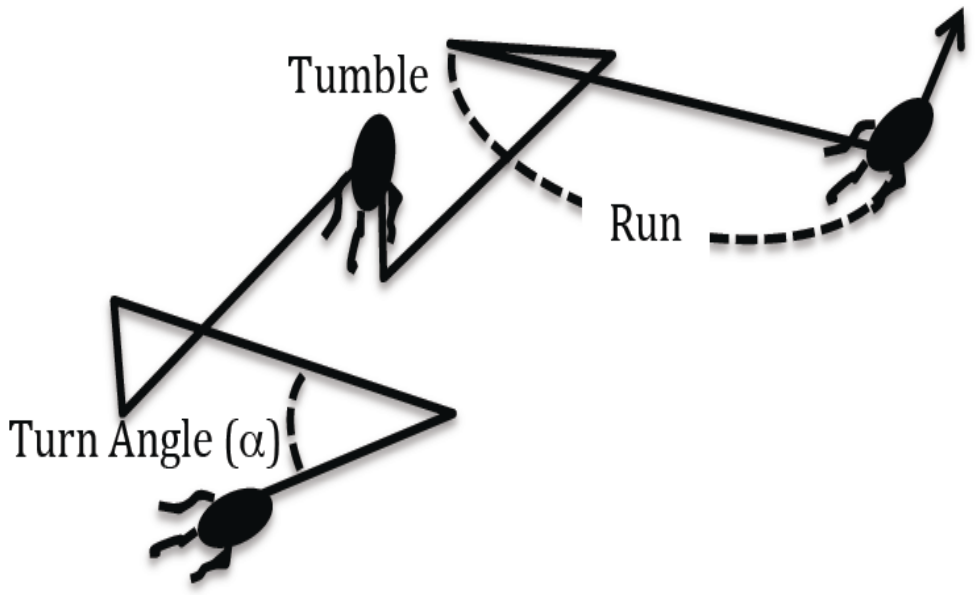

# Student project

* Goal: simulating bacterial movement in 2D space

## Design

> Bacterial movement, figure 1 from [Wang et al., 2011]

## Design phase 1

Allow bacteria to move following the random run and tumble model:

* Run: a bacterium goes into a direction with a random distance
* Tumble: a bacterium picks a random new direction

Setup:

* Environment is constant
* All bacteria start at coordinat (0,0)
* The program writes down the coordinats of all bacteria
   every timestep *in any clumsy way*

## Extension 1: environment

In reality, bacteria move up a food gradient (imagine dissolved sugars).
Bacteria do so by:

* When moving up a food gradient (i.e. they find more and more food):
   the chance of tumbling decreases
* When moving down a food gradient (i.e. they find less and less food):
   the chance of tumbling increases

Make the bacterium remember the previous food density
and make it impact the tumbling behavior.

## Extension 2: better timekeeping

The problem of previous design is that there is scheduling needed
if logging takes place every second.

See this table, where bacterium A had a tumble at 3.14 seconds
and bacterium B after 1.72 and 3.21 second.

Time|Position A|Position B
0   |(0,0)     |(0,0)
1   |(1,1)     |(-1,-1)
2   |(2,2)     |(-0.3,-0.7)
3   |(3,3)     |(-1.3,-1.7)
4   |(3.2,3.4) |(-1.6,-1.3)
5   |(4.2,4.4) |(-2.6,-2.3)

The Doob-Gillespie algorithm allows one to simulate
per event.

# References

* [Wang et al., 2011]Wang, Charles CN, et al. "Simulation of bacterial chemotaxis by the random run and tumble model." 2011 IEEE 11th International Conference on Bioinformatics and Bioengineering. IEEE, 2011.
