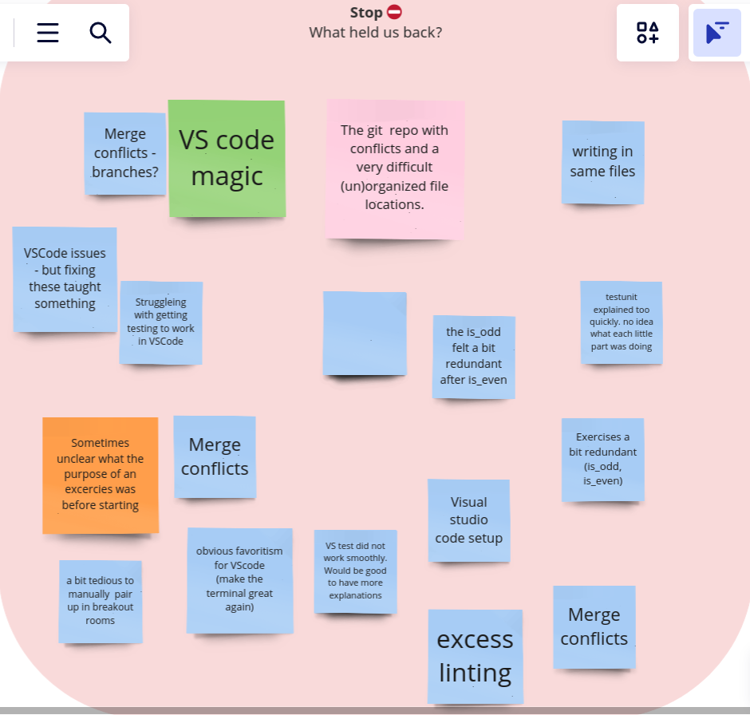
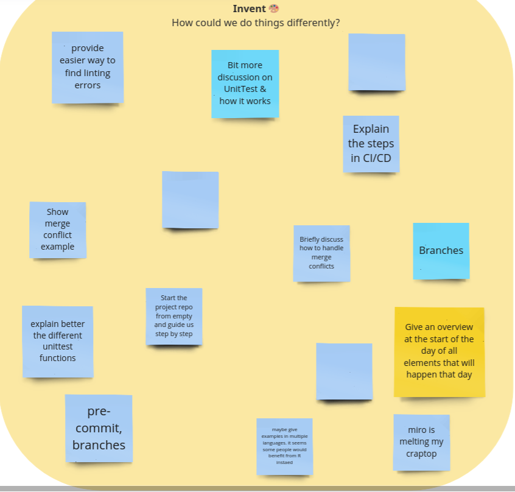

# Reflection day 3 autumn 2023

Exercises felt at better length. 
The learners need time to get things to work
as part of the exercise and they had.

The breaks sometimes hurt: learners were
sometimes in the middle of something very
fun and rewarding (this was true for
the end of the exercise less frequently
and in way milder form). Still, breaks are
important, so I should do this. 
And it is nice to feel motivated to get back to
work again. I will keep this, yet mention 
this at the start that breaks sometimes 
are a nuisance.

Before the lecture I felt the need to prepare
some git exercises, so the learners could
catch up from Monday:
 * git basic workflow: exercise fairytale basic, [#4](https://github.com/programming-formalisms/programming_formalisms_project_autumn_2023/issues/4)
 * git with branches: exercise fairytale on branches, [#5](https://github.com/programming-formalisms/programming_formalisms_project_autumn_2023/issues/5)
During the lesson, I felt doing this would not
pay off enough. It followed that the team would
get dozens of merge conflicts when working on
the same file. This was at an annoying time,
as we worked on real code they wanted to get
running and in perfect style. Also here:
I'd really enjoyed that this would have been done
on Monday with trivial text.

 * [ ] Do do the fairytale example on branches?
   ~~~Vote with learners~~~ Yes

The CI part was disconnected from the exercises.
The theory was too much and too vague.
I am happy I felt that during the lecture,
and I predict this was clearly noticeable.

The unittest part was thin: it was mostly
showing how to get code working. And I agree
that that should be the exercise. 
Do show the theory though, especially 
more Hamcrest example. Also, show the R
equivalents.

The learners worked in 5 different duos.
I let the pick manually so learners pick
different partners. At the start of an exercise,
this did take away time and I think that that
is unfair: the exercise time should start
running when all students are ready. Also,
this was a bit of a search and I jumped between
rooms to get the pairs formed.

There was a bug in my scheduling script.
Due to that, I (1) was interrupted while
lecturing, and (2) I missed a break :-)

I dislike my use of the word 'Conclusion'
on slides, as if it is the only
thing to conclude. Instead,
learners should think critically
('Always document everything', really?).
and be encouraged to challenge these ideas.
If the points I present are challenged,
I can observe I did a bad job convincing
the learners. Use the word 'Discussion'
as a slide title instead and write explicitly
they are encouraged to be critical!

To align with making exercise goals more
clear, give the answer directly!
In that way, the R developers can tag along
if Python syntax is in their way.

### Feedback

[I really wished I had had the csv with text,
I will screenshots for now. This will make
me overlook items :-/ !]

I seems many thought the balance between
exercises and theory was good.
And I enjoy to see that some learners 
find -to me!- details so fun.
I should add those CI scripts live :-)

I am happy to see the clearly seem
to have the same pain points as I either
felt (e.g. manual pairing is tedious)
or predicted (e.g. getting things to
work) or intended (e.g. merge conflicts are
annoying (hence, use branches)).

 * [ ] Add to Day 1 goals: let all learners do a git basic workflow
 * [ ] Add to Day 1 goals: let learners feel merge conflicts
 * [ ] Add to Day 1 goals: let all learners do a git workflow with branches

Using one IDE is a choice, will give stuff
to figure out, so these are things I 
expect to see:

 * VS code magic
 * VSCode issues - but fixing these taught something
 * obvious favoritism for VScode (make the terminal great again)
 * VS test did not work smoothly. Would be good to have more explanations
 * Visual studio code setup

Showing multiple IDEs is possible, as well
as the terminal (it is 
just `python -m unittest tests/test_*`), at the cost of
less theory and the feedback 'Always
use the same tool/IDE for the same thing'.
The CLI to unittest should be mentioned,
this makes VSCode less important:

 * [ ] Mention `python -m unittest tests/test_*`
   in course material

Due to time, focus on things I think I should
discuss and/or change:

Exercise goals should indeed be clear. The
`is_odd` exercise seems redundant if I do
not share the goals. In that way, it is 
explicit that coding of this very similar
same function was not a goal at all.

 * [ ] Add exercise goals

It should be made clear that the repo 
architecture is standard. However,
using one file was a choice by me to
get good commit disciple: if all pairs push
their code every iteration, this would not
have been a problem. However -and ignoring
that learners needed to be added to the
GitHub Team and I forgot to add that as an
exercise (ideally at Day 1!)- not all
learners get VSCode to work.

 * [ ] Add to Day 1 goals: add all learners to the team
 * [ ] Think deeper about this later

The learners agree with the thin unittest
part and CI scripts part. I can do that
better next time.

 * [ ] Increase Hamcrest in unittest
 * [ ] Add CI scripts live and fix with learners

Or in general, as suggested:

 * [ ] Build up the repo from scratch during the
   course: it is beautifully in line with the
   course; to formalize our workflow!
   This can also be done as early as when
   writing a faiytale and then adding the
   spellchecker!

Also, I feel the repository should always be
in a valid state, so we build up pride
over our exemplary work. In that way,
it could help achieve learners feel that
their code is 'good enough', instead of 'ugly'.

 * [ ] Always keep the learners' project 
   repository in a valid state. Fix together.

Adding R examples including videos is easy,
as I already have these. Refer to these in
exercises

 * [ ] Consider having an R subteam (but what
   if there are learners that cannot do R not
   Python??)

Show how to do ruff from CLI (`pip install ruff; ruff .`)

I should indeed add more book pictures to
my lectures; references seem to feel 
giving to little glory  :-)

 * [ ] Make sure Day 1 does what is needed for me
