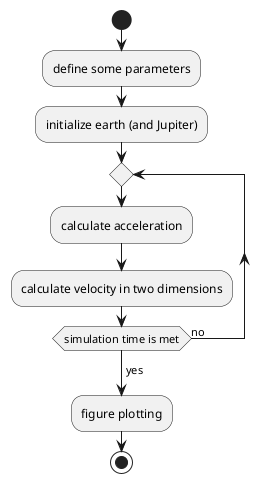

# Day one Q&A Fall 2023
<!--- Reminder do not edit anothers post, please use a fresh paragraph when typing hack md is a simultations editing tool-->


- Zoom: https://uu-se.zoom.us/j/66409709879
Passcode: 583470 
- Material: https://uppmax.github.io/programming_formalisms_intro/index.html

- Menti results: 
    - https://www.mentimeter.com/app/presentation/alepdj7fe96n79hom2jfsfa4i75vunfa/embed


## Icebreaker questions

What topic do you work with?

- Precision Medicine
- Deep learning for image reconstruction
- Proteomics and Mass spectrometry
- Evolutionary genomics, mostly focused on fungi
- Electromagnetics
- Metagenomics
- Eukaryotic genomics & virology
- Bioinformatics (lineage tracing)
- Gut Microbiome
- Computational genomics
- Planet formation
- Biological image analysis
- Quantum chemistry
- Omics method development 

Questions:


- Q: Is it possible to get some proof of participation for the course?
    - A: yes, Lars Eklund is tasked to do that. One can ask by sending him an email to lars.eklund@uppmax.uu.se or (if he needs a reminder) to support@uppmax.uu.se :-)
    -A: yes I will issue Official signed pdf certificates of participation through the course next week Once we have had all the lectures. If  you send an email to me on friday I will have the return mail needed. 

-------------------------
Coffee break until 10.10
------------------------


- Q: Can these be mixed?
    - A: by Richel: unsure what is meant meant by 'these'. As far as I remember when seeing this comment, it was about functional versus object oriented: yes, these can be mixed; it is called a multi-paradigm language (C++ is an example) :-)
    


### Planning document

#### PlantUML part
- Extension: https://github.com/marcozaccari/markdown-diagrams-browser-extension


 


# Day one General Discussion
Discussions in general will go here I remind you that these documents will be uploaded to the repository branch that will be created and that the NBIS training code of conduct should be followed. Be respectfull to eachother so you do not edit others posts. Hack md alows for simultaions editing. /Lars Eklund

### Note on activating environment on windows
for me, running in VS on windows, the default terminal was powershell which didn't recognize the command "source". Running in a bash terminal solved the issue.

## Daily questions (Technical questions)
- Q: 
  - A:
- Q: Can PlantUML generate horizontal diagrams? (to be used in papers or theses)
    - A: there are diagram types that allow a horizontal flow
    - A: plantuml can in most diagrams be told which direction to place realtionships , https://plantuml.com/use-case-diagram#d551e48d272b2b07
- Q: Which HTML generators would you suggest for building a personal website?


### Have you distributed your software? How?

- Q: Have you distributed your software?
    How?


- Q: Which of these documentations is about input/output descriptions?
  
**Note:** UML diagrams can be used to descibe all UML diagrams, the top of introduction diagrams made with Graphviz program, can be viewd as a USECASE diagram with interacting usecases.  


-------------------
## GROUP DISCUSSIONS UML and Diagrams

### ROOM 1
### ROOM 2
### ROOM 3
### ROOM 4
### ROOM 5
## Version control
[Broken link]


----------
## copy right and licensing

- Q: What settings do one needs for getting name + surname displayed by default in the MIT license file, rather than github username? Ex. "Copyright (c) 2023 Bob Smith" and not "Copyright (c) 2023 bobby"
    - A: I (Richel) thinks it uses you GitHub name if you filled it in in your profile.
      I assume so as I create licenses on GitHub regularily


### Why should we document code?
### What is your impression about documentation?
- A:
---
### PARTICIPANT QUESTIONS
- Q: Was it possible to render the plantUML directly on GitHub? How?
    - A: This answer is for md. files and if you have the markdown plugin enabled this should display them in the browser. Git currently support another 
        software that does not need this plugin and that is mermaid, the reason we use PlantUML is that it fits our needs for diagram types.                               https://www.dandoescode.com/blog/plantuml-vs-mermaid goes through the diffrences.
    ```plantuml
    @startumlbob->Alice:Hello
    start 
    :some action;
    stop

    @enduml
    ```
    - A [Richel]: nope, it is not yet supported natively in GitHub, but it is on the way!
    
- Q: Is there any Github examples or journals that runs WRF model with this workflow please?
    - A [Richel]: yes, at https://github.com/wrf-model/WRF#wrf-arw-modeling-system I find a link to https://www2.mmm.ucar.edu/wrf/users/


- Q: There is a slight inconsistency in the "Create a first version of the python code" type-along. It is suggested to create a directory "Figure", but the "plt.savefig" command saves to a "Figures" folder.
    - A [Richel]: Thanks for noticing, I created an Issue at https://github.com/UPPMAX/programming_formalisms/issues/19 :-)

- Q: pipx vs venv,virtualenv
    - A: Pipx is for enduser environmet rather than developing `[Broken link]`
        while venv and virtualenv is focused on generating a shared coding environmet for you and your team. This is of course only applical to 
        python development. Other languages and environments are setup differently, but having a automated deployment and development environment
        is a recomended practice in all cases.

- Q: What are the differences between using conda and pip to create virtual environment?
    - A [Richel]: they achieve similar things (and venv also is exists to do the same :-) ).
      The differences are better explained in articles such as https://pythonspeed.com/articles/conda-vs-pip/

- Q: When working in HPC, sometimes I use some of the pre-installed modules. Should I be reinstalling these locally in my virtual environment (using up more disk space)? What are the best practices for reproducibility when sharing my code with others (pip freeze wouldn't include globally installed modules right?)
    - A [Richel]: Ideally you have a similar environment installed someplace else too, which can
        be local or on a GitHub Action script (more on that Wednesdays), so you can
        run test that can run on any other computer than your own HPC environment.
        Best practices for reproducible research are at 
        [the NBIS 'Tools for Reproducible Research'](https://nbis-reproducible-research.readthedocs.io/en/course_2104/), 
        this course (especially Wednesdays) will give plenty of best practices 
        that are a subset of these practices. For example, using git and GitHub 
        and tests and Continuous Integration allows one to achieve reproducible research. 
        Another question is *how* reproducible you want/can get your workflow. 
        Ideally (in my opinion), you upload a Singularity container (not discussed in this course) 
        that can be used to redo your experiment easily. 
        I, Richel, care about Reproducible Research and Open Science, so ask me more!
        


-----------------------------------------------------------------
## Questions above this line
-----------------------------------------------------------------
